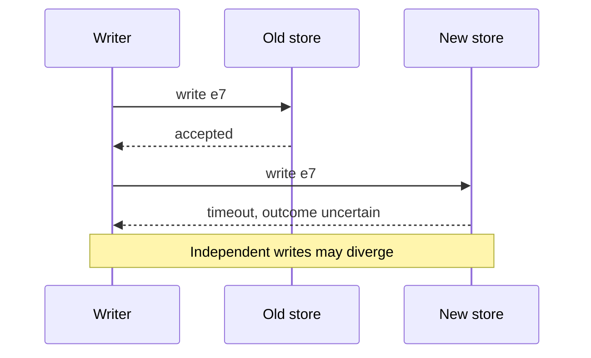
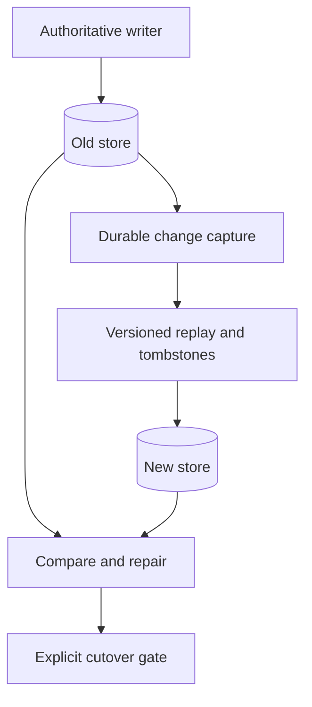
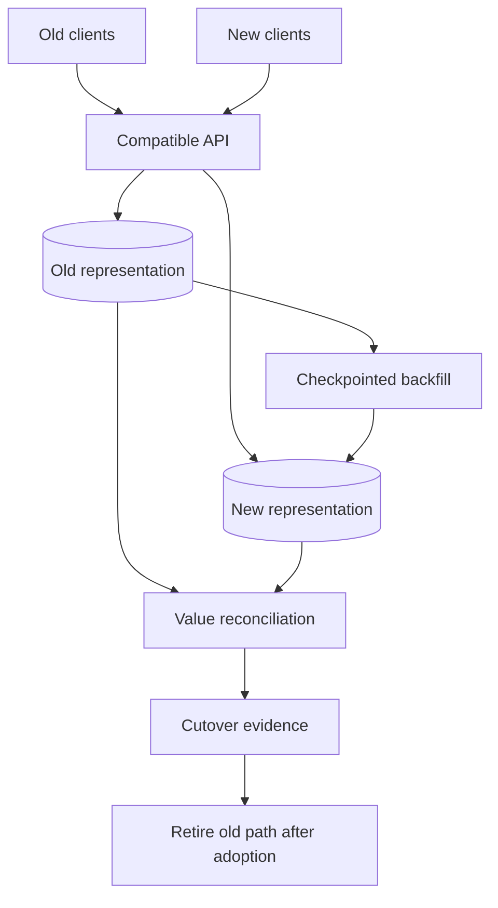

# Migrations

[Curriculum](../../README.md) · [Migrate live systems and verify recovery](README.md)

> Project connection · feeds **P5 (it changes safely)**

## At the whiteboard

> “We are replacing an event store while reads and writes continue. The old
> write succeeds and the new write times out. What do we return, which copy is
> authoritative, and how will we find and repair the difference?”

A migration must preserve a defined contract while versions and stores coexist.
Two writes are not one atomic operation merely because they share a function.

| Event | Expected policy to specify |
|---|---|
| Old store accepts event `e7`; new store is unavailable | Durable record of replication work |
| Change `v8` arrives before replayed `v7` | Older replay cannot overwrite newer state |
| A record is deleted during backfill | Tombstone or equivalent deletion semantics survive |
| Read cutover fails | Reversal has a defined data and routing boundary |

## Establish authority before cutover

1. Choose an authoritative write path and a durable change-capture boundary.
   Sampling detects some divergence; it does not itself repair missing writes.
2. Backfill from a defined snapshot or watermark while replaying changes with
   version and deletion rules. Make both stages restartable.
3. Compare invariants and representative workloads. Define repair, catch-up,
   and the evidence required before switching reads.
4. Stop old writes and retire compatibility only after rollback requirements
   expire. Track intermediate benefits separately from retirement savings.

**Follow-up:** “The new store already accepts writes. Can a DNS change instantly
restore the old system?” No: account for new data, resolver TTLs, and established
connections before claiming a rollback bound.

Senior depth makes partial failure and replay safe. Lead depth coordinates
consumer versions, owners, staged value, stop conditions, and actual retirement.

## The mechanism: de-risk, enable, finish

**De-risk the uncertain requirement early, not the riskiest production cohort.**
A replay, shadow read, disposable test environment or limited pilot can expose a
hard compatibility requirement without putting the largest customer at risk.
Choose initial live exposure for representativeness, observability, reversibility
and bounded impact. An easy pilot tests deployment mechanics; it does not prove
that every difficult consumer can migrate.

| Question | Evidence to collect before expanding |
|---|---|
| Can the new store represent the hardest record? | Replayed fixture with keys, versions and tombstones preserved |
| Does the rollout machinery work? | Small live cohort, monitored errors and an exercised stop control |
| What happens during a partial write? | Durable replication intent plus restart/reconciliation trace |
| Can old clients read new writes? | Compatibility tests across supported versions |

**Enable adoption.** Supply a supported adapter, migration command and progress
report. Make retries safe. A checkpoint means “these inputs are durably applied,”
not merely “the loop visited them.” Keep a bridge for consumers that cannot yet
move, with an owner and an expiry/review condition.

**Finish deliberately.** Prevent new unapproved use of the old path, count
remaining writers and readers, observe actual traffic, and remove the old system
only after the rollback window and retention requirements permit it. A static
search can miss dynamic callers; zero matches is not proof of zero traffic.

## Separate intermediate gains from retirement savings

Coexistence can cost more while already helping users. These are **constructed
units per month**, not provider prices:

| Stage | Old-system cost | New-system cost | Total | Migrated cohort latency |
|---|---:|---:|---:|---:|
| Before | 100 | 0 | 100 | 600 ms |
| Partial rollout | 100 | 30 | 130 | 180 ms |
| Retired old path | 0 | 80 | 80 | 180 ms |

The partial rollout has a real latency benefit and a real cost penalty.
Retirement removes the old-system cost; it is not the first moment any benefit
exists. Track migration labor, ongoing support, incidents and capacity separately.
Do not turn the drawing into a universal cost curve or an “80% abandoned” statistic.

## A rollback is four separate questions

| Boundary | What reversal can and cannot do |
|---|---|
| Code | Revert a change only while the old version understands current state |
| Traffic | Change routing; account for cached routes and existing connections |
| Data | Restore retained values or replay a trustworthy log; recreating a deleted column does not restore its contents |
| Business effect | Reconcile or compensate an already executed payment; disabling a flag does not undo it |

Keep a defined authority while old and new versions coexist. If new-only writes
have started, redirecting reads to an unreconciled old store loses visible state.
A safe reversal needs reverse replication, a write pause with reconciliation,
or an explicitly narrowed forward-recovery policy.

## Practice on P5

Choose one load-bearing change in the continuing project. Record the invariant,
hardest compatibility case, first low-impact live cohort, replication/repair
mechanism, stop condition and retirement owner. Include a late old writer and a
delete during backfill in the test data.

Ask an assistant to find a counterexample to that plan, then check it against the
actual contracts. Do not require an objection when the plan is sound. A useful
review may approve it unchanged and record why.

**Acceptance:** restart a partial backfill without corrupting newer writes;
reconcile values, not just row counts; exercise the supported reversal; and show
that retiring the old path leaves no supported caller dependent on it. An
intentionally irreversible step needs a tested restore or forward-fix policy.

**Words to keep:** *de-risk* reduces uncertainty; *coexistence* runs both paths;
*cutover* changes authority or routing; *retirement* removes the old obligation.

[Database foundations](../../02-applications/02-databases/data-models-and-queries.md) ·
[Recovery lab](labs/recovery-migration/README.md) ·
[Make technical decisions and improve team workflows](../05-technical-decisions/README.md)

## Draw it from memory · Draw coexistence before drawing cutover

**Redraw challenge:** Circle every writer that still targets the old representation. What evidence permits retirement?

[Static view](../../../assets/learning/traffic-shift-still.svg)
