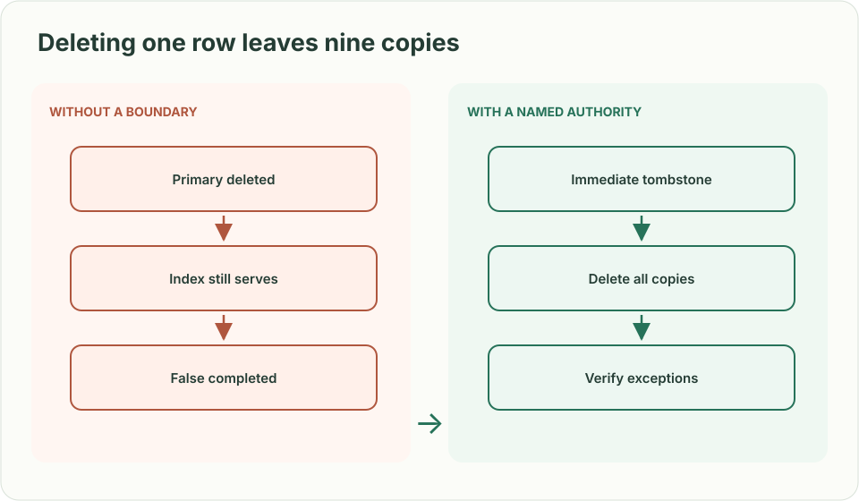
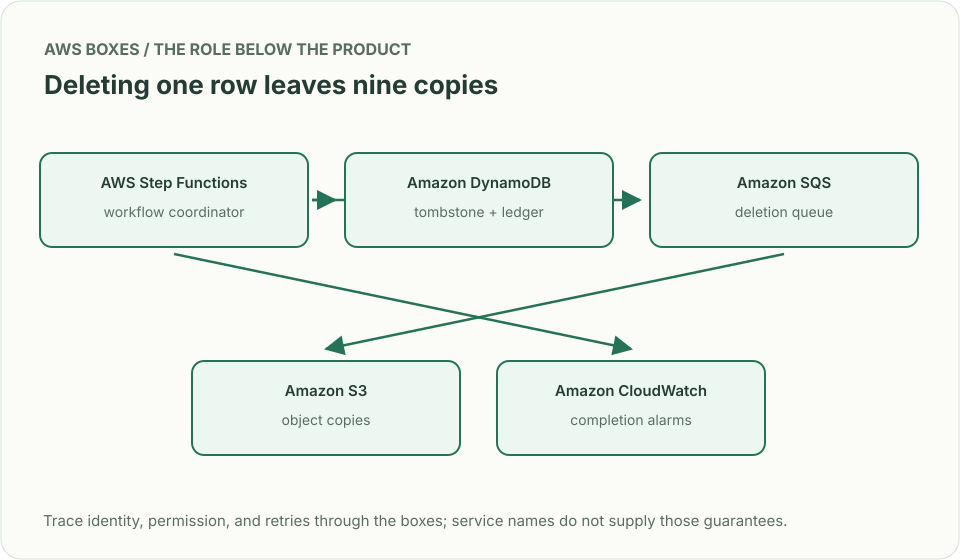
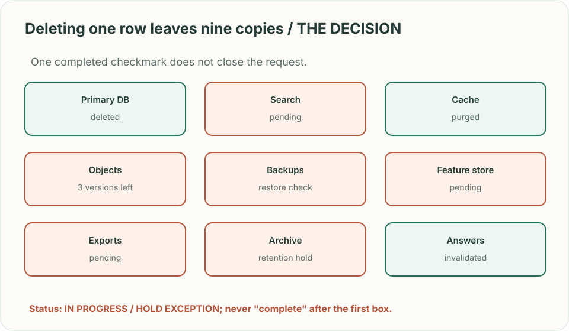

# Data erasure: one request, nine copies

> **Interviewer:** “A customer requests deletion of a profile. It exists in the main database, search, object storage, an event archive, backups, derived features, and cached answers. Design a workflow that reports truthfully when deletion has happened.”

**Your contract.** Invent a 30-day completion target for this exercise; actual legal deadlines depend on jurisdiction and counsel. Retention and legal holds can override ordinary deletion. Do not assert that one database DELETE removes backups or immutable archives.

| Condition | Expected state |
|---|---|
| Request submitted twice with the same ID | One erasure job, stable status and no accidental duplicate side effects |
| Main row gone but search hit remains | Job is **in progress**, and reads suppress the subject immediately |
| S3 version is under legal hold | Surface an exception with owner, scope, and reason; never report “fully erased” |
| A backup is restored after erasure | Deletion tombstone/ledger prevents re-exposure and triggers re-erasure |

## Treat erasure as a stateful distributed workflow

Record an authenticated request ID, subject scope and policy decision. Immediately deny reads via a retained tombstone while asynchronous workers enumerate stores and delete or render inaccessible each copy. Every subsystem reports an evidence record for an exact version/range; a coordinator marks complete only after required acknowledgements, or records a formal exception. Reconcile stale projections and backup restores against the ledger. Don't leak the user's identity in a broadly readable job dashboard. A legal-hold path needs explicit review, not a silent retry loop.

| AWS box | Job here | Alternative and deciding factor |
|---|---|---|
| AWS Step Functions (workflow coordinator) | Track deletion steps, retries, and exception states | Application-owned orchestrator where dynamic inventories exceed workflow limits |
| Amazon DynamoDB (request ledger) | Hold idempotency keys, tombstones, and per-store evidence | Amazon RDS for complex relationships and transactional review workflow |
| Amazon S3 (object and backup storage) | Delete all applicable object versions or flag retention/hold exceptions | Other object stores under the same explicit inventory requirement |
| Amazon SQS (work queue) | Decouple slow deletion workers and bound retry rate | EventBridge for event routing, with separate stateful coordination |
| Amazon CloudWatch (audit telemetry) | Alert on overdue jobs, missing acknowledgements, restored copies | Existing observability with immutable investigation evidence elsewhere |

A DynamoDB TTL is eventual expiry, **not** a deadline or erasure proof. S3 Object Lock can prevent removal of retained object versions; the state machine must record this honestly. Enumerate data lineage before claiming coverage.

**Senior follow-up:** A search index is down for two days. Keep the subject suppressed from live reads; show how the worker resumes and verifies the index after recovery.

**Staff follow-up:** One team introduces a new feature store without registering it. Create an ownership and data-classification gate, rollout check, periodic scan, and a reporting rule that reveals missing coverage.

**Practice artifact:** Draw a copy inventory and state machine. For each row in the table, state what the user-facing status says and what evidence the operator can inspect.

**Source boundary:** Original exercise motivated by [Meta's June 2026 privacy infrastructure case study](https://engineering.fb.com/2026/06/25/security/privacy-aware-infrastructure-in-the-ai-native-era-an-asset-classification-case-study/). [DynamoDB TTL documentation](https://docs.aws.amazon.com/amazondynamodb/latest/developerguide/ttl-expired-items.html) and [S3 Object Lock documentation](https://docs.aws.amazon.com/AmazonS3/latest/userguide/object-lock.html) constrain the AWS design; this is not legal advice or a reported interview question.
