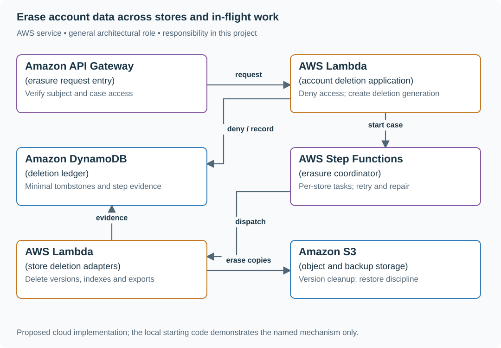

# Erase account data across stores and in-flight work

## Application background

A customer closes their document account and asks for their data to be removed. Their documents are stored in the main database, exported files, search results and backups. Deleting one database row does not remove all those copies.

Some work may still be in progress. An export that started earlier could finish after the account closes, or an old import could recreate deleted records. First stop access and new work, then track cleanup of each copy.

### Example walkthrough

| Action | Expected behavior |
|---|---|
| The customer requests account deletion | Disable access and record an erasure request. |
| An old export tries to publish its file | Reject publication for the closed account. |
| Cleanup reaches a retained backup | Record the retention rule and expiry rather than falsely reporting immediate removal. |

An erasure workflow is a saved checklist of deletion steps and their results. Its completion report must distinguish removed data from data that remains under a stated retention rule.

## Your assignment

**Deliver:** Build an account-deletion coordinator that stops new access, tracks cleanup in each store and reports both completed deletion and specifically retained data.

**Required behavior:** DELETE /account creates an erasure case and a durable deletion generation. New reads and writes are denied under that generation. GET /erasure/{case_id} exposes pending, completed and specifically retained categories without leaking erased content.

The required first milestone is a working local implementation of the behavior above. The numbered implementation steps define the scope. The cloud architecture is a later extension, not something the starter has already provisioned.

## Get the code and run the supplied example

The code is in the public [junior-to-staff repository](https://github.com/Soulful-Iris/junior-to-staff). Install Git and Python 3.12+. No AWS account or Python packages are required for this first run. If you already have a checkout, use it and skip cloning.

```bash
git clone https://github.com/Soulful-Iris/junior-to-staff.git
cd junior-to-staff
python3 examples/architecture-starts/erasure_workflow.py
```

**Supplied file:** [`examples/architecture-starts/erasure_workflow.py`](https://github.com/Soulful-Iris/junior-to-staff/blob/main/examples/architecture-starts/erasure_workflow.py). You can also [read or download the source here](../../../../examples/architecture-starts/erasure_workflow.py).

This program is a **mechanism demonstration**: it runs the small scenario in one process and prints the result. It is not an HTTP service, a complete application, or an AWS deployment. A successful run demonstrates this mechanism only. It does not establish the workload or failure guarantees of the application you will build.

**Example output from the supplied run:**

Generated IDs and timestamps may differ. Compare the state transitions and outcomes.

```text
rejected by deletion generation
Readable account: absent
Deletion evidence: {'ana': 6}
```

### Set up your implementation workspace

Create `work/erasure-workflow/` in your checkout (or use a separate repository). Copy the supplied mechanism into that directory as `mechanism.py`, then extract its state transitions into functions you can call from your implementation. The record and module names below describe what you must implement. They are not a promise that files with those names already exist. Keep a `README.md` beside your implementation with its exact run commands and observed results.

## Local components and state to implement

This table names the records, interfaces or decision inputs for your deliverable. Unless a name is explicitly linked to supplied source above, it is something you create. Implement the local state transitions first, then connect the HTTP, storage or worker boundaries required by the steps.

| Record / module | Key or interface | Responsibility |
|---|---|---|
| deletion_ledger | subject,generation,requested_at | Prevents stale jobs and restored data from resurrecting access. |
| erasure_steps | case_id,store,status,evidence_ref | One restartable task per affected store. |
| retention_exceptions | case_id,category,reason,expiry | Explicit product-approved exceptions. No broad hidden exemption. |

## Implement the assignment

### 1. Deny access before cleanup

Commit the deletion generation and disable account access first. Every consumer that can recreate data must check the ledger before writing. Use non-sensitive identifiers in evidence and restrict ledger readers. A tombstone is not permission to keep the entire old profile.

### 2. Inventory and dispatch deletion

List primary tables, object versions, cache keys, search documents, analytics exports and processors. Store one idempotent step for each owner. A step records concrete evidence, such as affected version ranges or processor confirmation, before completion.

### 3. Handle backups and holds

Document when immutable backups expire and the procedure that reapplies the deletion ledger before a restore is served. Track a hold at the affected category rather than declaring the whole account exempt. The 30-day figure is a scenario assumption, not legal advice or a compliance guarantee.

### 4. Finish and explain the case

Expose pending steps, age and named escalation owner. Reconcile storage inventories and running jobs against completed cases. Mark complete only when the configured policy is satisfied and any retained categories are disclosed through the authorized case view.

## Demonstrate the completed local result

| Action | Expected visible result |
|---|---|
| Run the starting program | A version-4 import is rejected by deletion generation 6. |
| Stop one store adapter | The case remains pending with that store and age visible. |
| Restore yesterday’s backup | Replay deletion generations before opening reads. The erased account stays unavailable. |

**Handoff:** In your implementation README, include the start command, one successful operation, the failure case above and the resulting stored state or decision. State which dependencies are simulated. Someone with a fresh checkout should be able to reproduce this without your chat history.

## Workload assumptions and capacity decisions

These are constructed exercise assumptions. The stated workload is a design target. The local demonstration does not establish that throughput. Use the [estimation constants](../../../01-code/01-problem-solving/estimation-constants.md) to check units before choosing capacity.

| Input or objective | Calculation / consequence |
|---|---|
| 100 requests/day. 30-day exercise deadline | Up to 3,000 open cases if everything consumes the full window. Size workflow metadata independently of data volume. |
| Six data stores per account | Track six acknowledgements with evidence, not one optimistic deleted flag. |
| Ten-minute export jobs | Cancellation must reach running work. Removing only the queued message is insufficient. |

## Map the local implementation to AWS

**Deployment status: local only.** Running the supplied command creates no AWS resources and configures no cloud connections. The diagram is a proposed deployment of the completed application. Each box needs either a deployed runtime, a provisioned service or an explicitly external dependency.

Read the diagram by following the arrows from the entry point: application code accepts the request or event, the state owner commits it, and any worker produces the later result. The table ties those roles to code and adapter work. Multiple boxes do not imply multiple Python files already exist.



Step Functions coordinates progress. It does not discover every copy automatically. A separate deletion ledger prevents old workers or backup restoration from reintroducing a deleted subject. Each store adapter must return evidence for its own boundary.

| Local responsibility | Cloud destination and role | Implementation still required |
|---|---|---|
| Local HTTP boundary or the endpoint you will add | Amazon API Gateway: erasure request entry | Create routes and an integration. Translate requests and responses and configure identity validation. |
| Python operation or worker function | AWS Lambda: account deletion application | Write a Lambda event adapter, package its dependencies and give its role only the required resource actions. |
| Local dictionary, SQLite records or state model | Amazon DynamoDB: deletion ledger | Design partition/sort keys and write a storage adapter with conditional updates or transactions. Python state and SQL are not uploaded as a database. |
| Local workflow transitions | AWS Step Functions: erasure coordinator | Define workflow tasks and durable transition inputs. Retries still need application-level idempotency and reconciliation. |
| Python operation or worker function | AWS Lambda: store deletion adapters | Write a Lambda event adapter, package its dependencies and give its role only the required resource actions. |
| Local file, object fixture or exported payload | Amazon S3: object and backup storage | Implement upload/download and metadata adapters, scoped access, object naming, retention and incomplete-upload cleanup. |

### Provision resources, then connect the application

| Resource or boundary | Initial configuration and reason |
|---|---|
| Step Functions | Durable orchestration with bounded retries and explicit manual-repair states. Avoid putting personal content in execution input/history. |
| DynamoDB ledger | Retain minimal generation and case identity. Check on restore and import paths. |
| S3 versions and exports | Enumerate versions and replicas in scope. A delete marker alone does not remove historical object bytes. |
| Search and caches | Delete projections and invalidate access. Authorization remains enforced while cleanup is delayed. |

Use one disposable AWS environment for the cloud exercise. Put the named resources in `infra/template.yaml` or your existing IaC tool, pass resource IDs through configuration, and scope each runtime role to its own tables, buckets and queues. The diagram is a design to implement. It is not a claim that these resources have been deployed. Record the commands you used to deploy and remove the exercise resources.

For concrete provisioning commands, configuration wiring and cleanup, use the [AWS foundation guide](../../../../examples/architecture-starts/infra/README.md). It includes a deployable table/queue/object-storage foundation and explains which application and service adapters you still implement.

A provisioned queue or table does not make the local program use it. Configure resource IDs in the deployed runtime, replace the local adapter, and replay the same successful and failing operation against that runtime. Record the deployed commit and observable result, then remove the disposable resources using your infrastructure tool.

## Extend the design after the baseline works


A vendor says deletion is complete but cannot provide object-level evidence. Decide which assurance is sufficient for that processor, who accepts it and what the customer sees. Keep technical progress distinct from policy approval.

<details>
<summary>Additional design cases, alternatives and original source notes</summary>


**Your contract.** Invent a 30-day completion target for this exercise. Actual legal deadlines depend on jurisdiction and counsel. Retention and legal holds can override ordinary deletion. Do not assert that one database DELETE removes backups or immutable archives.

| Condition | Expected state |
|---|---|
| Request submitted twice with the same ID | One erasure job, stable status and no accidental duplicate side effects |
| Main row gone but search hit remains | Job is **in progress**, and reads suppress the subject immediately |
| S3 version is under legal hold | Surface an exception with owner, scope, and reason. Never report “fully erased” |
| A backup is restored after erasure | Deletion tombstone/ledger prevents re-exposure and triggers re-erasure |

## Treat erasure as a stateful distributed workflow

Record an authenticated request ID, subject scope and policy decision. Immediately deny reads via a retained tombstone while asynchronous workers enumerate stores and delete or render inaccessible each copy. Every subsystem reports an evidence record for an exact version/range. A coordinator marks complete only after required acknowledgements, or records a formal exception. Reconcile stale projections and backup restores against the ledger. Don't leak the user's identity in a broadly readable job dashboard. A legal-hold path needs explicit review, not a silent retry loop.

| AWS box | Job here | Alternative and deciding factor |
|---|---|---|
| AWS Step Functions (workflow coordinator) | Track deletion steps, retries, and exception states | Application-owned orchestrator where dynamic inventories exceed workflow limits |
| Amazon DynamoDB (request ledger) | Hold idempotency keys, tombstones, and per-store evidence | Amazon RDS for complex relationships and transactional review workflow |
| Amazon S3 (object and backup storage) | Delete all applicable object versions or flag retention/hold exceptions | Other object stores under the same explicit inventory requirement |
| Amazon SQS (work queue) | Decouple slow deletion workers and bound retry rate | EventBridge for event routing, with separate stateful coordination |
| Amazon CloudWatch (audit telemetry) | Alert on overdue jobs, missing acknowledgements, restored copies | Existing observability with immutable investigation evidence elsewhere |

A DynamoDB TTL is eventual expiry, **not** a deadline or erasure proof. S3 Object Lock can prevent removal of retained object versions. The state machine must record this honestly. Enumerate data lineage before claiming coverage.

**Senior follow-up:** A search index is down for two days. Keep the subject suppressed from live reads. Show how the worker resumes and verifies the index after recovery.

**Staff follow-up:** One team introduces a new feature store without registering it. Create an ownership and data-classification gate, rollout check, periodic scan, and a reporting rule that reveals missing coverage.

**Practice artifact:** Draw a copy inventory and state machine. For each row in the table, state what the user-facing status says and what evidence the operator can inspect.

**Source boundary:** Original exercise motivated by [Meta's June 2026 privacy infrastructure case study](https://engineering.fb.com/2026/06/25/security/privacy-aware-infrastructure-in-the-ai-native-era-an-asset-classification-case-study/). [DynamoDB TTL documentation](https://docs.aws.amazon.com/amazondynamodb/latest/developerguide/ttl-expired-items.html) and [S3 Object Lock documentation](https://docs.aws.amazon.com/AmazonS3/latest/userguide/object-lock.html) constrain the AWS design. This is not legal advice or a reported interview question.

</details>
