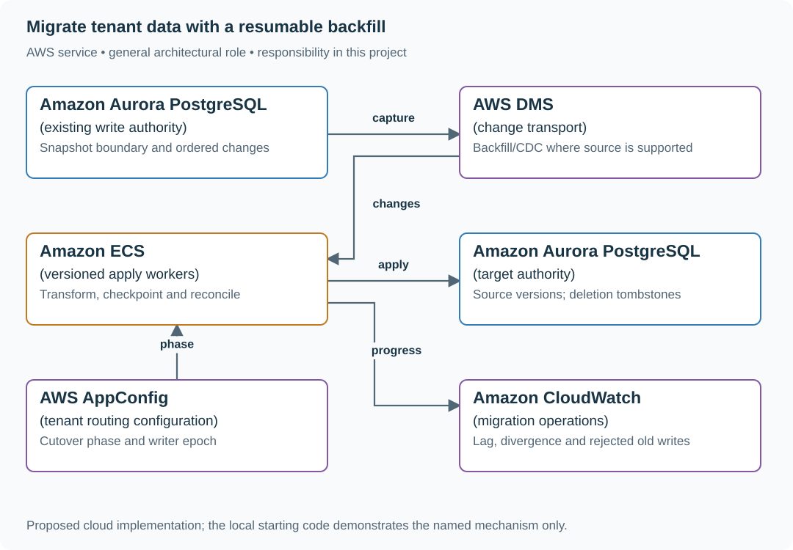

# Multi-tenant migration

## What you are building

> Move a 10 TB multi-tenant service from its old database to a new schema without asking 12-week-old mobile clients to upgrade. A security deadline is four weeks away. Build a resumable per-tenant backfill and a controlled write-authority handoff.

**Working contract:** Each tenant has a recorded migration state and one write authority. Backfill, updates and deletions carry monotonically comparable source versions. Reads never resurrect an older row after a newer deletion.

## Workload and the decisions it changes

These are constructed exercise assumptions. The stated workload is a design target; the local demonstration does not establish that throughput. Use the [estimation constants](../../../01-code/01-problem-solving/estimation-constants.md) to check units before choosing capacity.

| Input or objective | Calculation / consequence |
|---|---|
| 10 TB at 100 MB/s effective copy | 10,000,000 MB / 100 = 100,000 s ≈ 27.8 hours ideal; retries, indexes and live changes extend this. |
| Security deadline: four weeks | A full client replacement cannot fit a 12-week compatibility window; add an adapter or narrow the deadline scope. |
| Live writes: 1,000/s assumption | A one-hour CDC pause adds 3.6 million changes; copy throughput alone does not prove catch-up. |

## Start with one working boundary

Run from the repository root with Python 3.12+:

```bash
python3 examples/architecture-starts/multi_tenant_migration.py
```

[Open the starting code](../../../../examples/architecture-starts/multi_tenant_migration.py). This is a runnable demonstration of the critical state boundary. The API, UI, cloud adapters and operating behavior below are the application you build around it.

| Record / module | Key or interface | Responsibility |
|---|---|---|
| tenant_migration | tenant,phase,source_watermark,writer_epoch | Controls routing and cutover eligibility. |
| target_records | tenant,id,source_version,deleted | Conditional apply prevents stale backfill and update replay. |
| reconciliation | tenant,range,count,canonical_hash | Evidence that copied data agrees at a defined watermark. |

## AWS implementation



DMS can move rows and changes, but application compatibility, semantic transformations and write fencing remain your responsibility. The design uses per-tenant cutover so one problematic customer does not force a global switch.

## Build it in this order

### 1. Make old and new contracts coexist

Write down the old client request/response shape and the target schema. Add an adapter that preserves old behavior while storing the new representation. Record the last client version requiring the adapter; do not remove fields merely because the new UI stopped using them.

### 2. Backfill through the same versioned apply path

Take a consistent snapshot boundary and start change capture without a gap. Persist range checkpoints only after durable target writes. Use a conditional source-version comparison for snapshot rows, live changes and tombstones. Retry a range safely after process death.

### 3. Reconcile before changing reads

Compare canonical records or range hashes at an aligned source watermark. Account for deletes and null/default conversions. Shadow reads are useful only when you distinguish replication lag from transformation errors; sample by tenant size and unusual schema values.

### 4. Transfer write authority once

Drain or fence old writers, apply the final change watermark, then advance the tenant’s writer epoch and routing state. A DNS change alone is not a write fence. Before new-format writes, document whether rollback is still possible or requires reverse transformation.

## Infrastructure configuration

| Resource or boundary | Initial configuration and reason |
|---|---|
| AWS DMS | Use only if the source/target pair and required CDC semantics are supported; record snapshot/CDC start boundary and task lag. |
| Aurora source and target | Separate credentials and writer roles; preserve tombstones and source versions through transformation. |
| ECS migration workers | Bound copy concurrency to protect live traffic. Checkpoint ranges and expose per-tenant progress/lag. |
| AppConfig routing | Application consumes tenant placement changes; epoch enforcement occurs at the write authority, not only in cached routing. |

Use one disposable AWS environment for the cloud exercise. Put the named resources in `infra/template.yaml` or your existing IaC tool, pass resource IDs through configuration, and scope each runtime role to its own tables, buckets and queues. The diagram is a design to implement; it is not a claim that these resources have been deployed. Record the commands you used to deploy and remove the exercise resources.

For concrete provisioning commands, configuration wiring and cleanup, use the [AWS foundation guide](../../../../examples/architecture-starts/infra/README.md). It includes a deployable table/queue/object-storage foundation and explains which application and service adapters you still implement.

## Observe the result

| Action | Expected visible result |
|---|---|
| Run the starting program | Version 6 deletion remains after late version 4 backfill. |
| Restart halfway through a range | The same range replays without duplicate logical rows. |
| Send an old-client write after cutover | The compatibility adapter accepts the supported contract; the fenced old database rejects direct writes. |

## The next design decision

The target accepts data the old schema cannot represent. Mark that first write as an explicit rollback boundary. Design a forward repair path and explain why flipping traffic back would lose meaning even if every server is healthy.

<details>
<summary>Additional design cases, alternatives and original source notes</summary>

[Curriculum](../../../README.md) · [Migrations and recovery](../README.md)

All prompts here are constructed practice, without company attribution.

> **Candidate opening:** “Security needs tenant isolation in four weeks; mobile
clients will write the old schema for twelve weeks. Copy live data without losing
edits or resurrecting deletes, and choose a rollback boundary the teams can use.”

| Input | Expected behavior | Scope |
|---|---|---|
| Old v2 commits; target write fails | Durable replay repairs target | Independent dual writes are not atomic |
| Live delete v2 followed by backfill v1 | Tombstone v2 survives | Versioned apply, explicit delete retention |
| New-only write after cutover | Rollback waits for reverse repair | Routing alone cannot restore data compatibility |

Prerequisites: [migration concepts](../../../03-production/01-system-design/mechanism-reference.md) and [transaction lab](../../../02-applications/02-databases/labs/postgresql/README.md).
Start with the [runnable migration fixture](../labs/recovery-migration/migration.md).
Deliver compatibility/authority first, then snapshot plus replay, then full
reconciliation and a rehearsed writer/reader rollback.

Name source authority and the durable change record before designing traffic
percentages. Enforce versions and tombstones at apply, and advance checkpoints
only after durable writes. Then separate reader routing from writer authority.

<details>
<summary>Worked approach and AWS mapping — open after your attempt</summary>

**Prompt:** move from a shared relational schema to tenant-isolated storage while teams release independently. Define why: contractual isolation, noisy neighbors, or operating limits. “New technology” alone is not a benefit. Assume 10 TB to backfill and a 100 MB/s safe copy budget: about 28 hours of ideal transfer, before verification, ongoing writes, retries, and throttling.

Choose a routing registry with tenant migration state. Expand client contracts first. Capture changes with an outbox or CDC; backfill a consistent baseline and apply ordered updates. Shadow reads compare meaningful values. Move a small tenant only when reconciliation and latency pass. Keep rollback routing and change capture until a stated point of no return.

**AWS mapping:** RDS source, a target selected by access pattern, DMS/CDC where the supported source/target behavior fits, S3 for checkpoints/export artifacts, CloudWatch for lag and mismatch rate. Validate CDC ordering, schema-change handling, and transaction boundaries before committing to the mechanism.

**Decision memo:** source and target owners; acceptance metric; customer cohorts; capacity/cost budget; rollback trigger; data repair procedure; old-path retirement owner. **Failure drill:** change a record during backfill, crash the worker, then resume. Row-count equality alone does not prove correctness.

**Junior:** explain old/new compatibility. **Senior:** implement resumable copy and reconciliation. **Staff:** negotiate sequencing, avoid two years of dual operation, and identify what would make you cancel the migration.

</details>

## Follow-up: region failover during migration

**Senior:** run partial-write, stale-backfill, delete, replay and rollback tests.
**Lead follow-up:** negotiate the mobile/retention/capacity conflict in the
[three-team memo](../labs/recovery-migration/migration.md), then explain why DNS
TTL and connection drain prevent an instantaneous universal rollback. Assessor
checks include zero value/version/tombstone mismatches, old-writer fencing, a
point of no return, and partial benefits versus retirement-only benefits.


[Design route](../../../../indexes/system-designs.md) · [Practice rubric](../../../../practice/README.md)

</details>
