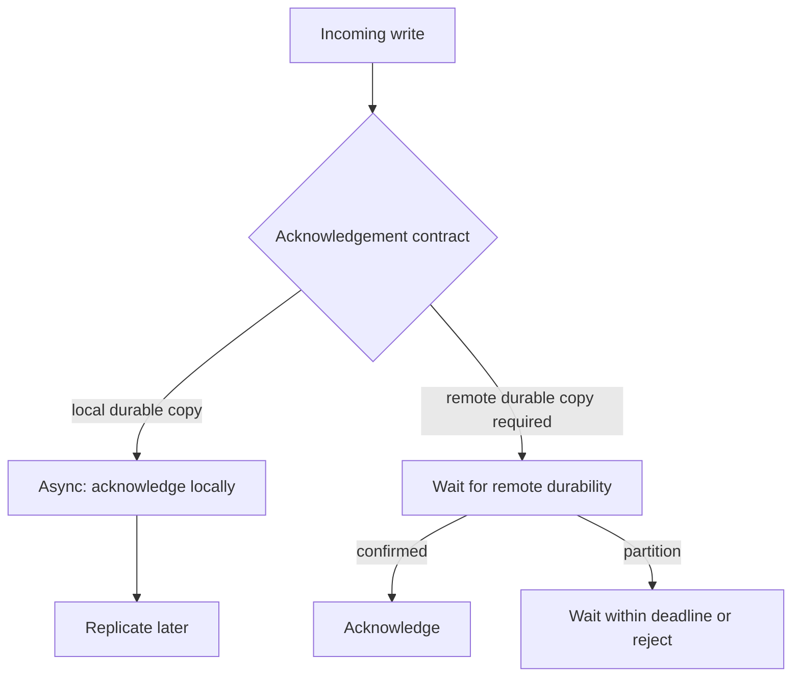

# Design and rehearse regional write failover

## Application background

Customers place orders through an application running in one geographic region. A second region holds a copied database so it can take over if the first becomes unavailable. When copying happens after the original write, the second region can briefly be behind.

Suppose a customer sees Order saved just before the first region fails. If the second region has not received that order, sending traffic there restores access but may lose an order the customer was told was safe.

### Example walkthrough

| Action | Expected behavior |
|---|---|
| Order 501 is acknowledged in region A | The customer believes it is saved. |
| Region B has received only through order 500 when A fails | Name the missing acknowledged order before claiming zero data loss. |
| Operators promote region B | Prevent the old writer from accepting conflicting writes when it returns. |

Failover means moving service to the replacement region. Recovery time and acknowledged-data loss are separate measurements. The exercise makes their trade-off explicit.

### Sizing that affects this decision

At 3,000 writes/s, a replica that is 20 seconds behind may be missing roughly 60,000 recent writes. That is possible exposure, not an observed loss count. The requested 15-minute recovery time does not by itself satisfy a zero-data-loss objective.

These are exercise assumptions. The [estimation reference](../../../01-code/01-problem-solving/estimation-constants.md) explains the units and approximations. They do not establish the local demo's measured capacity.

## Your assignment

**Deliver:** Write and rehearse the regional recovery procedure. Show when writes are acknowledged, how the old writer is stopped, which records the replacement has and what data may be lost.

**Required behavior:** Only one writer epoch may commit orders. A failover publishes a new epoch after the previous writer is fenced. Acknowledged means the durability policy has been met. Promotion must report the last recoverable commit position.

The required first milestone is a working local implementation of the behavior above. The numbered implementation steps define the scope. The cloud architecture is a later extension, not something the starter has already provisioned.

## Get the code and run the supplied example

The code is in the public [junior-to-staff repository](https://github.com/Soulful-Iris/junior-to-staff). Install Git and Python 3.12+. No AWS account or Python packages are required for this first run. If you already have a checkout, use it and skip cloning.

```bash
git clone https://github.com/Soulful-Iris/junior-to-staff.git
cd junior-to-staff
python3 examples/architecture-starts/regional_failover.py
```

**Supplied file:** [`examples/architecture-starts/regional_failover.py`](https://github.com/Soulful-Iris/junior-to-staff/blob/main/examples/architecture-starts/regional_failover.py). You can also [read or download the source here](../../../../examples/architecture-starts/regional_failover.py).

This program is a **mechanism demonstration**: it runs the small scenario in one process and prints the result. It is not an HTTP service, a complete application, or an AWS deployment. A successful run demonstrates this mechanism only. It does not establish the workload or failure guarantees of the application you will build.

**Example output from the supplied run:**

Generated IDs and timestamps may differ. Compare the state transitions and outcomes.

```text
committed
fenced
committed
['order-1', 'order-2']
```

### Set up your implementation workspace

Create `work/regional-failover/` in your checkout (or use a separate repository). Copy the supplied mechanism into that directory as `mechanism.py`, then extract its state transitions into functions you can call from your implementation. The record and module names below describe what you must implement. They are not a promise that files with those names already exist. Keep a `README.md` beside your implementation with its exact run commands and observed results.

## Local components and state to implement

This table names the records, interfaces or decision inputs for your deliverable. Unless a name is explicitly linked to supplied source above, it is something you create. Implement the local state transitions first, then connect the HTTP, storage or worker boundaries required by the steps.

| Record / module | Key or interface | Responsibility |
|---|---|---|
| writer_authority | epoch,region,lease | A strongly enforced fencing authority. Not just a dashboard flag. |
| replication_checkpoint | source_commit,target_applied | States which committed prefix is recoverable. |
| failover_run | decision,steps,evidence,timestamps | Auditable operations and measured recovery time. |

## Implement the assignment

### 1. Name the failure and durability boundary

Distinguish one-AZ loss, whole-region loss and network partition. State where a successful response’s write is durable. If cross-region replication is asynchronous, publish the loss exposure and choose whether to wait for recovery rather than promote missing data.

### 2. Implement a real writer fence

The starting program illustrates the rule, not a distributed authority. In the cloud design, specify how the database rejects old-writer commits or how access is definitively revoked before promotion. A process that merely reads a cached region flag can continue writing during a partition.

### 3. Write the timed runbook

Record detection evidence, who makes promotion decisions, how to stop writes, checkpoint comparison, promotion command, read/write validation and traffic change. Keep each step restartable and record its completion. Do not route traffic until the new writer can enforce the chosen epoch.

### 4. Reconcile and return safely

After the old region returns, keep it fenced. Compare acknowledged operation identities with recovered state before rebuilding it as a replica. Plan failback as another authority transfer. An automatic DNS preference must not recreate two writers.

## Demonstrate the completed local result

| Action | Expected visible result |
|---|---|
| Run the starting program | Epoch 7 is rejected after epoch 8 becomes authoritative. |
| Disconnect replication before a failover rehearsal | The operator sees the recoverable checkpoint and explicit loss exposure. |
| Bring the old region back | It cannot commit until deliberately reconfigured under the current authority. |

**Handoff:** In your implementation README, include the start command, one successful operation, the failure case above and the resulting stored state or decision. State which dependencies are simulated. Someone with a fresh checkout should be able to reproduce this without your chat history.

## Workload assumptions and capacity decisions

These are constructed exercise assumptions. The stated workload is a design target. The local demonstration does not establish that throughput. Use the [estimation constants](../../../01-code/01-problem-solving/estimation-constants.md) to check units before choosing capacity.

| Input or objective | Calculation / consequence |
|---|---|
| 3,000 writes/s. 20 seconds replica lag | As many as 60,000 recent writes may be absent from the replica. This is exposure, not a measured loss count. |
| 15-minute recovery objective | Budget detection, fencing, promotion, validation and traffic movement. DNS time is only one part. |
| RPO zero requested | Requires an acknowledgement boundary that survives the stated failure domain, or an honest renegotiation of the objective. |

## Map the local implementation to AWS

**Deployment status: local only.** Running the supplied command creates no AWS resources and configures no cloud connections. The diagram is a proposed deployment of the completed application. Each box needs either a deployed runtime, a provisioned service or an explicitly external dependency.

Read the diagram by following the arrows from the entry point: application code accepts the request or event, the state owner commits it, and any worker produces the later result. The table ties those roles to code and adapter work. Multiple boxes do not imply multiple Python files already exist.


AWS routing and database replication solve different parts of failover. The diagram deliberately separates them. If zero loss is mandatory, select and verify a synchronous cross-region durability design and accept its latency/availability tradeoff instead of relabeling an asynchronous replica.

| Local responsibility | Cloud destination and role | Implementation still required |
|---|---|---|
| Local endpoint selection | Amazon Route 53: traffic routing | Configure DNS routing and recovery controls. A routing change alone does not fence a previous writer. |
| Local application process | Regional application: order request handling | Deploy the same identified artifact in each region with region-specific dependencies and a writer authority check. |
| Current authoritative write store | Aurora primary Region: current database writer | Configure the primary data path, capture acknowledged positions and document the write durability boundary. |
| Replica state in the failover exercise | Aurora secondary Region: replicated recovery target | Observe replication progress and define promotion criteria and reconciliation for unreplicated writes. |
| Local recovery decision or operator action | Amazon Application Recovery Controller: recovery controls | Configure recovery controls and execute the documented fencing/promotion procedure. Do not equate traffic routing with data recovery. |
| Local counters, timestamps and diagnostic output | Amazon CloudWatch: recovery evidence | Emit bounded metrics and logs, build the named operational view and configure retention and access. |

### Provision resources, then connect the application

| Resource or boundary | Initial configuration and reason |
|---|---|
| Aurora Global Database candidate | Understand its replication and failover behavior for the selected engine/version. Asynchronous replication cannot establish unconditional zero-loss regional failover. |
| Route 53 or ARC | Use traffic controls after storage authority is safe. Routing does not fence database writes. |
| Independent recovery evidence | Store runbook, configuration and access path where loss of the primary region does not make them unavailable. |
| CloudWatch and audit logs | Track last replicated commit, write rejections, recovery step durations and the exact promotion decision. |

Use one disposable AWS environment for the cloud exercise. Put the named resources in `infra/template.yaml` or your existing IaC tool, pass resource IDs through configuration, and scope each runtime role to its own tables, buckets and queues. The diagram is a design to implement. It is not a claim that these resources have been deployed. Record the commands you used to deploy and remove the exercise resources.

For concrete provisioning commands, configuration wiring and cleanup, use the [AWS foundation guide](../../../../examples/architecture-starts/infra/README.md). It includes a deployable table/queue/object-storage foundation and explains which application and service adapters you still implement.

A provisioned queue or table does not make the local program use it. Configure resource IDs in the deployed runtime, replace the local adapter, and replay the same successful and failing operation against that runtime. Record the deployed commit and observable result, then remove the disposable resources using your infrastructure tool.

## Extend the design after the baseline works
### Worked follow-up: Choose between regional durability and regional write availability

If region A acknowledges before B has a durable copy, A can fail during that gap. Zero acknowledged loss requires that the chosen acknowledgement boundary already spans the failure being promised.

| Starting design | Changed requirement |
|---|---|
| Acknowledgement may precede replication to a second region. | The business asks whether every acknowledged write must survive loss of the first region. |

**Revised architecture.** Follow the changed responsibility and failure path below. This is a design to implement. The supplied local example does not provision these components.



**What to implement.** Present two concrete choices. With asynchronous replication, local acknowledgement stays fast but failover can lose the unreplicated suffix. With synchronous cross-region durability, acknowledgement waits for the required remote durable copy and partitions can block writes. Specify the actual protocol and failure assumptions, not just two database icons. Promotion also needs storage-enforced writer fencing. Do not infer either contract from a product name or DNS failover.

**Walk through the result.** Use a constructed 70 ms cross-region round trip and a local 20 ms write target. Explain why a write that waits for that remote acknowledgement cannot retain the 20 ms target on this path. At 3,000 writes/s and 20 seconds of measured lag, up to 60,000 writes may be exposed in the asynchronous scenario. Record which trade the product accepts.


Product rejects both any data loss and the latency cost of synchronous regional durability. Write a decision record with the failure cases and measurable options. No infrastructure diagram can make contradictory guarantees simultaneously true.

<details>
<summary>Additional design cases, alternatives and original source notes</summary>


Assume 3,000 writes/s, a 15-minute recovery-time target, and an *initial* proposal of zero lost acknowledged bookings. These are exercise constraints. Derive whether the architecture actually supports both targets and where cost or latency changes.

| Event | Expected answer |
|---|---|
| Write v9 is acknowledged in Region A, then A dies | State whether v9 survives. Asynchronous replication alone does not guarantee it |
| Customer retries booking in B | Preserve request identity, detect duplicate if v9 later returns |
| A comes back with unreplicated data | Do not blindly make A writer again. Reconcile and fence old owners |
| Planned cutover while users remain active | Demonstrate read and write behavior during transition |

## Make RPO and RTO concrete

RPO bounds lost accepted data. RTO bounds service restoration. If an acknowledgment happens before the second durable copy commits, zero acknowledged-write loss is false under total regional loss. Options include cross-Region synchronous or strongly consistent commit at higher latency/availability cost, explicitly accepting nonzero RPO, or changing what 200 means. Draw the exact acknowledgement point and name the owner of writes in each Region. DNS or health checks change routing, not data durability.

Follow the two outgoing paths from A: the customer gets 200, while replication toward B remains incomplete. If A fails there, B has v8. Place a new acknowledgment boundary after the necessary durable copies if zero lost acknowledged writes is the required outcome.

## Put the AWS names on the boxes

**Why these boxes, and what changes the choice:** Route 53 changes where clients connect but cannot replicate missing acknowledged writes. DynamoDB Global Tables have mode-dependent consistency. Aurora Global Database is another choice with its own replication and failover guarantees. A writer epoch must be enforced at write time, and CloudWatch health alone cannot fence an old writer.


**Senior follow-up:** A is partitioned rather than destroyed. Both Regions can reach some clients. Fence the old writer before promoting B and define behavior when fencing cannot be confirmed. Use an epoch or lease with write-time enforcement. Observing a lease in a monitoring dashboard does not prevent a stale process writing.

**Staff follow-up:** Product asks for 99.99% availability, 15-minute RTO, zero acknowledged loss, and unchanged write P95. Use a small capacity/latency budget to show which constraints are in tension. Offer two defensible architectures and a failure exercise that could disprove each. Assign the reconciliation owner and rollback authority.

**Practice artifact:** A/B region boxes, timeline labeling last committed/replicated/acknowledged versions, decision memo on RPO/RTO, and a rehearsal of stale-owner fencing and return-to-primary.

**AWS translation:** DynamoDB global tables offer distinct replication/consistency modes with different write latency and durability consequences. Do not label an eventually consistent cross-Region replica “zero RPO.” See [AWS global tables modes](https://docs.aws.amazon.com/amazondynamodb/latest/developerguide/bp-global-table-design.html). [Meta's June 2026 failure-readiness account](https://engineering.fb.com/2026/06/03/data-center-engineering/lights-out-systems-on-validating-instant-power-loss-readiness/) motivates practicing abrupt regional-equivalent failures. This booking scenario is constructed.

</details>
