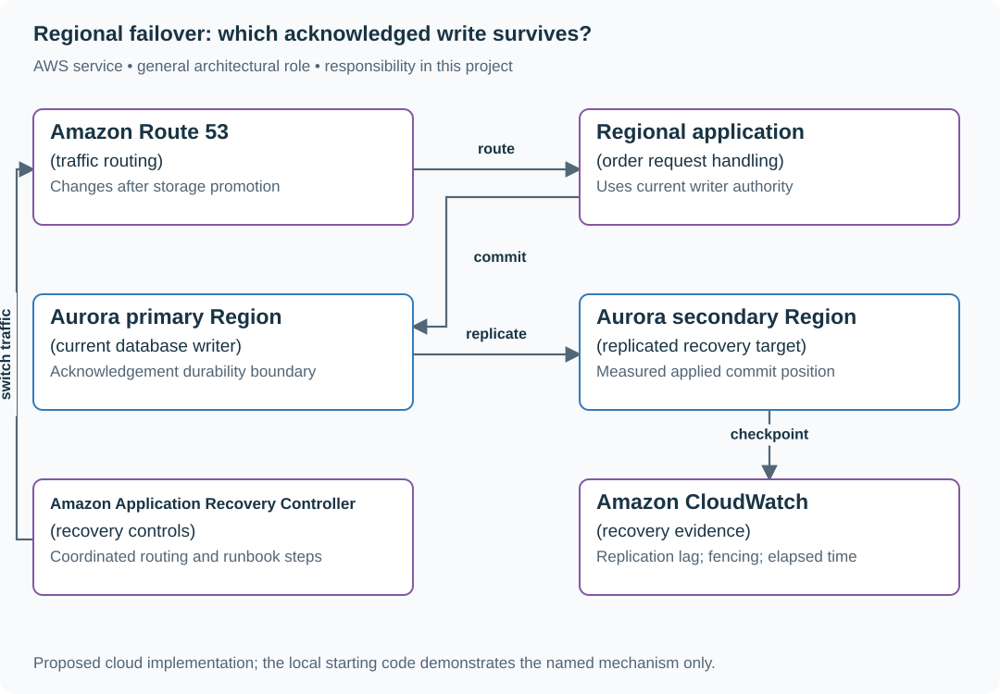
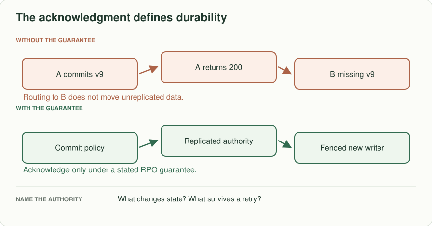
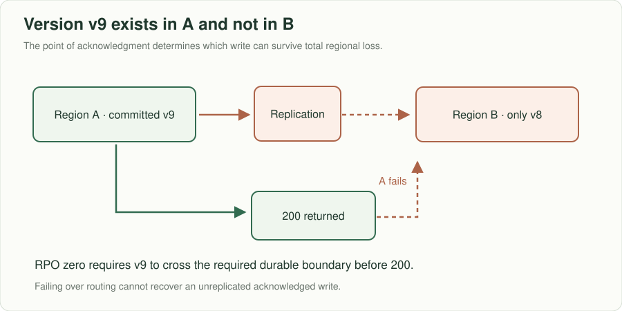
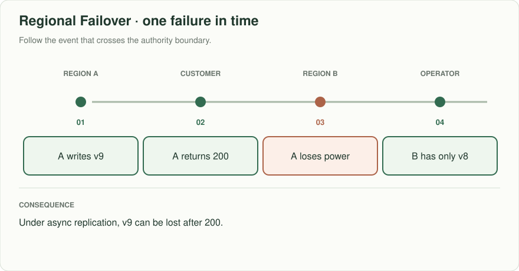
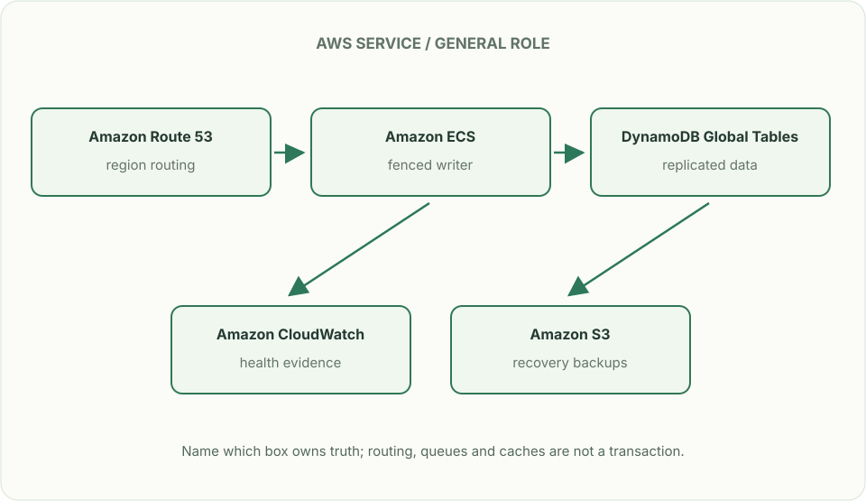

# Regional failover: which acknowledged write survives?

## What you are building

> Build the failover procedure for a regional order service doing 3,000 writes/s. Product asks for recovery within 15 minutes and zero acknowledged-write loss. The proposed asynchronous replica cannot meet both claims during every regional outage; make the actual acknowledgement and promotion rules explicit.

**Working contract:** Only one writer epoch may commit orders. A failover publishes a new epoch after the previous writer is fenced. Acknowledged means the durability policy has been met; promotion must report the last recoverable commit position.

## Workload and the decisions it changes

These are constructed exercise assumptions. The large workload is a design target; the local demonstration does not establish that throughput. Use the [estimation constants](../../../01-code/01-problem-solving/estimation-constants.md) to check units before choosing capacity.

| Input or objective | Calculation / consequence |
|---|---|
| 3,000 writes/s; 20 seconds replica lag | As many as 60,000 recent writes may be absent from the replica; this is exposure, not a measured loss count. |
| 15-minute recovery objective | Budget detection, fencing, promotion, validation and traffic movement; DNS time is only one part. |
| RPO zero requested | Requires an acknowledgement boundary that survives the stated failure domain, or an honest renegotiation of the objective. |

## Start with one working boundary

Run from the repository root with Python 3.12+:

```bash
python3 examples/architecture-starts/regional_failover.py
```

[Open the starting code](../../../../examples/architecture-starts/regional_failover.py). This is a runnable demonstration of the critical state boundary. The API, UI, cloud adapters and operating behavior below are the application you build around it.

| Record / module | Key or interface | Responsibility |
|---|---|---|
| writer_authority | epoch,region,lease | A strongly enforced fencing authority; not just a dashboard flag. |
| replication_checkpoint | source_commit,target_applied | States which committed prefix is recoverable. |
| failover_run | decision,steps,evidence,timestamps | Auditable operations and measured recovery time. |

## AWS implementation



AWS routing and database replication solve different parts of failover. The diagram deliberately separates them. If zero loss is mandatory, select and verify a synchronous cross-region durability design and accept its latency/availability tradeoff instead of relabeling an asynchronous replica.

## Build it in this order

### 1. Name the failure and durability boundary

Distinguish one-AZ loss, whole-region loss and network partition. State where a successful response’s write is durable. If cross-region replication is asynchronous, publish the loss exposure and choose whether to wait for recovery rather than promote missing data.

### 2. Implement a real writer fence

The starting program illustrates the rule, not a distributed authority. In the cloud design, specify how the database rejects old-writer commits or how access is definitively revoked before promotion. A process that merely reads a cached region flag can continue writing during a partition.

### 3. Write the timed runbook

Record detection evidence, who makes promotion decisions, how to stop writes, checkpoint comparison, promotion command, read/write validation and traffic change. Keep each step restartable and record its completion. Do not route traffic until the new writer can enforce the chosen epoch.

### 4. Reconcile and return safely

After the old region returns, keep it fenced. Compare acknowledged operation identities with recovered state before rebuilding it as a replica. Plan failback as another authority transfer; an automatic DNS preference must not recreate two writers.

## Infrastructure configuration

| Resource or boundary | Initial configuration and reason |
|---|---|
| Aurora Global Database candidate | Understand its replication and failover behavior for the selected engine/version. Asynchronous replication cannot establish unconditional zero-loss regional failover. |
| Route 53 or ARC | Use traffic controls after storage authority is safe; routing does not fence database writes. |
| Independent recovery evidence | Store runbook, configuration and access path where loss of the primary region does not make them unavailable. |
| CloudWatch and audit logs | Track last replicated commit, write rejections, recovery step durations and the exact promotion decision. |

Use one disposable AWS environment for the cloud exercise. Put the named resources in `infra/template.yaml` or your existing IaC tool, pass resource IDs through configuration, and scope each runtime role to its own tables, buckets and queues. The diagram is a design to implement; it is not a claim that these resources have been deployed. Record the commands you used to deploy and remove the exercise resources.

## Observe the result

| Action | Expected visible result |
|---|---|
| Run the starting program | Epoch 7 is rejected after epoch 8 becomes authoritative. |
| Disconnect replication before a failover rehearsal | The operator sees the recoverable checkpoint and explicit loss exposure. |
| Bring the old region back | It cannot commit until deliberately reconfigured under the current authority. |

## The next design decision

Product rejects both any data loss and the latency cost of synchronous regional durability. Write a decision record with the failure cases and measurable options. No infrastructure diagram can make contradictory guarantees simultaneously true.

<details>
<summary>Additional design cases, alternatives and original source notes</summary>

> **Interviewer:** “A primary Region accepts a booking and returns 200. It goes dark before the asynchronous replica sees the write. Health checks route the customer to a second Region, where the booking is missing. What can the product honestly promise, and what do operators do next?”

Assume 3,000 writes/s, a 15-minute recovery-time target, and an *initial* proposal of zero lost acknowledged bookings. These are exercise constraints; derive whether the architecture actually supports both targets and where cost or latency changes.

| Event | Expected answer |
|---|---|
| Write v9 is acknowledged in Region A, then A dies | State whether v9 survives; asynchronous replication alone does not guarantee it |
| Customer retries booking in B | Preserve request identity, detect duplicate if v9 later returns |
| A comes back with unreplicated data | Do not blindly make A writer again; reconcile and fence old owners |
| Planned cutover while users remain active | Demonstrate read and write behavior during transition |



## Make RPO and RTO concrete

RPO bounds lost accepted data; RTO bounds service restoration. If an acknowledgment happens before the second durable copy commits, zero acknowledged-write loss is false under total regional loss. Options include cross-Region synchronous or strongly consistent commit at higher latency/availability cost, explicitly accepting nonzero RPO, or changing what 200 means. Draw the exact acknowledgement point and name the owner of writes in each Region. DNS or health checks change routing, not data durability.



Follow the two outgoing paths from A: the customer gets 200, while replication toward B remains incomplete. If A fails there, B has v8. Place a new acknowledgment boundary after the necessary durable copies if zero lost acknowledged writes is the required outcome.



## Put the AWS names on the boxes



**Why these boxes, and what changes the choice:** Route 53 changes where clients connect but cannot replicate missing acknowledged writes. DynamoDB Global Tables have mode-dependent consistency; Aurora Global Database is another choice with its own replication and failover guarantees. A writer epoch must be enforced at write time, and CloudWatch health alone cannot fence an old writer.

Read the smaller label under each service first: it names the architectural job. Then ask whether that service supplies the guarantee in the problem, or simply moves work to the next box.

**Senior follow-up:** A is partitioned rather than destroyed; both Regions can reach some clients. Fence the old writer before promoting B and define behavior when fencing cannot be confirmed. Use an epoch or lease with write-time enforcement; observing a lease in a monitoring dashboard does not prevent a stale process writing.

**Staff follow-up:** Product asks for 99.99% availability, 15-minute RTO, zero acknowledged loss, and unchanged write P95. Use a small capacity/latency budget to show which constraints are in tension. Offer two defensible architectures and a failure exercise that could disprove each. Assign the reconciliation owner and rollback authority.

**Practice artifact:** A/B region boxes, timeline labeling last committed/replicated/acknowledged versions, decision memo on RPO/RTO, and a rehearsal of stale-owner fencing and return-to-primary.

**AWS translation:** DynamoDB global tables offer distinct replication/consistency modes with different write latency and durability consequences; do not label an eventually consistent cross-Region replica “zero RPO.” See [AWS global tables modes](https://docs.aws.amazon.com/amazondynamodb/latest/developerguide/bp-global-table-design.html). [Meta's June 2026 failure-readiness account](https://engineering.fb.com/2026/06/03/data-center-engineering/lights-out-systems-on-validating-instant-power-loss-readiness/) motivates practicing abrupt regional-equivalent failures; this booking scenario is constructed.

</details>
