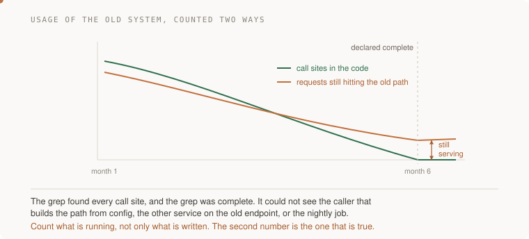

# Migrations — five focused exercises

[Migration method](migration-method.md) · [Migrate tags across data, clients and workers](projects/the-migration-you-actually-finish.md)

These are build assignments, not five supplied applications. Work in a disposable
fixture before a live pilot. Duration depends on the system; “one afternoon” is
not an acceptance criterion. Intermediate improvements and retirement savings
are different outcomes.

## 1. Test the hard requirement safely

Choose the consumer most likely to expose a compatibility gap: ordering,
rounding, implicit defaults, deletions, error semantics or an unsupported query.
Reproduce its behavior using recorded, permitted fixtures or a controlled replay.
Then choose first live exposure for bounded impact and recoverability, not simply
for maximum difficulty or customer size.

| Input | Expected evidence |
|---|---|
| Hard consumer depends on ordered events | Replay verifies the ordering contract or identifies a real mismatch |
| Simple consumer migrates successfully | Evidence about that consumer and rollout mechanics, not every consumer |
| Plan survives the hard case unchanged | Acceptable if the checks genuinely exercised the requirement |

Record assumptions confirmed as well as changed. Do not manufacture an unexpected
failure to satisfy the assignment. Involve the consumer owner in defining what
must remain compatible.

## 2. Compare without creating a second production effect

Run old and new **read behavior** on equivalent input and a defined version or
snapshot. Serve the authoritative result. Bound shadow work by a separate budget
for concurrency, queueing, CPU, connections and deadlines; merely starting an
asynchronous task does not isolate shared resources.

Never replay a payment, email or destructive write against a live provider just
to compare outputs. Use a sandbox or an effect-free adapter. Output agreement
also does not prove equal side effects, latency or resource usage.

| Comparison result | Decision |
|---|---|
| Same values, versions and deletion state | Record agreement for the tested input and snapshot |
| Different intended behavior | Obtain explicit acceptance of the changed contract |
| Unexplained difference | Investigate before expanding the affected cohort |
| Injected faulty fixture produces no difference | Repair the comparator or the fixture |

Normalize only differences irrelevant to the supported contract. Sorting can
hide an ordering bug; rounding can hide a money error. Keep each normalization's
reason. A zero divergence rate can be correct: verify both paths ran and use a
known faulty control, rather than requiring a real defect.

## 3. Make adoption easier without guessing

Build a codemod or compatibility adapter for the common case. It must preserve
supported behavior, identify unsupported shapes and leave those cases for a
reviewer rather than silently guessing. Run the transformation twice: the second
run should make no additional unintended edits.

Hand over a before/after example, command, compatibility tests and refusal list.
Measure migration and maintenance effort for both the platform team and adopting
teams. A wrapper is useful only if it preserves the required semantics and its
latency, security and operational costs are acceptable.

An exception may need manual work or a longer-lived bridge. Give it an owner,
support boundary and review condition; do not treat all exceptions as defects.

## 4. Block new unsupported use; measure remaining use

Use an explicit allowlist for supported legacy calls and test that known new
uses fail the chosen admission check. A static search can miss dynamic imports,
configuration, reflection or an old deployed binary. A manual grep is another
measurement to reconcile, not automatically the correct answer.

Pair static inventory with runtime observations at the old service. Use trusted
caller identity where available; a client-supplied header alone is not proof of
identity. Check telemetry with a known request so missing logs cannot masquerade
as zero traffic.

**Acceptance:** the old supported fixture still runs, the prohibited new usage
is detected, counts identify their blind spots, and another engineer can reproduce
the inventory. Enforcement strength should match the contract and rollout stage.

## 5. Retire after the recovery boundary is satisfied

Rehearse removal in a branch or disposable environment first. For each remaining
caller, record owner, migration work and a supported transition. Keep reverse
replication, compatible readers or retained recovery data for the promised
rollback window. Recreating a column does not restore discarded values.

Observe a window that covers the actual callers' schedules and plausible delays.
A week can contain nightly jobs but may miss month-end or quarterly work. Pair
runtime evidence with the caller inventory; no finite quiet window alone proves
that an unknown offline client will never return.

Do not intentionally fail production requests merely to discover their owners.
A brownout exercise needs explicit authorization, notice, bounded exposure,
monitoring and a tested stop control. Prefer inventory and rehearsals first.

Retire only obsolete resources whose dependencies and retention obligations have
been checked. Some backups or evidence may intentionally remain. Record the
code/configuration change, recovery decision and measured change in cost.
Finishing removes old-system obligations; users may already have benefited from
partially migrated cohorts.

## Map the mechanism to AWS, not the other way around

| Mechanism | Possible AWS role | Boundary to keep explicit |
|---|---|---|
| Database change capture | DMS for supported source/target combinations | Not an atomic commit across arbitrary stores; define watermark, lag, versions and replay retention |
| Read routing | ALB or API Gateway | Routing does not establish data authority or preserve writes by itself |
| Remaining-use evidence | CloudWatch metrics and configured access logs; CloudTrail for relevant AWS API activity | Configure and test collection; not every application operation or caller identity appears automatically |
| Reconciliation analysis | S3 snapshots with Athena queries | Compare equivalent versions; sampled agreement and row counts are not full semantic parity |
| Reusable infrastructure migration | Versioned CDK constructs or reviewed CloudFormation changes | Consumers still need compatibility review, rollout and a recovery plan |
| Configuration oversight | Config for observation; appropriate IAM/SCP controls for supported admission restrictions | Detection or later remediation is not the same as preventing a write |
| Retirement cost | Tagged billing/capacity records | Attribute shared and retained costs; a profile is not the bill |

Use the [recovery lab](labs/recovery-migration/README.md) for executable ownership,
replay, tombstone and rollback fixtures. The fixtures model specified boundaries;
they are not evidence of a live AWS migration.

## Final review

Explain one successful trace and one interrupted trace. Identify the authoritative
state, the first irreversible step, permitted differences, remaining callers and
retirement owner. Approval unchanged is valid when that evidence supports it.
