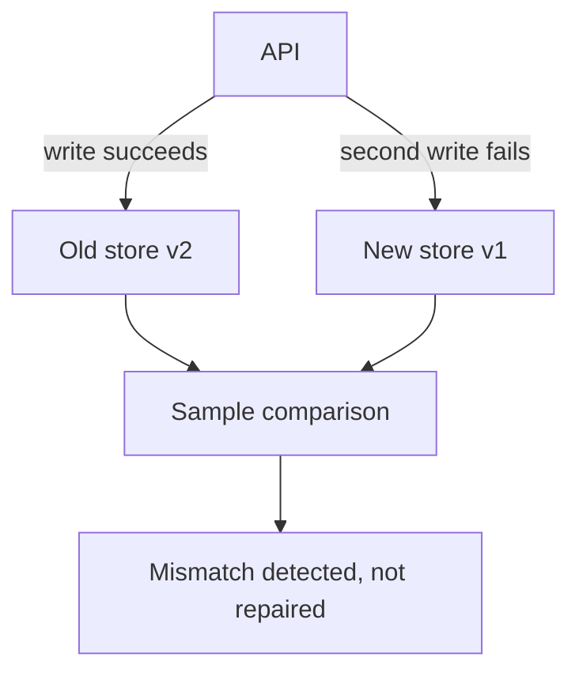
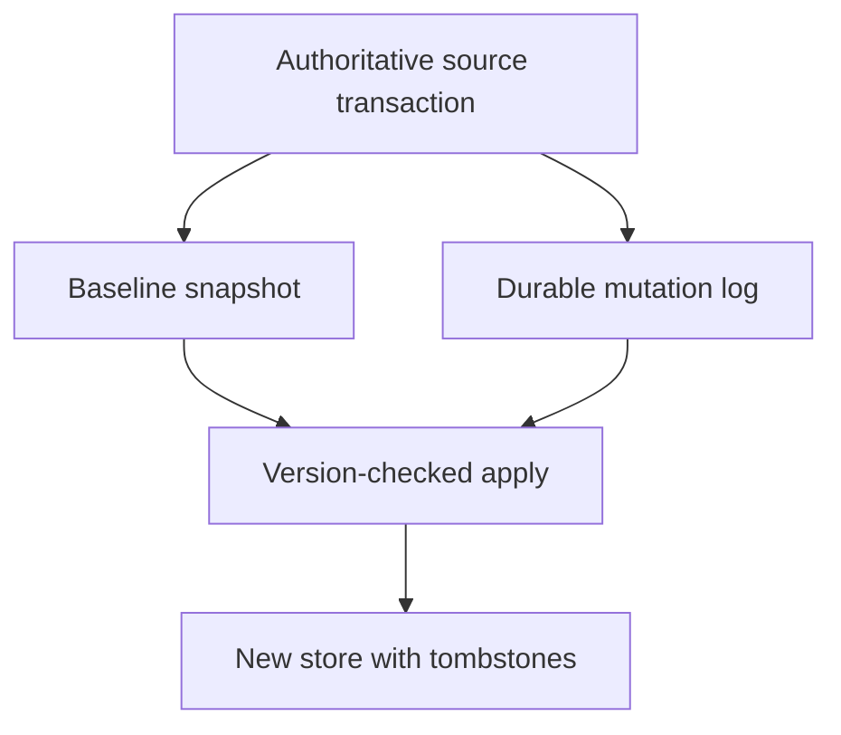
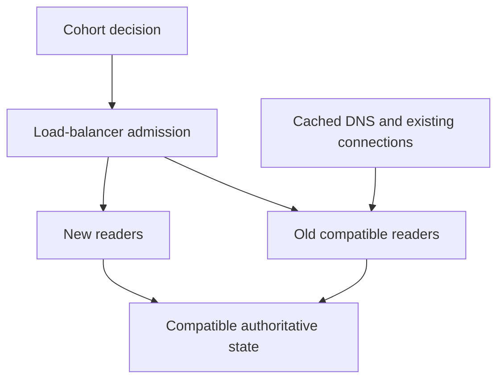

# 1. The migration you actually finish

[Curriculum](../../../README.md) · [Migrations and recovery](../README.md) · [Project index](../../../../indexes/projects.md)

## The reviewer's brief

> Move live bookmarks from an old schema to a new service while two teams keep shipping. An independent second write sometimes fails, backfill races updates, and deletion must not resurrect records. Which store is authoritative at every stage?

This is a **constructed practice brief**, not an attributed company question.
Prerequisites: [project index](../../../../indexes/projects.md) and [prerequisite lesson](../../05-technical-decisions/scope-and-leverage.md). This page is a build brief; it does not ship a runnable application. The build sequence below defines the implementation checkpoints.

| Case | Exact input or workload | Expected outcome |
|---|---|---|
| Small example | Old item 7 is v1; backfill reads v1; live update writes v2; delete writes tombstone v3; delayed backfill arrives last. | New projection ends at tombstone v3; v1 and v2 replays cannot resurrect it. |
| Boundary / failure | Old write succeeds but the new-store call fails before responding. | Acknowledged source mutation is durably captured for retry; a sampled mismatch alone is not repair. |
| Scope | A compatible read migration first; new-only writes require a separate rollback/authority decision. | Explain any additional assumption before implementing it. |

## See the first reviewable result

**First slice:** Read item 7 at v1 for backfill, update it live to v2, then delete it with tombstone v3. Deliver the old v1 backfill last. **Show:** old source, change log and target projection; target stays deleted at v3. Break the target write after the source acknowledges a change and demonstrate a *durable replay path*, not merely a mismatch alert.

<!-- project-expectation:start -->

## What you are expected to hand over

**The finished artifact:** A bounded replacement for a load-bearing part of your application, with a design decision, safe early testing of hard requirements, controlled adoption, a remaining-use inventory and a justified retirement boundary.

Bring a runnable slice or decision artifact, its normal output, and a captured
failure from the examples above. Include a check sensitive to the named fault,
the state owner, and the first operational limit. For each follow-up, recheck
the diagram and evidence; update them where the contract changes.

### How the review conversation gets harder

| Review gate | Changed requirement | Expected response |
|---|---|---|
| Baseline | Run the small example. | Demonstrate the observable outcome and identify which boundary owns it. |
| Failure | Source accepts a write but the target fails. | Retain durable replay and demonstrate repair without hiding the failure. |
| Senior | Snapshot v1 races live v2 and delete v3. | Apply increasing versions, retain tombstones for the replay horizon and verify checkpoint coverage. |
| Lead | Old clients remain for a quarter; DNS caches last 300 seconds. | Preserve data compatibility and distinguish routing, connection drain and rollback timing. |
| Evidence | A reviewer asks, “How do you know?” | Bring commands, fixtures and observed successful and interrupted traces. |
| Handoff | The author is unavailable. | Another engineer can run, observe, break and recover the declared fixture. |

Before implementation, state the invariant, the owner of each piece of state,
and what the user sees when the named dependency or assumption fails.

<!-- project-expectation:end -->

Before looking at the guidance, state the invariant and trace the example. In
interview practice, sketch independently, then reveal the reasoning. During
AI-assisted practice, verify each checkpoint before asking for the next change.

## Baseline and the failure to explain



Independent writes have a partial-failure window. Equality on sampled rows cannot
establish completeness, ordering or delete correctness.

<details>
<summary>Reveal the approach and decisions</summary>

Designate the old source as authority; commit mutations with an outbox or use an
equivalent durable change stream. Establish a baseline/high-water mark, replay
idempotently with versions/tombstones, then gate read cohorts on invariant checks
and compatible rollback. Newer state must not be overwritten or resurrected by
delayed work.

</details>

## Follow-up 1 · The backfill meets live writes

**Changed requirement:** How do you combine snapshot v1 with live v2 and delete v3
without losing either? Predict the failure before opening the design.

<details>
<summary>Expected reasoning and diagram</summary>

Apply only increasing versions and retain tombstones for the replay horizon.
Track checkpoint coverage, source counts/checksums and semantic mismatches.
A counter at zero needs a blind-spot analysis, including dynamic consumers and
delayed/offline writers.



</details>

## Follow-up 2 · A team cannot cut over

**Changed requirement:** One team must keep old clients for a quarter; DNS caches
last 300 seconds. What can rollback promise?

<details>
<summary>Expected reasoning and diagram</summary>

Preserve old/new data compatibility and choose explicit cohorts. Load-balancer
admission, DNS propagation and existing connection drain have different timing.
Keep partial gains measurable, but retire duplicated maintenance only after
consumers and replay obligations are gone.



</details>

## Evidence to bring to review

Build in three stops: reproduce the small case and baseline failure; implement
the protected boundary; then replay both changed requirements with captured
outputs. Record commands, fixtures and results in your implementation README.
A diagram is a prediction until those checks run.

**Senior expectation:** replay partial writes, stale backfill, deletes and a
documented rollback. **Additional lead scope:** resolve team deadlines, migration
budgets and retirement-only versus incremental value. This is practice evidence,
not a claim of interview readiness or multi-team delivery experience.

## Supplied mechanism practice

- [Live migration and rollback fixture](../labs/recovery-migration/migration.md) — its own commands, fixtures and validation limits.
- [Region loss and rebalancing exercise](../labs/recovery-migration/regions.md) — its own commands, fixtures and validation limits.

These verify specific boundaries; passing their reference tests does not implement
or assess the full project.

## Build and prompt sequence

Build a bounded replacement with a real compatibility obligation, rather than
choosing a project by size or by how intimidating it feels.

1. **Define authority.** State which store decides each operation, how an
   acknowledged mutation enters durable replay, and what is allowed to change.
2. **Test the difficult requirement safely.** Replay a hard consumer's ordering,
   defaults or deletion behavior in a controlled fixture. Choose live exposure
   separately for low impact and recoverability. A successful simple pilot is
   useful evidence, not proof about every consumer.
3. **Make adoption repeatable.** Supply a versioned adapter or migration command,
   checkpoints, explicit unsupported cases and a supported bridge for exceptions.
4. **Control convergence.** Block new unsupported uses of the old path and count
   remaining static and runtime callers. Reconcile discrepancies; neither grep
   nor a dashboard is automatically complete.
5. **Retire deliberately.** Exercise the promised reversal, cover scheduled and
   delayed callers, then remove obsolete dependencies after recovery and retention
   obligations are satisfied. Preserve evidence or backups still required.

```text
Given the old/new contracts and caller inventory:
identify the hardest compatibility requirement and a safe experiment for it.
Choose a bounded live pilot and explain its recovery boundary.
Show how every acknowledged change is replayed after target failure.
State what the remaining-use counter misses and how to check those blind spots.
Approval unchanged is allowed when the evidence supports the plan.
```

## Connect the mechanisms to AWS

**Capture and replay.** Use an outbox committed with the source mutation, or an
appropriate change stream whose capture and retention cover acknowledged writes.
DMS may support the source/target pair; it does not choose authority or make two
arbitrary writes atomic. Apply monotonic versions and retained tombstones in the
target. A scheduled repair Lambda still needs identity, ordering and checkpoints.

**Shadow reads.** Return the authoritative response and compare equivalent
versions in a bounded side path. Use separate admission/concurrency budgets and
include shared database pressure. Do not replay irreversible effects against a
live provider. A matching sample is evidence for that sample, not proof that every
row or side effect matches.

**Cutover.** Load-balancer admission, DNS caches and existing connections have
different boundaries. Routing is not data authority. Retain compatible readers
and writes throughout the supported transition. New-only writes need reverse
compatibility, reconciliation or an explicit forward-recovery policy before
claiming rollback is possible.

## Acceptance: traces, not ceremonies

| Check | Evidence that passes |
|---|---|
| Source accepts a write; target fails | Durable replay repairs it without inventing another business effect |
| Backfill v1 arrives after update v2 and delete v3 | Target remains deleted at v3 |
| Comparator sees an intentionally equal pair | Agreement is allowed; both paths demonstrably ran |
| Comparator sees a labeled faulty pair | It reports the relevant mismatch without normalizing it away |
| New unsupported old-path usage is added | The chosen admission check rejects it; supported legacy usage remains valid |
| Counter disagrees with source/runtime inspection | Blind spots are reconciled before retirement |
| New-only write occurs before rollback | Restore compatibility or follow the declared recovery policy; do not pretend DNS recovers data |

Migration value can arrive before retirement: a migrated cohort may gain capacity,
lower latency or simpler operations while coexistence still costs money. Track
those gains separately from eliminating the old system's obligations. The goal is
a justified transition and a completed declared scope, not an arbitrary deadline,
a mandatory surprise, or zero differences on live data regardless of semantics.

[Back to the ordered project index](../../../../indexes/projects.md)
