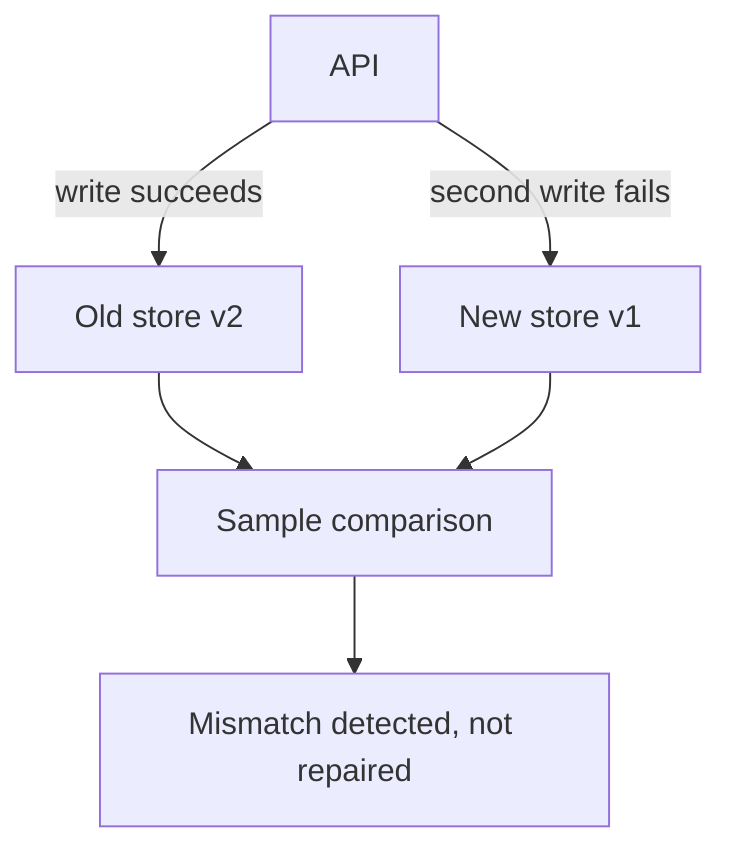
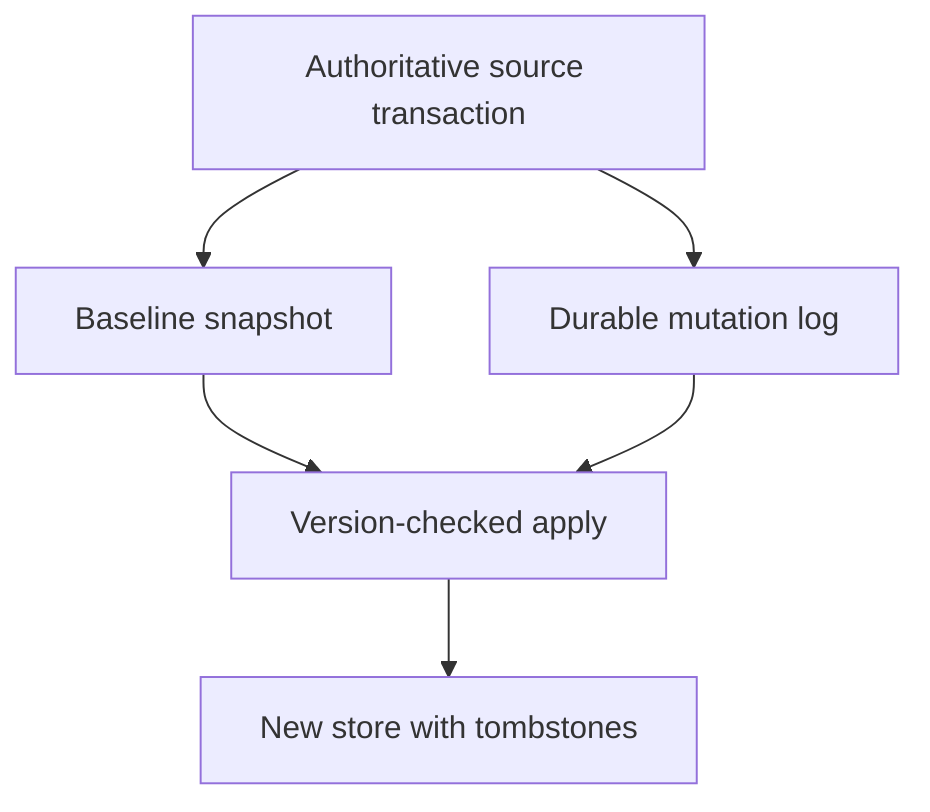
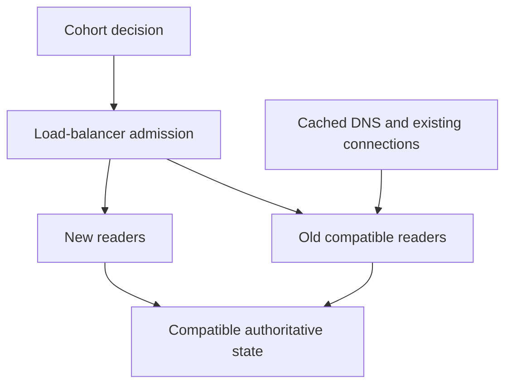

# 1. The migration you actually finish

[Curriculum](../../../README.md) · [Migrations and recovery](../README.md) · [Project index](../../../../indexes/projects.md)

## The reviewer's brief

> Move live bookmarks from an old schema to a new service while two teams keep shipping. An independent second write sometimes fails, backfill races updates, and deletion must not resurrect records. Which store is authoritative at every stage?

This is a **constructed practice brief**, not an attributed company question.
Prerequisites: [project index](../../../../indexes/projects.md) and [prerequisite lesson](../../05-technical-decisions/scope-and-leverage.md). This page is a build brief; it does not ship a runnable application. The original build and prompt sequence below defines the implementation checkpoints.

| Case | Exact input or workload | Expected outcome |
|---|---|---|
| Small example | Old item 7 is v1; backfill reads v1; live update writes v2; delete writes tombstone v3; delayed backfill arrives last. | New projection ends at tombstone v3; v1 and v2 replays cannot resurrect it. |
| Boundary / failure | Old write succeeds but the new-store call fails before responding. | Acknowledged source mutation is durably captured for retry; a sampled mismatch alone is not repair. |
| Scope | A compatible read migration first; new-only writes require a separate rollback/authority decision. | Explain any additional assumption before implementing it. |

## See the first reviewable result

**First slice:** Read item 7 at v1 for backfill, update it live to v2, then delete it with tombstone v3. Deliver the old v1 backfill last. **Show:** old source, change log and target projection; target stays deleted at v3. Break the target write after the source acknowledges a change and demonstrate a *durable replay path*, not merely a mismatch alert.

<!-- project-expectation:start -->

## What you are expected to hand over

**The finished artifact:** Replace something load-bearing in your operating application — how items are stored, how authentication works, the job runner — with the full apparatus around it: a design doc, the hardest case first, a mechanical block on new usage, a remaining-work counter, and the deletion.

Bring a runnable slice or decision artifact, its normal output, and a captured
failure from the table above. Include one check that turns red when the guarantee
breaks, the state owner, and the first operational limit. For each follow-up,
change the diagram **and** the evidence before claiming the design still works.

### How the review conversation gets harder

| Review gate | The interviewer changes | Expected response |
|---|---|---|
| Baseline | Run the small example from the table above. | Demonstrate the observable outcome end to end and identify which boundary owns it. |
| Failure | Reproduce the boundary/failure row above. | Show the failure before the fix, then prove the protected behavior without hiding the error. |
| Senior · The backfill meets live writes | How do you combine snapshot v1 with live v2 and delete v3 without losing either? Predict which boundary must change before opening the design. | Apply only increasing versions and retain tombstones for the replay horizon. Track checkpoint coverage, source counts/checksums and semantic mismatches. A counter at zero needs a blind-spot analysis, including dynamic consumers and delayed/offline writers. |
| Lead · A team cannot cut over | One team must keep old clients for a quarter; DNS caches last 300 seconds. What can rollback promise? State what evidence would make you reject your first design. | Preserve old/new data compatibility and choose explicit cohorts. Load-balancer admission, DNS propagation and existing connection drain have different timing. Keep partial gains measurable, but retire duplicated maintenance only after consumers and replay obligations are gone. |
| Evidence | A reviewer asks, “How do you know?” | Build in three stops: reproduce the small case and baseline failure; implement the protected boundary; then replay both changed requirements with captured outputs. |
| Handoff | The author is unavailable and the environment is new. | Another engineer can run, observe, break, and recover the artifact from the repository evidence. |

Before implementation, say the baseline invariant, the owner of each piece of
state, and what the user sees when the named dependency or assumption fails. That
five-minute explanation is part of the project: if it is vague, the build is not
ready to begin.

<!-- project-expectation:end -->

Before looking at the guidance, state the invariant in one sentence and trace the example. In interview practice, implement or sketch independently, then reveal the reasoning. During AI-assisted practice, use the prompts below and verify each checkpoint before the next request.

## Baseline and the failure to explain



Independent writes have a partial-failure window. Equality on sampled rows cannot establish completeness, ordering or delete correctness.

<details>
<summary>Reveal the approach and decisions</summary>

Designate the old source as authority; commit mutations with an outbox or use an equivalent durable change stream. Establish a baseline/high-water mark, replay idempotently with versions/tombstones, then gate read cohorts on invariant checks and compatible rollback. The invariant is that newer state cannot be overwritten or resurrected by delayed work.

</details>

## Follow-up 1 · The backfill meets live writes

**Changed requirement:** How do you combine snapshot v1 with live v2 and delete v3 without losing either? Predict which boundary must change before opening the design.

<details>
<summary>Expected reasoning and changed diagram</summary>

Apply only increasing versions and retain tombstones for the replay horizon. Track checkpoint coverage, source counts/checksums and semantic mismatches. A counter at zero needs a blind-spot analysis, including dynamic consumers and delayed/offline writers.



</details>

## Follow-up 2 · A team cannot cut over

**Changed requirement:** One team must keep old clients for a quarter; DNS caches last 300 seconds. What can rollback promise? State what evidence would make you reject your first design.

<details>
<summary>Expected reasoning and changed diagram</summary>

Preserve old/new data compatibility and choose explicit cohorts. Load-balancer admission, DNS propagation and existing connection drain have different timing. Keep partial gains measurable, but retire duplicated maintenance only after consumers and replay obligations are gone.



</details>

## Evidence to bring to review

Build in three stops: reproduce the small case and baseline failure; implement the protected boundary; then replay both changed requirements with captured outputs. Record commands, fixtures, and observed results in your implementation README. A diagram is a prediction until those checks run.

**Senior expectation:** Replay partial writes, stale backfill, deletes and a documented rollback. **Additional lead scope:** Resolve team deadlines, migration budgets and completion-only versus incremental value. Completion demonstrates practice evidence; it does not establish interview readiness or multi-team delivery experience.

## Supplied mechanism practice

- [Live migration and rollback fixture](../labs/recovery-migration/migration.md) — includes its own run command, fixtures and validation limits.
- [Region loss and rebalancing exercise](../labs/recovery-migration/regions.md) — includes its own run command, fixtures and validation limits.

These exercises verify specific boundaries; completing their reference tests does not implement or assess the full project.

## Build and prompt sequence

*You end up with a commit that deletes the old thing, and a counter at zero.*

**Build**

Replace something load-bearing in your operating application — how items are stored, how
authentication works, the job runner — with the full apparatus around it: a
design doc, the hardest case first, a mechanical block on new usage, a
remaining-work counter, and the deletion.

**The thought process**

The decision that makes or breaks this is **which thing to replace**. Too small
and it teaches nothing; too large and you will abandon it at 80% and prove the
point the expensive way. The test: it should be something where a mistake means
data in two shapes, and where you can feel yourself not wanting to start.

Then the ordering people get backwards: **hardest case first.** Migrating the
easy thing produces confidence and no information. What you want out of phase
one is the discovery that your plan was wrong about something, and the easy case
has no such discovery in it.

Third, the one that decides whether this converges: **you need a mechanical
block on new usage.** Without it you are migrating in one direction while new
code arrives in the other, and you will not know which is winning for months.

**How to organise the prompts**

```
Here is the thing I am replacing and everything that uses it.

Rank the users by how AWKWARD they are to migrate, not by size. I want
the one most likely to break my plan. For the top one, tell me what
specifically does not fit the new model.
```

```
Write the check that makes NEW usage of the old path fail the build. Not
a warning — a failure. Show me it failing on a deliberately added usage,
then passing when I remove it.
```

```
Write a query or script that counts remaining call sites on the old
path, that I can run any day.

Then tell me what it will MISS — dynamic usage, reflection, config,
anything it cannot see.
```

That second question is the one that stops you declaring victory on a blind
counter.

```
Now the design doc: context with a number in it, goals, at least three
non-goals, two alternatives argued at their strongest with a stated
reason each lost, the rollout, and the kill criteria.

Keep it under four pages.
```

**On AWS**

The mechanics depend on what you are migrating, but three patterns come up
constantly and are worth knowing by name.

**Authority plus durable change capture.** Keep one authoritative writer during
the initial migration. Commit its data and outbox in one transaction, or choose
a source change stream whose capture/retention semantics cover every acknowledged
mutation. Replay into the target with payload identity, monotonic row versions,
and tombstones. Establish the baseline/high-water mark before combining backfill
and live changes. Independent writes can fail halfway; a comparison is detection,
not atomicity or repair. A scheduled **Lambda** via **EventBridge** can measure
and drive idempotent repair, but its logic must define authority and ordering.

**Shadow reads.** Return the authoritative result, compare the target in a
bounded side path, and classify mismatches. Use values, versions and deletion
state as well as counts. Sampled agreement does not establish zero divergence;
run full invariant checks on the fixture and describe sampling blind spots.

**Cutover.** **DMS** can support appropriate database migrations, but does not
choose your compatibility or rollback contract. A read-replica promotion is a
specific database operation, not a generic replacement for schema migration.
A load balancer changes admission according to its rollout configuration;
**Route 53** weighted DNS changes are observed after resolver caches refresh,
and existing connections can remain on the old route. Keep both endpoints and
data representations compatible during the transition. Technical semantics
checked 2026-09-22: [Route 53 TTL](https://docs.aws.amazon.com/Route53/latest/DeveloperGuide/resource-record-sets-values-basic.html).

**Required fixture.** Inject source-success/target-failure, stale backfill after a
live update, delete followed by old replay, and rollback after a new-version write.
After repair there must be zero fixture invariant violations and no resurrection.
Write the last reversible point; new-only writes require reverse compatibility
or an explicit stop/fix-forward plan before they are admitted.

**What productionising it means**

The block on new usage is in CI, not in a message to yourself. The counter runs
on a schedule and the number is somewhere you see it. And the old code is
**gone** — not deprecated, not commented out, deleted, in a commit you can point
at. Retirement removes the old system’s ongoing operational and compatibility
cost; earlier cohorts can already gain performance or reliability.

**The learning**

Migration value can arrive incrementally: a migrated cohort may gain capacity
or simpler workflows before the last consumer moves. Full retirement unlocks
other benefits, such as removing duplicate operations and compatibility work.
Measure both, and use them to decide whether to finish, pause, or reduce scope;
completion is valuable, but “no benefit before the end” is not a general rule.

**How you would know it is wrong**

- Push a branch that adds new usage of the old path. The build must fail.
- Run the counter, then grep by hand. A discrepancy means the counter is the broken thing.
- Try deleting the old system early, in a branch. Find out what screams while it is cheap.
- Check both paths are not documented as current. A new reader will pick whichever they read first.
- Read your kill criteria back at the end. Were they observable? Would you have noticed?

**Stage it**

1. The design doc, with the non-goals and the two alternatives.
2. The hardest case migrated, and what it taught written down.
3. The mechanical block and the counter, both demonstrated.
4. The deletion, with the counter at zero.

---

[Back to the ordered project index](../../../../indexes/projects.md)
