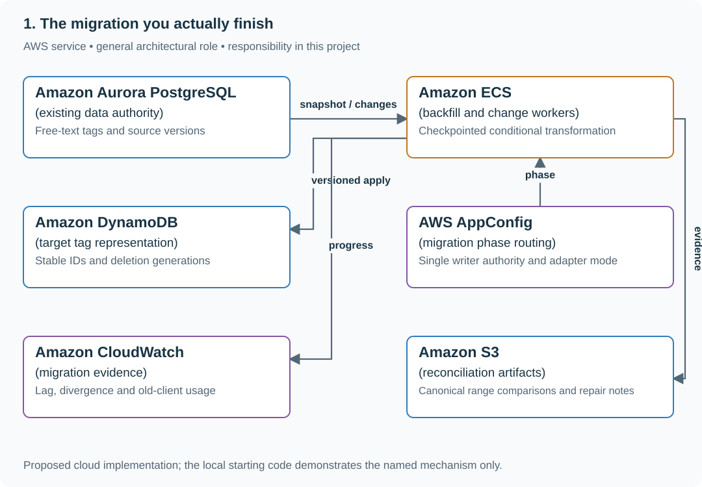

# Migrate tags across data, clients and workers

## Application background

A reading list originally stores tags as free text. Stable tag IDs will support renaming and consistent display, but old browsers, queued jobs and exports still consume the old representation.

This is a fictional engineering scenario. The workload figures later in the page are exercise assumptions, not measured production traffic.

## Your assignment

**Deliver:** A staged tag migration with compatibility adapters, resumable backfill, reconciliation and explicit retirement of old readers and writers.

Migrate a live reading-list application from free-text tags to stable tag IDs. Old browsers and queued title jobs still use the previous shape. The migration is complete only when data, readers, writers, background workers and rollback/repair paths all agree on the new contract.

**Required behavior:** One writer authority exists at each phase. Backfill and live changes carry source versions, including deletions. Old clients remain supported through an adapter until a documented retirement point; a progress percentage alone does not prove completion.

The required first milestone is a working local implementation of the behavior above. The numbered implementation steps define the scope; the cloud architecture is a later extension, not something the starter has already provisioned.

## Get the code and run the supplied example

The code is in the public [junior-to-staff repository](https://github.com/Soulful-Iris/junior-to-staff). Install Git and Python 3.12+. No AWS account or Python packages are required for this first run. If you already have a checkout, use it and skip cloning.

```bash
git clone https://github.com/Soulful-Iris/junior-to-staff.git
cd junior-to-staff
python3 examples/architecture-starts/the_migration_you_actually_finish.py
```

**Supplied file:** [`examples/architecture-starts/the_migration_you_actually_finish.py`](https://github.com/Soulful-Iris/junior-to-staff/blob/main/examples/architecture-starts/the_migration_you_actually_finish.py). You can also [read or download the source here](../../../../examples/architecture-starts/the_migration_you_actually_finish.py).

This program is a **mechanism demonstration**: it runs the small scenario in one process and prints the result. It is not an HTTP service, a complete application, or an AWS deployment. A successful run demonstrates this mechanism only; it does not establish the workload or failure guarantees of the application you will build.

**Example output from the supplied run:**

Generated IDs and timestamps may differ; compare the state transitions and outcomes.

```text
5 applied
6 applied
4 ignored stale
Final target: {'version': 6, 'tags': [], 'deleted': True}
```

### Run the application you will extend

The [reading-list API setup guide](../../../../examples/reading-list-starter/README.md) gives you a real local HTTP server, SQLite database, save/list/edit requests and controlled title success/timeout behavior. Start it in one terminal and send the documented `curl` requests from another. Read that setup before following the implementation steps below. The demo above isolates this lesson's mechanism; the server is where you integrate it.

For a first run, start this in **terminal 1** from the repository root:

```bash
python3 examples/reading-list-starter/app.py --db /tmp/reading-list.sqlite3
```

In **terminal 2**, save one bookmark with a controlled title timeout:

```bash
curl -i http://127.0.0.1:8080/bookmarks \
  -H 'X-Demo-User: alice' -H 'Content-Type: application/json' \
  -d '{"url":"https://example.com/docs","title_mode":"timeout"}'
```

Expect **201 Created**, a bookmark `id` and `title_status: "timeout"`. The URL is persisted despite the title failure. This is the supplied baseline; the assignment adds the behavior described above. The lookup is a fixture, so no external website is contacted. For members Bob or Ben in a scenario, use the starter's second demo identity `bob`; Alice or Ana corresponds to `alice`.

Work in your own branch or copy `examples/reading-list-starter/` to `work/the-migration-you-actually-finish/`. `app.py` exists in that directory; add the modules named below there as you separate HTTP, storage and background work. The server has demo membership, not production authentication.

## Local components and state to implement

This table names the records, interfaces or decision inputs for your deliverable. Unless a name is explicitly linked to supplied source above, it is something you create. Implement the local state transitions first, then connect the HTTP, storage or worker boundaries required by the steps.

| Record / module | Key or interface | Responsibility |
|---|---|---|
| migration_state | phase,checkpoint,writer_epoch | Resumable progress and authority. |
| link_tags_v2 | link_id,tag_ids,source_version,deleted | Target representation with monotonic apply. |
| consumer_inventory | owner,version,reads,writes,retirement | Evidence that old contracts can actually be removed. |

## Implement the assignment

### 1. Inventory before changing storage

List old/new API shapes, browser versions, worker payloads, exports and AI inputs. Name the owner of each reader/writer. Add a canonical tag mapping and compatibility serializer while the old path remains the write authority.

### 2. Implement resumable versioned backfill

Read a consistent source boundary and capture subsequent changes without a gap. Apply source versions conditionally, including tombstones. Persist checkpoints after durable target application so restarting a range is safe.

### 3. Reconcile and transfer authority

Compare canonical records at an aligned watermark, accounting for deletes and tag normalization. Fence old direct writers, apply the final change prefix, then move routing/epoch to the target. Shadow reads alone do not stop an old worker from writing stale data.

### 4. Finish retirement and repair

Observe supported-client usage, drain or adapt old queue payloads, update exports and remove old fields only after every required consumer is covered. Name the first target write that old code cannot interpret; after that point use a prepared reverse adapter or forward repair rather than a misleading rollback button.

## Demonstrate the completed local result

| Action | Expected visible result |
|---|---|
| Run the starting program | Version-4 backfill cannot resurrect the version-6 deletion. |
| Restart mid-range | The range replays safely and progress resumes. |
| Send an old worker payload after cutover | The adapter handles it or the old writer is explicitly rejected. |

**Handoff:** In your implementation README, include the start command, one successful operation, the failure case above and the resulting stored state or decision. State which dependencies are simulated. Someone with a fresh checkout should be able to reproduce this without your chat history.

## Workload assumptions and capacity decisions

These are constructed exercise assumptions. The stated workload is a design target; the local demonstration does not establish that throughput. Use the [estimation constants](../../../01-code/01-problem-solving/estimation-constants.md) to check units before choosing capacity.

| Input or objective | Calculation / consequence |
|---|---|
| One million links; 500 rows/s backfill assumption | About 33 minutes ideal copy time, excluding live changes, indexes and retries. |
| Live update version 5; deletion version 6; late backfill version 4 | Target must retain the version-6 tombstone. |
| Four consumer types | Browser, API, worker and AI/tagging input all belong in the compatibility inventory. |

## Map the local implementation to AWS

**Deployment status: local only.** Running the supplied command creates no AWS resources and configures no cloud connections. The diagram is a proposed deployment of the completed application. Each box needs either a deployed runtime, a provisioned service or an explicitly external dependency.

Read the diagram by following the arrows from the entry point: application code accepts the request or event, the state owner commits it, and any worker produces the later result. The table ties those roles to code and adapter work. Multiple boxes do not imply multiple Python files already exist.



The backfill worker transports and transforms data; source versions and writer fencing preserve correctness. Configuration routing is coordination metadata, not a substitute for rejecting stale writers.

| Local responsibility | Cloud destination and role | Implementation still required |
|---|---|---|
| Local records and transaction boundary | Amazon Aurora PostgreSQL: existing data authority | Write PostgreSQL schema/migrations and a database adapter; configure credentials, connection limits and recovery. |
| Application or worker process | Amazon ECS: backfill and change workers | Build a container and task definition; supply configuration, task roles and graceful shutdown behavior. |
| Local dictionary, SQLite records or state model | Amazon DynamoDB: target tag representation | Design partition/sort keys and write a storage adapter with conditional updates or transactions; Python state and SQL are not uploaded as a database. |
| Local versioned configuration | AWS AppConfig: migration phase routing | Publish validated configuration versions and consume them with bounded caching and rollback behavior. |
| Local counters, timestamps and diagnostic output | Amazon CloudWatch: migration evidence | Emit bounded metrics and logs, build the named operational view and configure retention and access. |
| Local file, object fixture or exported payload | Amazon S3: reconciliation artifacts | Implement upload/download and metadata adapters, scoped access, object naming, retention and incomplete-upload cleanup. |

### Provision resources, then connect the application

| Resource or boundary | Initial configuration and reason |
|---|---|
| Workers | Bound copy load so live requests retain capacity; checkpoints are durable and replay-safe. |
| Routing | Enforce writer authority at the write boundary, not only in cached client routing. |
| Completion | Record old consumer usage and schema compatibility; remove old resources only after the declared retirement conditions. |

Use one disposable AWS environment for the cloud exercise. Put the named resources in `infra/template.yaml` or your existing IaC tool, pass resource IDs through configuration, and scope each runtime role to its own tables, buckets and queues. The diagram is a design to implement; it is not a claim that these resources have been deployed. Record the commands you used to deploy and remove the exercise resources.

For concrete provisioning commands, configuration wiring and cleanup, use the [AWS foundation guide](../../../../examples/architecture-starts/infra/README.md). It includes a deployable table/queue/object-storage foundation and explains which application and service adapters you still implement.

A provisioned queue or table does not make the local program use it. Configure resource IDs in the deployed runtime, replace the local adapter, and replay the same successful and failing operation against that runtime. Record the deployed commit and observable result, then remove the disposable resources using your infrastructure tool.

## Extend the design after the baseline works


A previously unknown export tool still reads the old table. Add it to the inventory and decide whether to adapt or retire it; migration completion is about actual consumers, not only the services you remembered initially.

<details>
<summary>Additional design reasoning and requirement changes</summary>

## Follow-up 1 · The backfill meets live writes

**Changed requirement:** How do you combine snapshot v1 with live v2 and delete v3
without losing either? Predict the failure before opening the design.

<details>
<summary>Expected reasoning and diagram</summary>

Apply only increasing versions and retain tombstones for the replay horizon.
Track checkpoint coverage, source counts/checksums and semantic mismatches.
A counter at zero needs a blind-spot analysis, including dynamic consumers and
delayed/offline writers.

</details>

## Follow-up 2 · A team cannot cut over

**Changed requirement:** One team must keep old clients for a quarter; DNS caches
last 300 seconds. What can rollback promise?

<details>
<summary>Expected reasoning and diagram</summary>

Preserve old/new data compatibility and choose explicit cohorts. Load-balancer
admission, DNS propagation and existing connection drain have different timing.
Keep partial gains measurable, but retire duplicated maintenance only after
consumers and replay obligations are gone.

</details>

## Supplied mechanism practice

- [Live migration and rollback fixture](../labs/recovery-migration/migration.md) — its own commands, fixtures and validation limits.
- [Region loss and rebalancing exercise](../labs/recovery-migration/regions.md) — its own commands, fixtures and validation limits.

These verify specific boundaries; passing their reference tests does not implement
or assess the full project.

</details>
