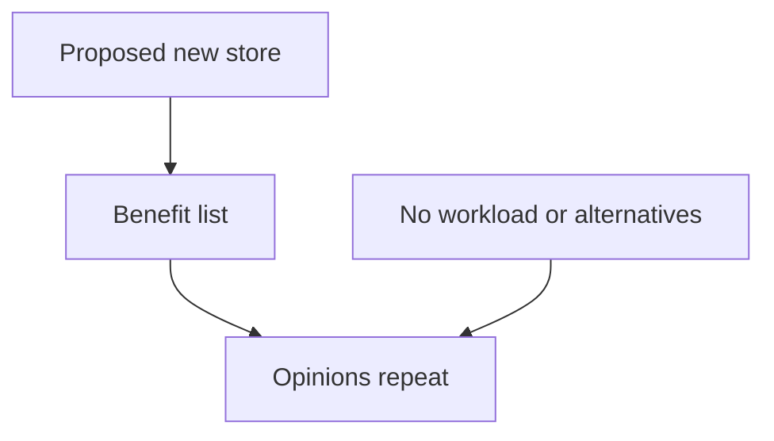
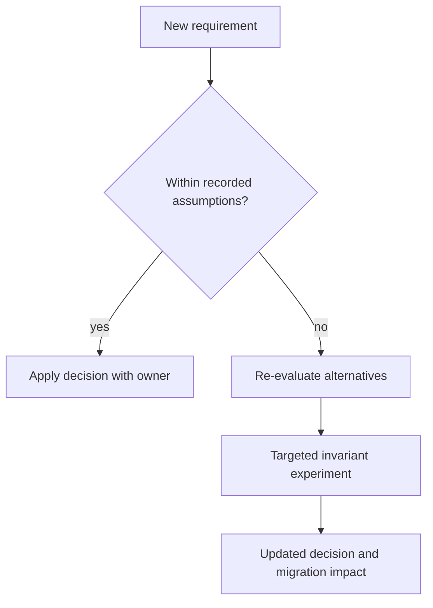
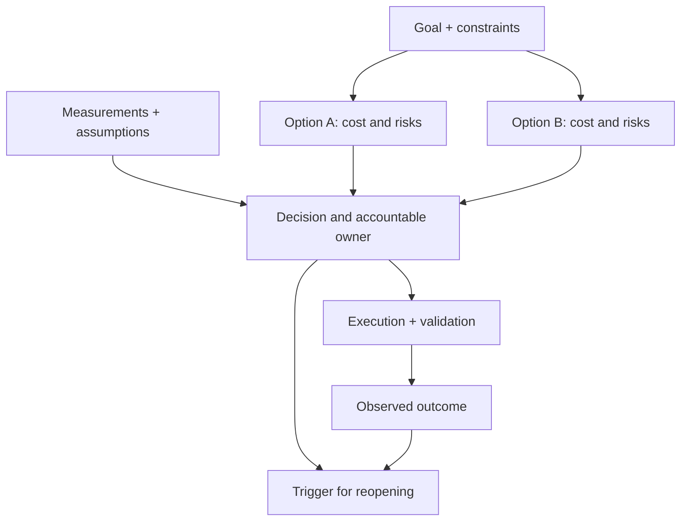

# Writing that decides

[Curriculum](../../README.md) · [Technical decisions and engineering effectiveness](README.md)

> Project connection · feeds **P5 (it changes safely)**

## At the whiteboard

> “A team proposes replacing a relational database with a key-value store.
> The document lists benefits but never names a workload or alternative. What
> would you need in order to approve, reject, or narrow the proposal?”

A decision document records why one choice fits a stated problem. Its expected
output is a decision with assumptions and an accountable next action.

| Constructed requirement | Evidence the document needs |
|---|---|
| Point reads must meet a measured latency target | Current baseline and representative test |
| Two related records must change together | Exact transaction or invariant boundary |
| Team has one month | Migration, operational, and rollback effort |
| Existing system may already suffice | Strongest version of the keep-and-improve alternative |



## Make the decision reviewable

1. State the current failure and non-goals. A technology preference is not the
   problem statement.
2. Compare the existing design, an incremental repair, and replacement against
   the same workload, correctness, operational, and delivery constraints.
3. Name the assumption with the largest consequence and a cheap test that could
   invalidate it. Put evidence beside the claim it supports.
4. Record decision owner, dissent, review date, rollout stages, and kill criteria.
   Approval is not evidence that the hypothesis remains true forever.

**Follow-up:** “A new access pattern needs a cross-record invariant.” Redraw the
decision path: does new evidence fit the decision's scope or trigger review?



Practice defending the rejected alternative first. Lead depth appears in how
the document coordinates affected teams and keeps compatibility work owned.

## Make the decision inspectable


A design document may include specifications and implementation detail. Its
**decision section** should let a reader reconstruct the problem, alternatives,
chosen contract and conditions for revisiting it. Documenting a past decision is
also useful; do not misrepresent it as a review performed before implementation.

| Section | Question it must answer |
|---|---|
| Context and goals | What fails now, for whom, under which measured workload? |
| Non-goals | What is outside this change, and what compatibility remains? |
| Options | Why keep, repair or replace the current design? |
| Decision | Who decides, based on what evidence and remaining assumptions? |
| Execution | Who owns migration, validation, support and recovery? |
| Revisit | What new fact, failure or review date reopens the decision? |

Non-goals define boundaries; they do not need to disappoint anyone. Include the
relevant alternatives, not a ceremonial quota. A product or technical constraint
may rule an option out quickly; explain that constraint.

## Worked review: the same contract, different proposals

Suppose checkout must commit an order and reserve its final inventory unit
together. A replacement proposal shows independent writes to two stores.

| Review input | Supported outcome |
|---|---|
| Independent writes, no reservation protocol or recovery | Request changes: demonstrate the crash boundary and enforce the invariant |
| A transaction enforces the invariant; workload, limits and recovery are documented | Approval unchanged can be correct; record the evidence inspected |
| A benchmark improves reads but omits checkout writes | Do not infer checkout safety or capacity from that benchmark |

A review's value is a justified decision, not the number of edited sentences or
people who changed their minds. Use **labeled faulty fixtures** to test whether a
review process detects defects. Do not invent defects in real proposals to make
the process look rigorous.

## A focused review prompt

```text
State the decision and its supported contract.
Compare the strongest plausible alternative under the same workload.
Locate the most consequential assumption and the evidence for it.
Recommend approval, changes, a bounded experiment, or rejection, with reasons.
Approval without edits is allowed. Do not fabricate evidence or objections.
```

A reviewer can be wrong too. Resolve disputed claims through a reproducer,
measurement or explicit product decision, rather than treating agreement as proof.

## P5 acceptance

Write the migration decision before expanding live exposure. A reader should be
able to state what changes, what remains supported, why the alternative lost,
who owns the next action and what stops rollout. Keep it as short as those
answers permit; move long schemas or measurements to linked evidence.

Revisit the record after the change. Compare predicted failures and costs with
what actually happened. New evidence may justify changing a well-founded earlier
decision; a document should preserve reasoning, not prohibit learning.

**Words to keep:** *non-goal* is a scope boundary; *alternative* is a plausible
competing choice; *approver* owns a decision; *kill criterion* stops expansion.

[Technical strategy](technical-strategy.md) · [Migration method](../04-migrations/migration-method.md)

## Draw it from memory · Keep alternatives and reversal conditions visible



**Redraw challenge:** Change one assumption. Can a reader tell whether it reverses the decision?
