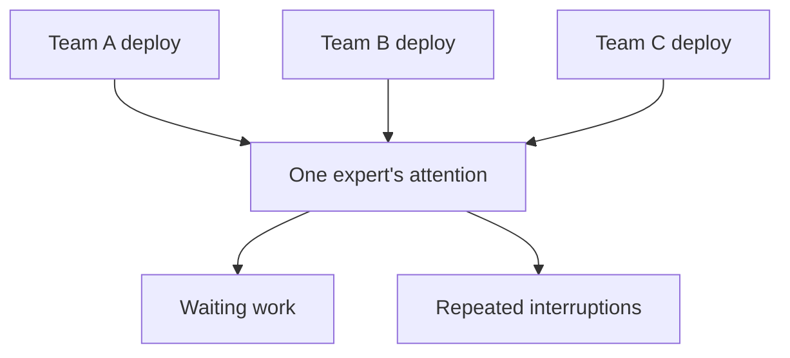
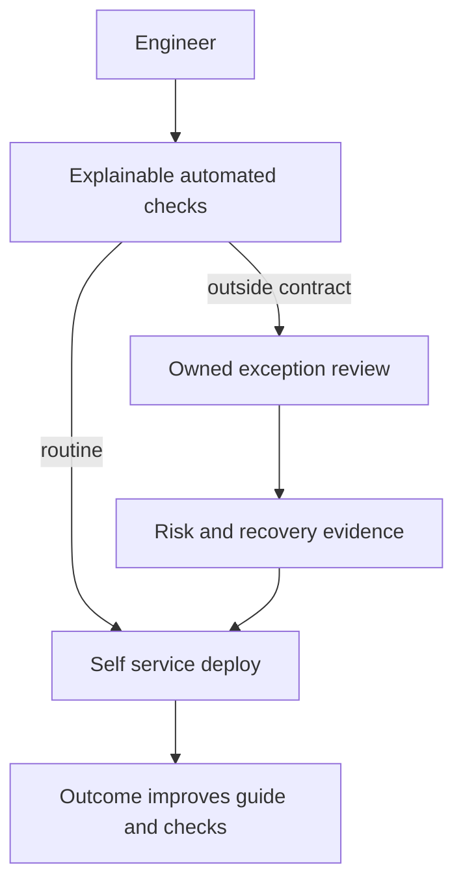
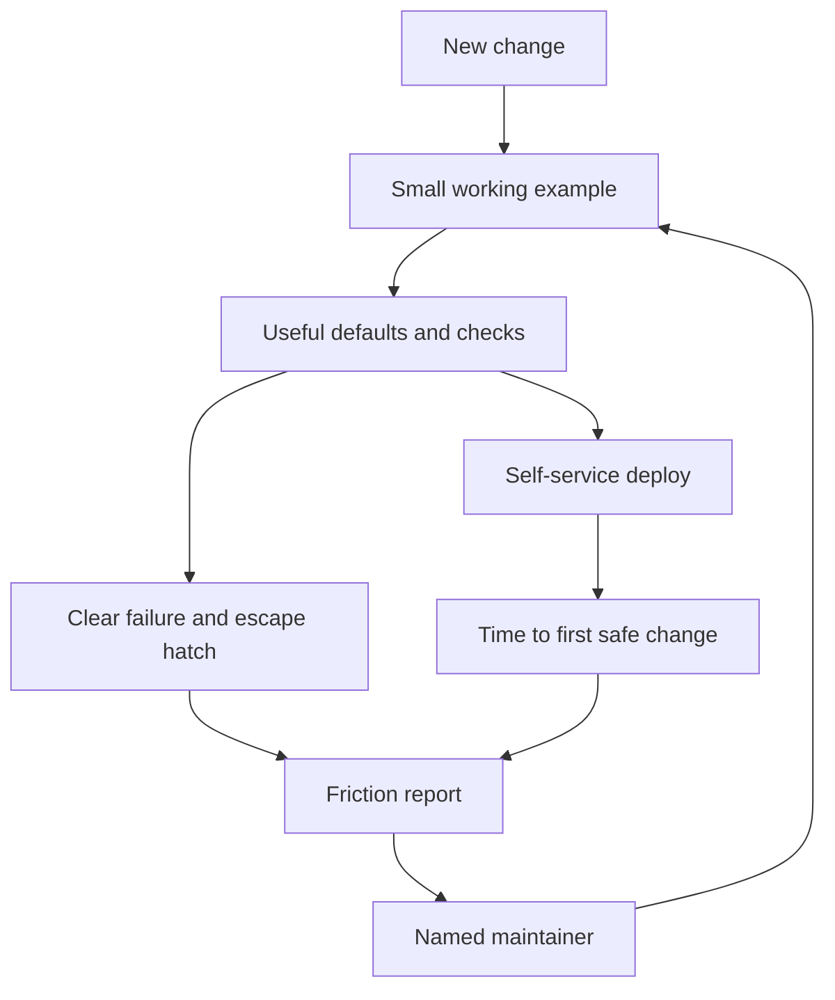

# Find delivery bottlenecks and reduce dependency on one engineer

Every routine deployment waits for Maya because she knows which commands are safe and how to recover a failed release. Six otherwise ready changes sit in a queue. An unusual schema migration also needs her judgment, but it should not be confused with the routine cases.

You will identify why work waits, choose a limited intervention and see whether another engineer can complete the task without private help. Faster output is useful only if the failure and support burden have not simply moved elsewhere.

[Curriculum](../../README.md) · [Technical decisions and engineering effectiveness](README.md)

> Project connection · feeds [Reading-list stage 5: evolve the running application](../../../projects/reading-list/stages/05-it-changes/README.md)

## Trace elapsed time before choosing an intervention

| Event in one constructed change | Time |
|---|---|
| Ready for review | Monday 09:00 |
| Build starts and finishes | Monday 09:01–09:03 |
| First substantive review | Tuesday 10:00 |
| Revision completed | Tuesday 10:20 |

The build took two minutes. The wait for review was about 25 elapsed hours. Those intervals overlap, so adding them as separate sequential costs would be misleading. For this change, speeding the build up by one minute cannot remove the dominant wait. Compare more changes before generalizing, including working-hour effects and the reason review could not begin.

## Reason through the changed situation

> “Every deployment waits for one engineer who understands the pipeline.
> They work harder each month, yet delivery gets slower. What would you change,
> and how would you tell whether the change actually helps the team?”

The goal is to remove a repeatable dependency on one person's attention while
preserving safe decisions. A new document alone does not establish that outcome.

| Teaching baseline | Expected evidence after intervention |
|---|---|
| Six routine deploys wait for one reviewer | Teammates can execute routine cases independently |
| One unusual schema change needs judgment | Escalation still reaches an accountable owner |
| Runbook exists | A new teammate completes a supervised rehearsal |
| Review queue shrinks | Failures, rework, and workload have not merely moved elsewhere |



## Remove the dependency deliberately

1. Categorize interruptions and observe a teammate attempting the work. Find
   which missing information or unsafe default forces escalation.
2. Automate mechanical checks and teach the decision boundary. Record why a
   check matters, the failure it detects, and when it is insufficient.
3. Let another engineer lead a real rehearsal while you observe. Repair the
   confusing step, not the learner's confidence.
4. Measure independent completions, recovery, and the exception workload. Keep
   ownership and support explicit so the improvement outlives its author.

**Follow-up:** “The self-service path refuses a legitimate unusual migration.”
Draw an exception with review evidence instead of removing the guardrail.



Senior evidence includes a reliable tool and clear explanation. Lead/staff
evidence includes adoption, reduced coordination cost, and peers who can make
the right decisions without you. Credit those peers' work explicitly.

## Make an outcome easier to achieve


A reusable tool, a maintained runbook, mentoring and a simpler design can all
help. Each also has adoption and upkeep costs. Measure the outcome instead of
assuming that review, code generation or any other stage is always the bottleneck.

## Find where time actually goes

Repository configuration shows **possible steps**, not how long people waited.
Use event timestamps: change ready for review, review requested, first substantive
response, CI queued/started/finished, revisions and merge. Define working-hours
versus elapsed-time treatment and keep overlapping activities separate.

| Constructed sample | CI service time | Human-review wait | Initial hypothesis |
|---|---:|---:|---|
| A | 2 minutes | 25 hours | Investigate review availability, batching and clarity |
| B | 40 minutes | 1 minute | Investigate machine work and queueing |
| C | Unknown | Unknown | Collect data; configuration alone cannot identify the bottleneck |

Do not add overlapping CI and review durations as if they were a serial critical
path. Compare similar changes before and after an intervention, and check error
rates, rework, abandonment and useful outcomes. Faster merges that move failures
into production are not an unqualified improvement.

## Choose an intervention that fits the cause

| Repeated problem | Possible intervention | Check for a new cost |
|---|---|---|
| Engineers repeat the same unsafe command | Safe default or bounded automation | Escape hatch, maintenance, false rejections |
| Only one person understands recovery | Paired drills and a tested runbook | Can another person recover without private help? |
| Reviewers cannot identify a change's contract | Smaller cohesive changes and explicit acceptance examples | Did coordination or integration work increase? |
| New engineers cannot find prerequisites | Short contextual guidance with working examples | Can a new reader use it without its author's assistance? |

Documentation is not automatically weaker than code. Some problems need a
human decision or an explanation; others benefit from an enforceable invariant.
Pick based on the failure, not a rule forbidding one medium.

## Support people without manufacturing a story

Mentorship can improve independent capability. Sponsorship can open an
opportunity. Evaluate either by real outcomes and effort; neither is a required
ritual for every exercise. Credit the recipient's work. Team delivery measures
are not reliable rankings of individual worth.

## Practice on P5

Choose one observed source of friction. State its baseline, your proposed
intervention, expected improvement and a counter-metric that could reveal harm.
Have another person use it when practical; otherwise label the result a solo
usability exercise. Record what remains unknown.

```text
Given these event timestamps and change categories:
separate service time, queue time, human wait and rework.
Identify missing data and overlapping stages.
Suggest one bounded experiment and how to detect displaced failure.
Do not assume the bottleneck is human review.
```

**Acceptance:** the diagnosis follows the supplied data, a machine-bound case is
not mislabeled human-bound, and absent timing evidence produces “unknown.” Show
whether adoption and outcomes changed, not only that a new tool exists.

[Choose the scope that removes repeated engineering work](scope-and-leverage.md) · [Testing strategy](../../02-applications/04-testing/testing-strategy.md)

## Draw it from memory · Make the paved road observable



**Redraw challenge:** How does an engineer succeed without privately asking the platform author for help?
