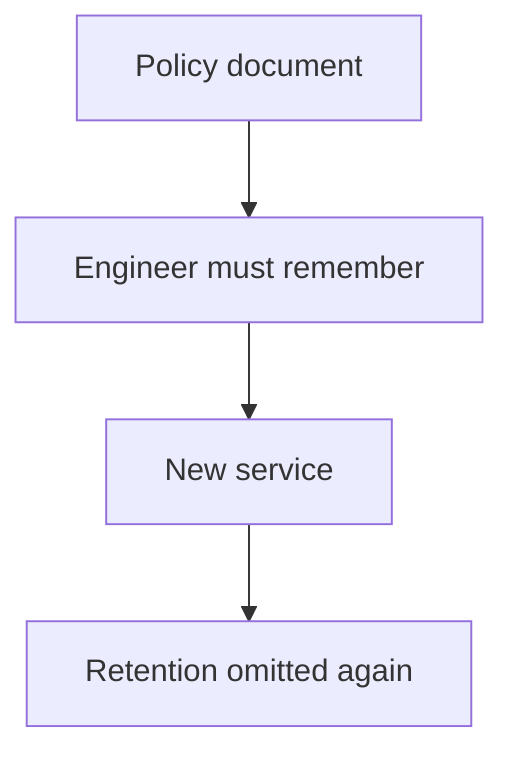
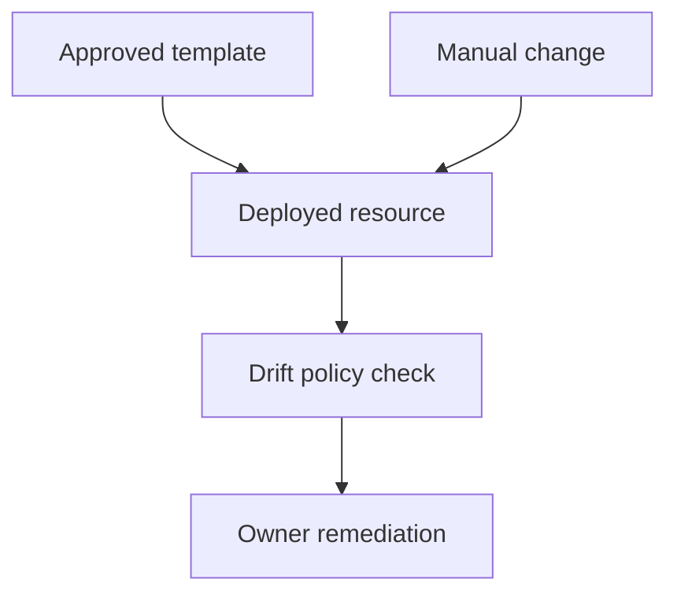
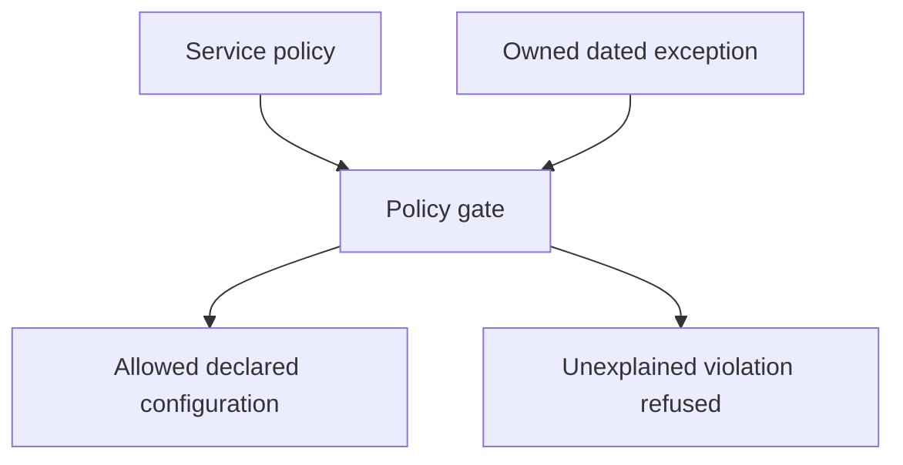

# 4. The paved road

[Curriculum](../../../README.md) · [Technical decisions and engineering effectiveness](../README.md) · [Project index](../../../../indexes/projects.md)

## The reviewer's brief

> Three services accidentally omit log retention when created from scratch. Engineers know the policy but forget it. Build a default or check and watch another engineer create a service. What evidence would show your tool removed work rather than adding a ritual?

This is a **constructed practice brief**, not an attributed company question.
Prerequisites: [project index](../../../../indexes/projects.md) and [prerequisite lesson](../scope-and-leverage.md). This page is a build brief; it does not ship a runnable application. The original build and prompt sequence below defines the implementation checkpoints.

| Case | Exact input or workload | Expected outcome |
|---|---|---|
| Small example | New service template sets 14-day retention; a fixture omits retention; another explicitly selects an approved 30-day policy. | Missing retention is rejected; approved values pass; the first-time user can discover the policy and override process. |
| Boundary / failure | The template is correct but an existing service drifts to indefinite retention. | A separate drift check finds it; a creation template does not enforce future state. |
| Scope | Toy retention values for the exercise, not legal or organization-wide retention advice. | Explain any additional assumption before implementing it. |

<!-- project-expectation:start -->

## What you are expected to hand over

**The finished artifact:** Find the thing you have explained more than twice — to yourself, in notes, or to a model — and make it structurally unavailable to get wrong. A default, a template, a generator, a failing check. Then hand it to another person and watch without helping.

Treat that sentence as a review contract, not an inspiration. A reviewable
submission contains all of the following:

- the narrow working slice or decision artifact described above, reproducible
  from a clean checkout with assumptions stated;
- captured proof of the normal flow **and** the boundary/failure row above;
- tests, probes, or metrics that can go red when the important guarantee breaks;
- a short decision record naming ownership, excluded scope, and the first
  operational limit; and
- a changed contract, diagram, and new evidence for each follow-up—not only a
  paragraph claiming the original design still works.

### How the review conversation gets harder

| Review gate | The interviewer changes | Expected response |
|---|---|---|
| Baseline | Run the small example from the table above. | Demonstrate the observable outcome end to end and identify which boundary owns it. |
| Failure | Reproduce the boundary/failure row above. | Show the failure before the fix, then prove the protected behavior without hiding the error. |
| Senior · An existing service drifts | A manual console edit removes retention after deployment. What notices? Predict which boundary must change before opening the design. | Compare actual resources against the declared policy on a schedule or relevant event. Report ownership and remediation; do not claim a repository template makes all future console changes impossible. |
| Lead · A legitimate exception exists | A security archive needs a different retention policy. Does your check block useful work? State what evidence would make you reject your first design. | Support a reviewed, expiring exception with reason and owner. Validate the exception itself; count repeated exceptions to discover whether the default is wrong. |
| Evidence | A reviewer asks, “How do you know?” | Build in three stops: reproduce the small case and baseline failure; implement the protected boundary; then replay both changed requirements with captured outputs. |
| Handoff | The author is unavailable and the environment is new. | Another engineer can run, observe, break, and recover the artifact from the repository evidence. |

Before implementation, say the baseline invariant, the owner of each piece of
state, and what the user sees when the named dependency or assumption fails. That
five-minute explanation is part of the project: if it is vague, the build is not
ready to begin.

<!-- project-expectation:end -->

Before looking at the guidance, state the invariant in one sentence and trace the example. In interview practice, implement or sketch independently, then reveal the reasoning. During AI-assisted practice, use the prompts below and verify each checkpoint before the next request.

## Baseline and the failure to explain



A remembered rule has an unreliable execution point. Default, enforcement and drift detection address different moments in a service’s life.

<details>
<summary>Reveal the approach and decisions</summary>

Pick a recurring harm, choose the strongest proportionate intervention, prove a negative fixture, then watch unaided first use. The invariant is a detectable violation at the appropriate boundary with a clear exception path. Record actual adoption and work removed.

</details>

## Follow-up 1 · An existing service drifts

**Changed requirement:** A manual console edit removes retention after deployment. What notices? Predict which boundary must change before opening the design.

<details>
<summary>Expected reasoning and changed diagram</summary>

Compare actual resources against the declared policy on a schedule or relevant event. Report ownership and remediation; do not claim a repository template makes all future console changes impossible.



</details>

## Follow-up 2 · A legitimate exception exists

**Changed requirement:** A security archive needs a different retention policy. Does your check block useful work? State what evidence would make you reject your first design.

<details>
<summary>Expected reasoning and changed diagram</summary>

Support a reviewed, expiring exception with reason and owner. Validate the exception itself; count repeated exceptions to discover whether the default is wrong.



</details>

## Evidence to bring to review

Build in three stops: reproduce the small case and baseline failure; implement the protected boundary; then replay both changed requirements with captured outputs. Record commands, fixtures, and observed results in your implementation README. A diagram is a prediction until those checks run.

**Senior expectation:** Show negative/positive fixtures and an unaided first-use observation. **Additional lead scope:** Own adoption, migration of existing services and the work the platform replaces. Completion demonstrates practice evidence; it does not establish interview readiness or multi-team delivery experience.

## Build and prompt sequence

*You end up with a mistake that nobody on your project can make silently again.*

**Build**

Find the thing you have explained more than twice — to yourself, in notes, or to
a model — and make it structurally unavailable to get wrong. A default, a
template, a generator, a failing check. Then hand it to another person and watch
without helping.

**The thought process**

The first decision is **what to pick**, and the signal is repetition. Anything
you have explained three times is either genuinely subtle or badly designed, and
the second is far more common.

Then the ranking that matters, from weakest to strongest: documentation, a
warning, a review checklist, a failing check, a default that is correct, and the
footgun deleted. **Prefer the strongest option you can afford**, because every
weaker one depends on somebody remembering at the exact moment they are busy.

Third, and this is the part that makes it a staff project rather than a tooling
one: **you have to watch somebody else use it.** Your own tool always feels
obvious to you. The information is entirely in the other person's confusion, and
you only get it by shutting up.

**How to organise the prompts**

```
Here is a mistake that keeps happening on this project: <describe it>.

Give me three ways to make it structurally impossible or loudly
obvious, ranked by how little anybody has to remember. Do not suggest
documentation or a guideline.
```

```
Implement the strongest one. Then show me it failing on a deliberately
wrong case, and passing on a correct one.
```

```
Now the first-run experience. Write down every step a person who has
never seen this has to take. Then tell me which of those steps I would
be tempted to leave undocumented because it is obvious to me.
```

**On AWS**

The AWS-shaped version of a paved road is worth knowing because it is what
platform teams actually build.

**Service Catalog** or a **CloudFormation**/**CDK** template that provisions the
approved shape — right tags, right logging, right permissions boundary — so the
easy path is the compliant one. **Config rules** to detect drift from it, and
**SCPs** or a permissions boundary to make the wrong thing impossible rather than
discouraged. That escalation — easy, then detected, then impossible — is exactly
the ranking above, in infrastructure.

At one-person scale the same idea is a repository template with the CI, the
`.env.example`, the health endpoint and the link checker already in it. Small,
and it means the boring correct things exist before you are tired.

**What productionising it means**

The wrong thing fails rather than warns. Somebody other than you used it, and you
asked what was annoying. And you wrote down what you stopped doing to make room —
if the answer is nothing, you added work rather than creating leverage.

**The learning**

A rule that depends on memory is a rule that fails on the busy day. Moving it
into a default or a failing check is the difference between being careful and
being unable to get it wrong — and the second one keeps working when you are not
there.

**How you would know it is wrong**

- Do the wrong thing on purpose. It must fail, not warn.
- Watch a person use it for the first time without helping. Every question is a documentation bug.
- Check adoption honestly. A paved road nobody walks solves a problem you had rather than theirs.
- Ask what you stopped doing.

**Stage it**

1. The repetition audit: what have you explained three times?
2. The three options, ranked, and the strongest one implemented.
3. It failing on a wrong case and passing on a right one.
4. Somebody else's first run, watched in silence, and what you changed after.

---

[Back to the ordered project index](../../../../indexes/projects.md)
