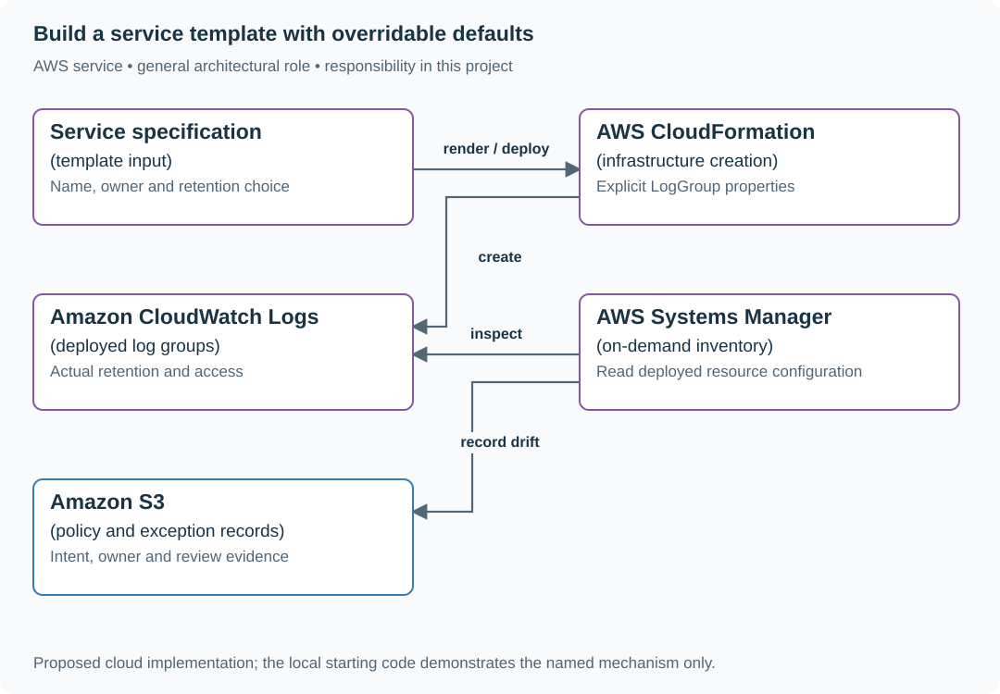

# Build a service template with overridable defaults

## Application background

Several teams create services with repeated infrastructure settings such as log retention. A template supplies a starting configuration; running services can later drift from it.

This is a fictional engineering scenario. The workload figures later in the page are exercise assumptions, not measured production traffic.

## Your assignment

**Deliver:** A service specification and generated configuration with a documented exception path, plus an inventory comparing intended and actual settings.

Build a service template for three teams that keep forgetting log retention. New services should get fourteen days by default, while an approved thirty-day case remains easy to express. Existing deployed services can drift after creation, so the template alone cannot establish current compliance with the team policy.

**Required behavior:** The generated infrastructure includes an explicit supported retention value and a discoverable override. The default reduces setup work. A separate on-demand inventory compares deployed values with intended policy; no recurring check or deployment gate is added to this repository.

The required first milestone is a working local implementation of the behavior above. The numbered implementation steps define the scope; the cloud architecture is a later extension, not something the starter has already provisioned.

## Get the code and run the supplied example

The code is in the public [junior-to-staff repository](https://github.com/Soulful-Iris/junior-to-staff). Install Git and Python 3.12+. No AWS account or Python packages are required for this first run. If you already have a checkout, use it and skip cloning.

```bash
git clone https://github.com/Soulful-Iris/junior-to-staff.git
cd junior-to-staff
python3 examples/architecture-starts/the_paved_road.py
```

**Supplied file:** [`examples/architecture-starts/the_paved_road.py`](https://github.com/Soulful-Iris/junior-to-staff/blob/main/examples/architecture-starts/the_paved_road.py). You can also [read or download the source here](../../../../examples/architecture-starts/the_paved_road.py).

This program is a **mechanism demonstration**: it runs the small scenario in one process and prints the result. It is not an HTTP service, a complete application, or an AWS deployment. A successful run demonstrates this mechanism only; it does not establish the workload or failure guarantees of the application you will build.

**Example output from the supplied run:**

Generated IDs and timestamps may differ; compare the state transitions and outcomes.

```text
{
  "Resources": {
    "Logs": {
      "Type": "AWS::Logs::LogGroup",
… (more output follows)
```

### Set up your implementation workspace

Create `work/the-paved-road/` in your checkout (or use a separate repository). Copy the supplied mechanism into that directory as `mechanism.py`, then extract its state transitions into functions you can call from your implementation. The record and module names below describe what you must implement; they are not a promise that files with those names already exist. Keep a `README.md` beside your implementation with its exact run commands and observed results.

## Local components and state to implement

This table names the records, interfaces or decision inputs for your deliverable. Unless a name is explicitly linked to supplied source above, it is something you create. Implement the local state transitions first, then connect the HTTP, storage or worker boundaries required by the steps.

| Record / module | Key or interface | Responsibility |
|---|---|---|
| service_spec | name,retention_days,owner | Small supported input contract with defaults. |
| rendered_template | AWS::Logs::LogGroup properties | Concrete configuration the user can inspect. |
| policy_exception | resource,reason,owner,expiry | Discoverable bounded alternative, not a hidden bypass. |

## Implement the assignment

### 1. Generate the concrete resource

Turn the starting function into a small template command that accepts service name, owner and optional retention. Output inspectable CloudFormation or your team’s existing IaC format. Keep defaults near the input documentation and show the exact generated resource.

### 2. Observe a first-time user

Ask another engineer to create a service from the instructions, noting unclear steps and manual edits. Measure completion time and missing information. Improve the interface where they stumble instead of adding a ritual acknowledgment that the policy exists.

### 3. Support legitimate variation

Accept the documented thirty-day setting and explain when a separately reviewed exception is needed. Record reason, owner and review date for an unusual archive. Do not force a security archive into the same retention policy as ordinary diagnostic logs.

### 4. Inspect deployed state on demand

Use describe-log-groups or the corresponding IaC drift view to compare actual RetentionInDays with intended values. An absent value means indefinite retention, not the fourteen-day default. Report the discrepancy with resource ownership and a concrete repair command; scheduling that inventory is a separate decision.

## Demonstrate the completed local result

| Action | Expected visible result |
|---|---|
| Run the starting program | The default template contains fourteen days; thirty days is accepted; missing deployed retention is flagged for review. |
| Create a service from the instructions | The engineer can find the default and override without reading generator internals. |
| Remove retention after creation | The next explicit inventory shows the discrepancy. |

**Handoff:** In your implementation README, include the start command, one successful operation, the failure case above and the resulting stored state or decision. State which dependencies are simulated. Someone with a fresh checkout should be able to reproduce this without your chat history.

## Workload assumptions and capacity decisions

These are constructed exercise assumptions. The stated workload is a design target; the local demonstration does not establish that throughput. Use the [estimation constants](../../../01-code/01-problem-solving/estimation-constants.md) to check units before choosing capacity.

| Input or objective | Calculation / consequence |
|---|---|
| Three services omit retention | Solve the repeated configuration task once and observe whether a new user can complete it unaided. |
| Default fourteen days; approved alternative thirty days | Keep policy choices explicit rather than enforcing one value for every workload. |
| Existing service with indefinite retention | Creation-time defaults cannot detect later console changes. |

## Map the local implementation to AWS

**Deployment status: local only.** Running the supplied command creates no AWS resources and configures no cloud connections. The diagram is a proposed deployment of the completed application. Each box needs either a deployed runtime, a provisioned service or an explicitly external dependency.

Read the diagram by following the arrows from the entry point: application code accepts the request or event, the state owner commits it, and any worker produces the later result. The table ties those roles to code and adapter work. Multiple boxes do not imply multiple Python files already exist.



CloudFormation supplies repeatable creation; current CloudWatch configuration is the deployed truth. An on-demand comparison reveals drift that a correct template cannot prevent by itself.

| Local responsibility | Cloud destination and role | Implementation still required |
|---|---|---|
| Local service configuration document | Service specification: template input | Version the input schema, document overrides and generate reviewable deployment configuration. |
| Local infrastructure configuration output | AWS CloudFormation: infrastructure creation | Translate the specification into actual resources and parameters, deploy a disposable stack and document its removal. |
| Local diagnostic events | Amazon CloudWatch Logs: deployed log groups | Emit structured JSON from the deployed runtime and configure log delivery, retention and query permissions. |
| Manual operational commands | AWS Systems Manager: on-demand inventory | Package scoped run procedures and record execution results; validate the recovery procedure against actual stored state. |
| Local file, object fixture or exported payload | Amazon S3: policy and exception records | Implement upload/download and metadata adapters, scoped access, object naming, retention and incomplete-upload cleanup. |

### Provision resources, then connect the application

| Resource or boundary | Initial configuration and reason |
|---|---|
| Template | Explicit RetentionInDays and ownership tags; no silent indefinite-retention fallback. |
| Inventory | Read-only resource inspection by default; a repair targets a named resource and desired value. |
| Exceptions | Preserve reason/owner/review date and distinguish diagnostic logs from retained evidence archives. |

For this decision project, provision resources only if a bounded implementation spike needs them; the diagram is also usable as the concrete option being evaluated. Put the named resources in `infra/template.yaml` or your existing IaC tool, pass resource IDs through configuration, and scope each runtime role to its own tables, buckets and queues. The diagram is a design to implement; it is not a claim that these resources have been deployed. Record the commands you used to deploy and remove the exercise resources.

For concrete provisioning commands, configuration wiring and cleanup, use the [AWS foundation guide](../../../../examples/architecture-starts/infra/README.md). It includes a deployable table/queue/object-storage foundation and explains which application and service adapters you still implement.

A provisioned queue or table does not make the local program use it. Configure resource IDs in the deployed runtime, replace the local adapter, and replay the same successful and failing operation against that runtime. Record the deployed commit and observable result, then remove the disposable resources using your infrastructure tool.

## Extend the design after the baseline works


The template grows fifty optional switches. Revisit the common service path and split genuinely different products instead of exposing every implementation detail as another mandatory choice.

<details>
<summary>Additional design reasoning and requirement changes</summary>

## Follow-up 1 · An existing service drifts

**Changed requirement:** A manual console edit removes retention after deployment. What notices? Predict which boundary must change before opening the design.

<details>
<summary>Expected reasoning and changed diagram</summary>

Compare actual resources against the declared policy on a schedule or relevant event. Report ownership and remediation; do not claim a repository template makes all future console changes impossible.

</details>

## Follow-up 2 · A legitimate exception exists

**Changed requirement:** A security archive needs a different retention policy. Does your check block useful work? State what evidence would make you reject your first design.

<details>
<summary>Expected reasoning and changed diagram</summary>

Support a reviewed, expiring exception with reason and owner. Validate the exception itself; count repeated exceptions to discover whether the default is wrong.

</details>

</details>
