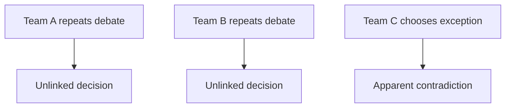
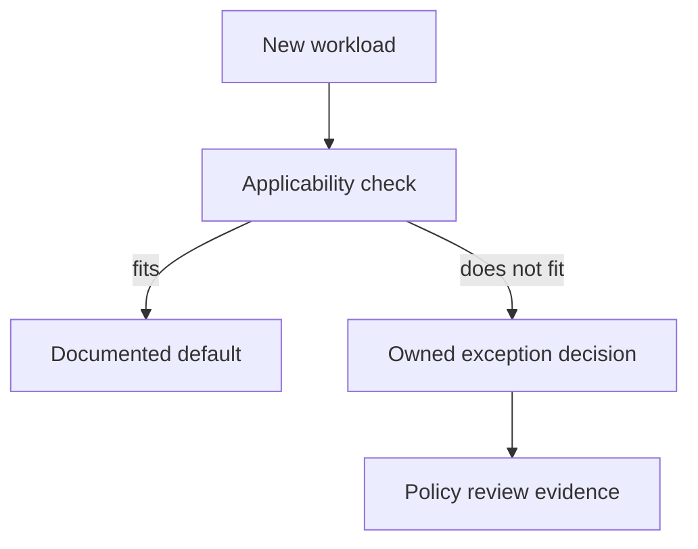
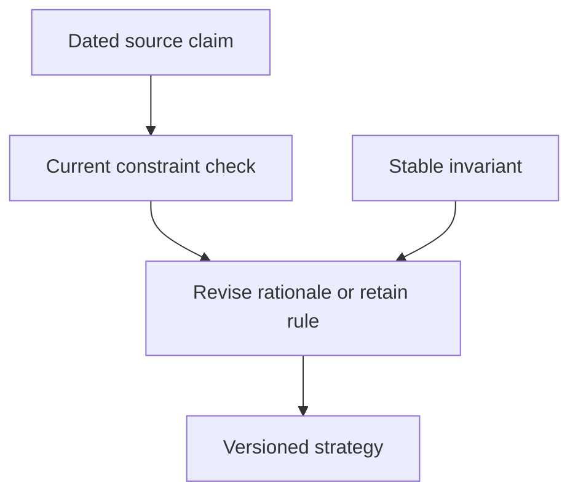

# 2. The strategy you found rather than invented

[Curriculum](../../../README.md) · [Technical decisions and engineering effectiveness](../README.md) · [Project index](../../../../indexes/projects.md)

## The reviewer's brief

> Three teams repeatedly debate whether to add another datastore. Two chose PostgreSQL and one chose a queue-backed projection. Write a half-page policy that shortens the next decision without ignoring the exception. Which shared constraint explains the choices?

This is a **constructed practice brief**, not an attributed company question.
Prerequisites: [project index](../../../../indexes/projects.md) and [prerequisite lesson](../scope-and-leverage.md). This page is a build brief; it does not ship a runnable application. The original build and prompt sequence below defines the implementation checkpoints.

| Case | Exact input or workload | Expected outcome |
|---|---|---|
| Small example | Five recorded decisions: three require transactions, one needs replayable events, one needs independent reporting. | Cite each decision; propose a default with explicit exceptions and name one cost paid by the default. |
| Boundary / failure | The memo says “always use one database” without addressing replay or isolation. | Reject the universal; the exceptional workload is a concrete counterexample. |
| Scope | An engineering strategy artifact, not a new service or invented industry consensus. | Explain any additional assumption before implementing it. |

## See the first reviewable result

**First slice:** Lay out five earlier decisions: three require transactions, one replayable events, one isolated reporting. Draft a default based on *those* records and list the two justified exceptions. **Show:** citations to the original decisions, one cost the default imposes, and a counterexample that defeats an overbroad “always one database” rule. Test the memo on the next decision.

<!-- project-expectation:start -->

## What you are expected to hand over

**The finished artifact:** Read back the real decisions you made across Acts 1 and 2. Find the one you kept making from scratch. Write it once, with its reasoning and its cost. Then cite it in the next decision and see whether the argument got shorter.

Bring a runnable slice or decision artifact, its normal output, and a captured
failure from the examples above. Include one check that turns red when the guarantee
breaks, the state owner, and the first operational limit. For each follow-up,
change the diagram **and** the evidence before claiming the design still works.

### How the review conversation gets harder

| Review gate | The interviewer changes | Expected response |
|---|---|---|
| Baseline | Run the small example from the cases above. | Demonstrate the observable outcome end to end and identify which boundary owns it. |
| Failure | Reproduce the boundary/failure case above. | Show the failure before the fix, then prove the protected behavior without hiding the error. |
| Senior · A new workload breaks the default | A team needs independently replayable events rather than current row state. Should enforcement block the design? Predict which boundary must change before opening the design. | Route it through a documented exception review that names the mismatched constraint and maintenance owner. Do not make a default impossible to challenge; measure exception recurrence as feedback on the policy. |
| Lead · The evidence expires | A managed service changes a relevant capability six months later. Which part of the memo changes? State what evidence would make you reject your first design. | Separate stable invariants from dated capability/cost observations. Reverify the source, update the constraint and rerun the decision comparison; a recent access date does not make an old study recent evidence. |
| Evidence | A reviewer asks, “How do you know?” | Build in three stops: reproduce the small case and baseline failure; implement the protected boundary; then replay both changed requirements with captured outputs. |
| Handoff | The author is unavailable and the environment is new. | Another engineer can run, observe, break, and recover the artifact from the repository evidence. |

Before implementation, say the baseline invariant, the owner of each piece of
state, and what the user sees when the named dependency or assumption fails. That
five-minute explanation is part of the project: if it is vague, the build is not
ready to begin.

<!-- project-expectation:end -->

Before looking at the guidance, state the invariant in one sentence and trace the example. In interview practice, implement or sketch independently, then reveal the reasoning. During AI-assisted practice, use the prompts below and verify each checkpoint before the next request.

## Baseline and the failure to explain



Repetition may reveal a useful default, but different constraints can legitimately produce different choices. Evidence must explain both commonality and exceptions.

<details>
<summary>Reveal the approach and decisions</summary>

Extract recurring constraints with citations, state the default and trade-off, then test it on the strongest counterexample. The invariant is that the rule retains its applicability conditions and revision trigger. A shorter discussion is useful only if the resulting decision remains sound.

</details>

## Follow-up 1 · A new workload breaks the default

**Changed requirement:** A team needs independently replayable events rather than current row state. Should enforcement block the design? Predict which boundary must change before opening the design.

<details>
<summary>Expected reasoning and changed diagram</summary>

Route it through a documented exception review that names the mismatched constraint and maintenance owner. Do not make a default impossible to challenge; measure exception recurrence as feedback on the policy.



</details>

## Follow-up 2 · The evidence expires

**Changed requirement:** A managed service changes a relevant capability six months later. Which part of the memo changes? State what evidence would make you reject your first design.

<details>
<summary>Expected reasoning and changed diagram</summary>

Separate stable invariants from dated capability/cost observations. Reverify the source, update the constraint and rerun the decision comparison; a recent access date does not make an old study recent evidence.



</details>

## Evidence to bring to review

Build in three stops: reproduce the small case and baseline failure; implement the protected boundary; then replay both changed requirements with captured outputs. Record commands, fixtures, and observed results in your implementation README. A diagram is a prediction until those checks run.

**Senior expectation:** Cite decisions and defend both the default’s cost and its exception. **Additional lead scope:** Assign policy owners and expiration reviews without erasing local context. Completion demonstrates practice evidence; it does not establish interview readiness or multi-team delivery experience.

## Build and prompt sequence

*You end up with half a page that stops an argument recurring.*

**Build**

Read back the real decisions you made across Acts 1 and 2. Find the one you kept
making from scratch. Write it once, with its reasoning and its cost. Then cite it
in the next decision and see whether the argument got shorter.

**The thought process**

The instinct is to write a strategy by thinking about the future. That produces
a document full of adjectives that nobody cites. **Strategy is synthesis, not
prophecy** — you find it by reading decisions you already made and noticing
which one keeps coming up unargued.

So the real first move is archaeology on your own work: what did you decide about
where errors surface, where validation lives, what gets retried, how state is
stored? If you decided the same thing three times without reference to the
previous two, that is your strategy, and it has been costing you the argument
each time.

Then the part that makes it real rather than decorative: **a strategy must have
a cost.** If it makes nothing worse, it has not chosen anything, and it is a
preference with formatting. Name what you are giving up.

**How to organise the prompts**

```
Here are five decisions I made across this project — in commits, docs
and code comments.

Find the decisions that appear in more than one of them, argued from
scratch each time. Where I reached DIFFERENT conclusions in different
places, show me that specifically. That is what I most want to see.
```

The inconsistencies are the gold. A decision made two different ways in two
places is exactly the cost a strategy removes.

```
Here is my draft strategy. Tell me what it makes WORSE, and for whom.

If your answer is that it makes nothing worse, then it is not a
strategy, it is a preference. Say that instead.
```

```
Rewrite this as plainly as possible. Remove every word that is there to
sound ambitious. Then tell me whether what remains is obvious — if it
is, say so, because that is the result I want and not a problem to fix.
```

**On AWS**

This project is mostly prose, and pretending otherwise would be the forced-AWS
paragraph the spec warns against. Two places it genuinely touches infrastructure:

**Where the decision is enforced.** A strategy that says "all configuration
comes from Parameter Store, never from a file" can be *checked* — a scheduled
**Config** rule, or simply a CI step that greps. A strategy nobody can violate
detectably is advisory.

**Where the document lives.** In the repository, beside the code it governs, so
it is reviewed when the code is. A strategy in a wiki drifts from the system
within a quarter, and nobody notices because the wiki does not fail a build.

**What productionising it means**

It is cited in at least one later decision, by you, and citing it visibly
shortened the argument. The rationale is written next to the ruling, so a future
reader can tell whether it still applies. And it has a stated cost, so a person
who disagrees can disagree with something specific.

**The learning**

The decisions you make repeatedly are the ones worth making once, and you cannot
find them by introspection — only by reading your own record. Which is also why
almost nobody has a real strategy: it requires going back through work you
consider finished.

**How you would know it is wrong**

- Search your own commits and docs for a citation of it after a month. Zero means it is not operating.
- Ask somebody to state it from memory after reading it once. If they cannot, it is not written clearly enough to follow.
- Try to violate it in a change and see whether anything objects.
- Check the rationale is still true. The constraint that produced it may have gone, and nobody will notice unless the reasoning is on the page.

**Stage it**

1. The archaeology: five real decisions, listed with where they were made.
2. The recurring one, and the places you resolved it differently.
3. Half a page: ruling, rationale, cost.
4. A later decision that cites it, and a note on whether the argument got shorter.

---

[Back to the ordered project index](../../../../indexes/projects.md)
