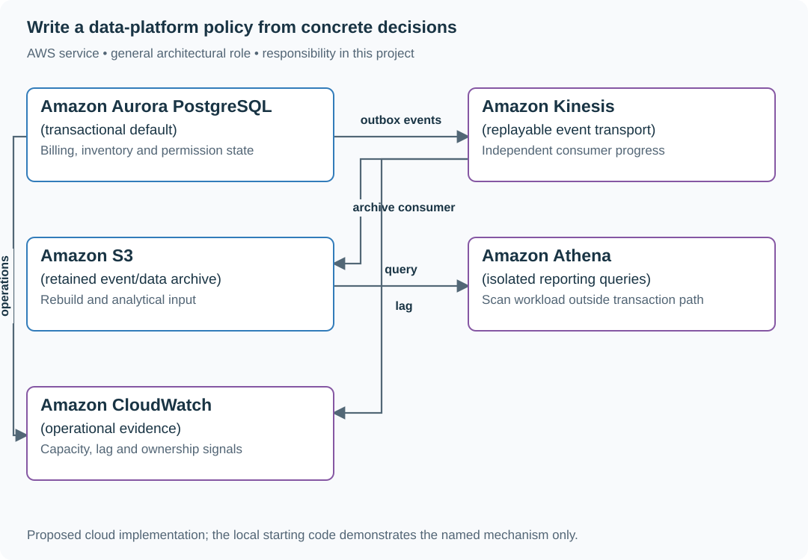

# Write a data-platform policy from concrete decisions

## Application background

An engineering organization repeatedly chooses storage for different products. Billing needs correct account updates, inventory needs safe reservations, event processing needs to replay input, and analytics needs to query large histories. One database choice is unlikely to suit all those needs equally.

Instead of beginning with a preferred technology, examine several real or clearly constructed decisions and record which requirements drove each one. Turn that evidence into a short policy that helps the next team make a choice.

A decision policy states which facts lead to which recommendation. Its value is helping a future decision, not making every team use the same service name.

## Your assignment

**Deliver:** Write a short data-platform decision policy grounded in five concrete cases. Show how it helps decide a new case, and identify when a team should request an exception.

**Required behavior:** The memo cites the constructed decision records, states the shared constraint, proposes a default and names evidence-based exceptions. It includes operating ownership and a review trigger when relevant capabilities or requirements change.

The primary deliverable is the report or operational procedure named above, backed by a reproducible local demonstration. Build the smallest supporting code needed to make that evidence visible.

## Get the code and run the supplied example

The code is in the public [junior-to-staff repository](https://github.com/Soulful-Iris/junior-to-staff). Install Git and Python 3.12+. No AWS account or Python packages are required for this first run. If you already have a checkout, use it and skip cloning.

```bash
git clone https://github.com/Soulful-Iris/junior-to-staff.git
cd junior-to-staff
python3 examples/architecture-starts/the_strategy_you_found_rather_than_invented.py
```

**Supplied file:** [`examples/architecture-starts/the_strategy_you_found_rather_than_invented.py`](https://github.com/Soulful-Iris/junior-to-staff/blob/main/examples/architecture-starts/the_strategy_you_found_rather_than_invented.py). You can also [read or download the source here](../../../../examples/architecture-starts/the_strategy_you_found_rather_than_invented.py).

This program is a **mechanism demonstration**: it runs the small scenario in one process and prints the result. It is not an HTTP service, a complete application, or an AWS deployment. A successful run demonstrates this mechanism only. It does not establish the workload or failure guarantees of the application you will build.

**Example output from the supplied run:**

Generated IDs and timestamps may differ. Compare the state transitions and outcomes.

```text
Constructed evidence: [('D1', 'transactions'), ('D2', 'transactions'), ('D3', 'transactions'), ('D4', 'replay'), ('D5', 'reporting')]
Shared requirements: {'transactions': 3, 'replay': 1, 'reporting': 1}
Default: transactional store; exceptions: independently replayable events and isolated analytics.
```

### Set up your implementation workspace

Create `work/the-strategy-you-found-rather-than-invented/` in your checkout (or use a separate repository). Copy the supplied mechanism into that directory as `mechanism.py`, then extract its state transitions into functions you can call from your implementation. The record and module names below describe what you must implement. They are not a promise that files with those names already exist. Keep a `README.md` beside your implementation with its exact run commands and observed results.

## Local components and state to implement

This table names the records, interfaces or decision inputs for your deliverable. Unless a name is explicitly linked to supplied source above, it is something you create. Implement the local state transitions first, then connect the HTTP, storage or worker boundaries required by the steps.

| Record / module | Key or interface | Responsibility |
|---|---|---|
| decision_record | id,workload,invariant,choice,cost,owner | Evidence for why a team chose its design. |
| policy_memo | default,exceptions,consequences,revisit_trigger | Half-page usable guidance for the next team. |
| exception_case | unmet_requirement,measured_gap,alternative | A concrete counterexample to the default. |

## Implement the assignment

### 1. Write the five source decisions

Record D1 billing atomicity, D2 inventory ownership, D3 permission/audit transaction, D4 independently replayable events and D5 reporting isolation. Include rejected options and their actual constraint, not merely which technology the team preferred.

### 2. Extract the common default

Propose PostgreSQL for transactional application records when its measured capacity and access patterns fit. Explain existing expertise, backup/restore and operating cost. A count of three choices is a clue. The transaction requirement is the reason.

### 3. State explicit exceptions

For D4, retain an event log/archive with replay identity and retention. For D5, isolate expensive analytical scans through a projection or warehouse. Name ownership, lag and reconciliation costs introduced by each exception.

### 4. Make the next decision easier

Give teams a short decision path: required guarantee, existing default fit, measured gap, smallest exception and owner. Revisit when a named workload or service capability changes. Avoid universal slogans that erase the concrete replay and reporting counterexamples.

## Demonstrate the completed local result

| Action | Expected visible result |
|---|---|
| Run the starting program | The five records remain visible and the exceptions survive the summary. |
| Propose always one database | D4 and D5 provide specific counterexamples to examine. |
| Change a relevant managed-service capability | Reopen the deciding constraint rather than defending an obsolete technology rule. |

**Handoff:** In your implementation README, include the start command, one successful operation, the failure case above and the resulting stored state or decision. State which dependencies are simulated. Someone with a fresh checkout should be able to reproduce this without your chat history.

## Workload assumptions and capacity decisions

These are constructed exercise assumptions. The stated workload is a design target. The local demonstration does not establish that throughput. Use the [estimation constants](../../../01-code/01-problem-solving/estimation-constants.md) to check units before choosing capacity.

| Input or objective | Calculation / consequence |
|---|---|
| Five decisions: three transactional, one replay, one reporting | The majority supports a transactional default, not a universal ban on other storage. |
| Three teams maintaining separate stacks assumption | Include on-call, backup, expertise and migration effort in the comparison. |
| Six-month capability review trigger | A product or service change can invalidate the old deciding constraint. Review is an explicit decision, not an installed recurring task. |

## Map the local implementation to AWS

**Deployment status: local only.** Running the supplied command creates no AWS resources and configures no cloud connections. The diagram is a proposed deployment of the completed application. Each box needs either a deployed runtime, a provisioned service or an explicitly external dependency.

Read the diagram by following the arrows from the entry point: application code accepts the request or event, the state owner commits it, and any worker produces the later result. The table ties those roles to code and adapter work. Multiple boxes do not imply multiple Python files already exist.



The diagram shows one concrete composition that preserves the three different workload needs. It is evidence for the policy discussion, not a claim that every team should deploy the whole stack.

| Local responsibility | Cloud destination and role | Implementation still required |
|---|---|---|
| Local records and transaction boundary | Amazon Aurora PostgreSQL: transactional default | Write PostgreSQL schema/migrations and a database adapter. Configure credentials, connection limits and recovery. |
| Local event sequence or input stream | Amazon Kinesis: replayable event transport | Implement producer/consumer adapters, partition keys, durable acceptance and checkpoint/replay behavior. |
| Local file, object fixture or exported payload | Amazon S3: retained event/data archive | Implement upload/download and metadata adapters, scoped access, object naming, retention and incomplete-upload cleanup. |
| Local investigation/report query | Amazon Athena: isolated reporting queries | Define an archive schema and catalog, query the exported data and constrain query access and cost. |
| Local counters, timestamps and diagnostic output | Amazon CloudWatch: operational evidence | Emit bounded metrics and logs, build the named operational view and configure retention and access. |

### Provision resources, then connect the application

| Resource or boundary | Initial configuration and reason |
|---|---|
| Decision scope | This is an evaluated option, not an instruction to provision every box. |
| Ownership | Name backup/restore, schema evolution and incident owners for each chosen service. |
| Revisit evidence | Verify current service capabilities from official documentation when they become a deciding factor. Preserve the original assumption and date. |

For this decision project, provision resources only if a bounded implementation spike needs them. The diagram is also usable as the concrete option being evaluated. Put the named resources in `infra/template.yaml` or your existing IaC tool, pass resource IDs through configuration, and scope each runtime role to its own tables, buckets and queues. The diagram is a design to implement. It is not a claim that these resources have been deployed. Record the commands you used to deploy and remove the exercise resources.

For concrete provisioning commands, configuration wiring and cleanup, use the [AWS foundation guide](../../../../examples/architecture-starts/infra/README.md). It includes a deployable table/queue/object-storage foundation and explains which application and service adapters you still implement.

A provisioned queue or table does not make the local program use it. Configure resource IDs in the deployed runtime, replace the local adapter, and replay the same successful and failing operation against that runtime. Record the deployed commit and observable result, then remove the disposable resources using your infrastructure tool.

## Extend the design after the baseline works


A team requests a new datastore for developer preference alone. Ask for the unmet guarantee or measured operating improvement, then compare it against the additional ownership burden without treating novelty as either sufficient or forbidden.

<details>
<summary>Follow-up scenarios and worked designs</summary>

## Follow-up 1 · A new workload breaks the default

**Changed requirement:** A team needs independently replayable events rather
than current row state. Should enforcement block the design?

<details>
<summary>Worked design and implementation</summary>

Route it through a documented exception review that names the mismatched
constraint and maintenance owner. Do not make a default impossible to challenge.
measure exception recurrence as feedback on the policy.

**Compare the actual contracts.** A current-state database answers “what is the balance now?” An independently replayable event log must also answer “what happened, in what order, and from which checkpoint can I rebuild?” Treat that requirement as a concrete reason to challenge the default.

Write an exception record naming replay retention, ordering scope, consumer independence and operating owner. Compare extending the default with adopting a stream. Deliver one replay example and the maintenance cost of the alternative. Keep the decision conditional on those requirements rather than turning every future team into an exception applicant.

</details>

## Follow-up 2 · The evidence expires

**Changed requirement:** A managed service changes a relevant capability six
months later. Which part of the memo changes?

<details>
<summary>Worked design and implementation</summary>

Separate stable invariants from dated capability/cost observations. Reverify the
source, update the constraint and rerun the decision comparison. A recent access
date does not make an old study recent evidence. A rule can also remain valid
when the changed capability does not affect its rationale.

**Keep a decision ledger with two kinds of entries.** Stable requirements include who may read data and how much acknowledged loss is acceptable. Dated observations include service capabilities, measured latency and prices. Only the affected observations need refreshing when a provider changes.

Use one changed capability to rerun the original option comparison. Record whether it changes the decision and why. Preserve the earlier record so a reader can understand what was reasonable at the time. A newer access date alone does not establish that the underlying evidence changed.

</details>

</details>
