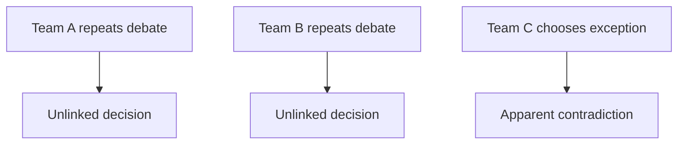
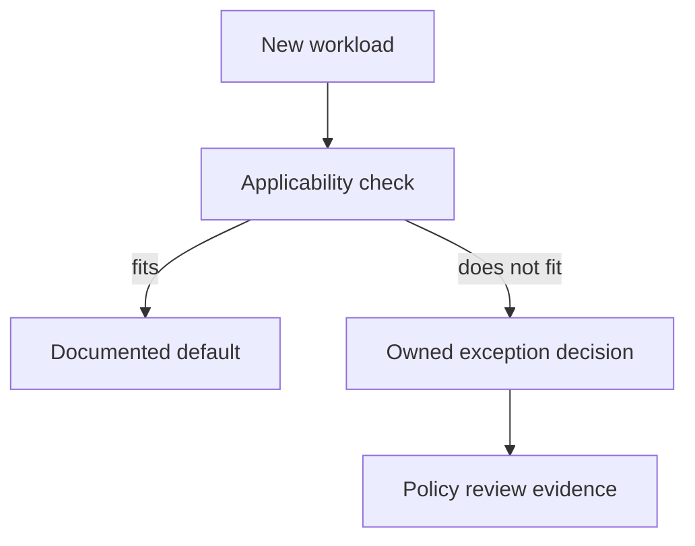
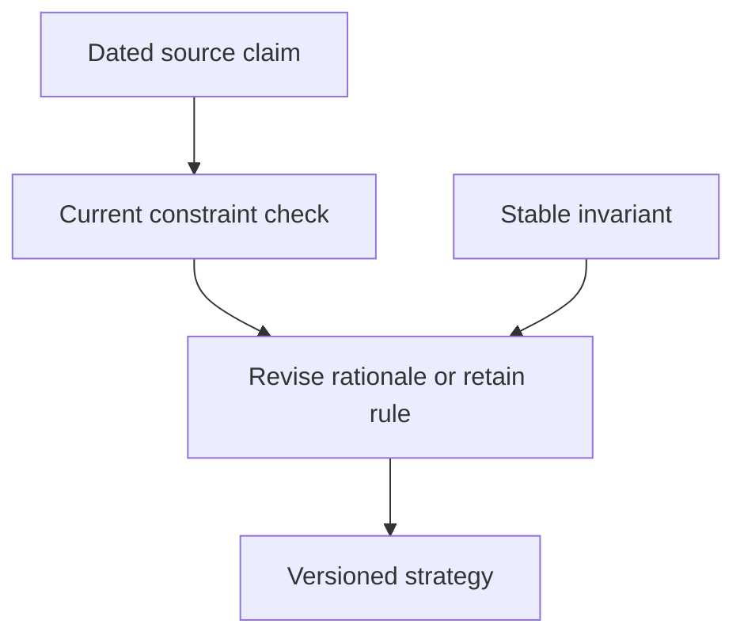

# 2. The strategy you found rather than invented

[Curriculum](../../../README.md) · [Technical decisions and engineering effectiveness](../README.md) · [Project index](../../../../indexes/projects.md)

## The reviewer's brief

> Three teams repeatedly debate whether to add another datastore. Two chose PostgreSQL and one chose a queue-backed projection. Write a half-page policy that shortens the next decision without ignoring the exception. Which shared constraint explains the choices?

This is a **constructed practice brief**, not an attributed company question.
Prerequisites: [project index](../../../../indexes/projects.md) and [prerequisite lesson](../scope-and-leverage.md). The output is a decision memo, not a runnable service.

| Case | Exact input or workload | Expected outcome |
|---|---|---|
| Small example | Five recorded decisions: three require transactions, one needs replayable events, one needs independent reporting. | Cite each decision; propose a default with explicit exceptions and account for its actual costs. |
| Boundary / failure | The memo says “always use one database” without addressing replay or isolation. | Reject the universal; the exceptional workload is a concrete counterexample. |
| Scope | An engineering strategy artifact, not a new service or invented industry consensus. | Explain any additional assumption before implementing it. |

## See the first reviewable result

**First slice:** Lay out five earlier decisions: three require transactions, one replayable events, one isolated reporting. Draft a default based on *those* records and list the two justified exceptions. Show the supporting decisions, adoption/support costs and a counterexample that defeats an overbroad “always one database” rule. Test the memo on the next decision.

<!-- project-expectation:start -->

## What you are expected to hand over

**The finished artifact:** A policy with a diagnosed constraint, supporting decisions, applicability, exceptions, owner and review trigger. In this exercise, synthesize earlier decisions from P1–P4; do not present that method as the only legitimate source of strategy.

Bring one case that fits and one that does not, explaining the difference.
For each follow-up, recheck the diagram and evidence rather than requiring an
edit when the existing policy already covers the new case.

### How the review conversation gets harder

| Review gate | Changed requirement | Expected response |
|---|---|---|
| Baseline | Apply the memo to the five decisions. | Explain the common requirement and each legitimate exception. |
| Failure | An overbroad default blocks replayable events. | Show the mismatch and repair the applicability boundary. |
| Senior | Another team needs independently replayable events. | Use an owned exception review; repeated exceptions are feedback on the policy. |
| Lead | A relevant capability changes six months later. | Recheck the dated observation and retain or revise the policy according to evidence. |
| Evidence | A reviewer asks for support. | Distinguish source facts, constructed workloads and assumptions. |
| Handoff | The author is absent. | Another engineer can apply the rule, find its owner and know when to reopen it. |

<!-- project-expectation:end -->

Before looking at the guidance, state the constraint and trace the example.
In interview practice, sketch independently; during AI-assisted practice, verify
the cited evidence rather than accepting a confident summary of it.

## Baseline and the failure to explain



Repetition may reveal a useful default, but different constraints can legitimately
produce different choices. Evidence must explain both commonality and exceptions.

<details>
<summary>Reveal the approach and decisions</summary>

Extract recurring constraints with citations, state the default and trade-off,
then test it on the strongest counterexample. The rule must retain its
applicability conditions and revision trigger. A shorter discussion is useful
only if the resulting decision remains sound.

</details>

## Follow-up 1 · A new workload breaks the default

**Changed requirement:** A team needs independently replayable events rather
than current row state. Should enforcement block the design?

<details>
<summary>Expected reasoning and diagram</summary>

Route it through a documented exception review that names the mismatched
constraint and maintenance owner. Do not make a default impossible to challenge;
measure exception recurrence as feedback on the policy.



</details>

## Follow-up 2 · The evidence expires

**Changed requirement:** A managed service changes a relevant capability six
months later. Which part of the memo changes?

<details>
<summary>Expected reasoning and diagram</summary>

Separate stable invariants from dated capability/cost observations. Reverify the
source, update the constraint and rerun the decision comparison. A recent access
date does not make an old study recent evidence. A rule can also remain valid
when the changed capability does not affect its rationale.



</details>

## Evidence to bring to review

Bring the scoped policy, citations to its inputs and decisions for the baseline
and both follow-ups. **Senior expectation:** defend the default and exceptions.
**Additional lead scope:** assign owners and review triggers without erasing local
context. This is practice evidence, not a claim of interview readiness or real
multi-team delivery experience.

## Build and prompt sequence

This assignment practices **bottom-up synthesis**, one strategy method rather
than the only source of technical direction. Use the five example decisions as
fixtures, or real decisions with clear provenance. A justified future requirement
can also motivate a policy before a pattern of past documents exists.

1. Extract each decision's constraint, evidence and owner.
2. Separate repeated needs from legitimate differences. Inconsistent choices
   are not necessarily mistakes when the workloads differ.
3. Write a short policy with scope, rationale, adoption/support cost, exceptions
   and a review trigger. Do not invent a harmed stakeholder to prove a trade-off.
4. Apply it to a new decision and a valid exception. Record whether it improved
   clarity and correctness, not only whether discussion became shorter.

```text
Given these decisions, cite the constraints that justify a shared default.
Identify legitimate exceptions and missing evidence.
State the smallest coherent policy, its owner and a reason to revisit it.
A clean proposal may be approved unchanged.
```

**AWS connection:** a policy may choose Parameter Store for a specific runtime
configuration need, but a blanket ban on files is not automatically sound. Name
the threat or operational requirement and test the chosen controls. A grep or a
Config finding observes only its declared scope; it does not prove every runtime
followed the policy or that a future write was prevented.

Keep the decision discoverable and reviewed with the affected system. A
repository or a wiki can work when ownership and update triggers are explicit;
neither location guarantees freshness. The final artifact is a decision memo,
not a new service or a claim about universal company practice.

[Back to the ordered project index](../../../../indexes/projects.md)
