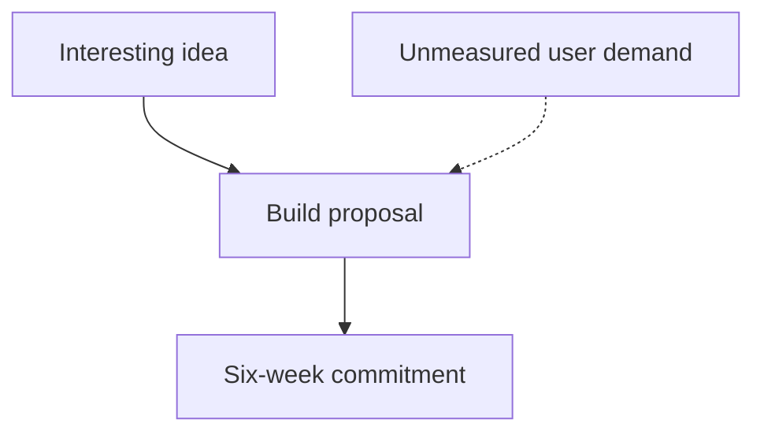
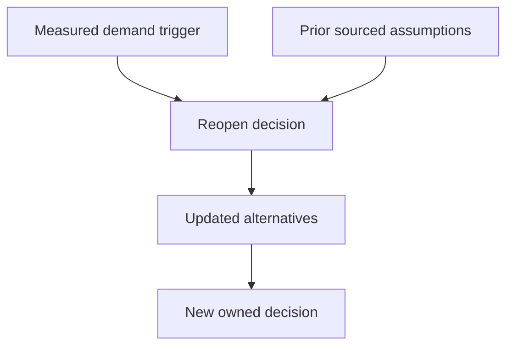
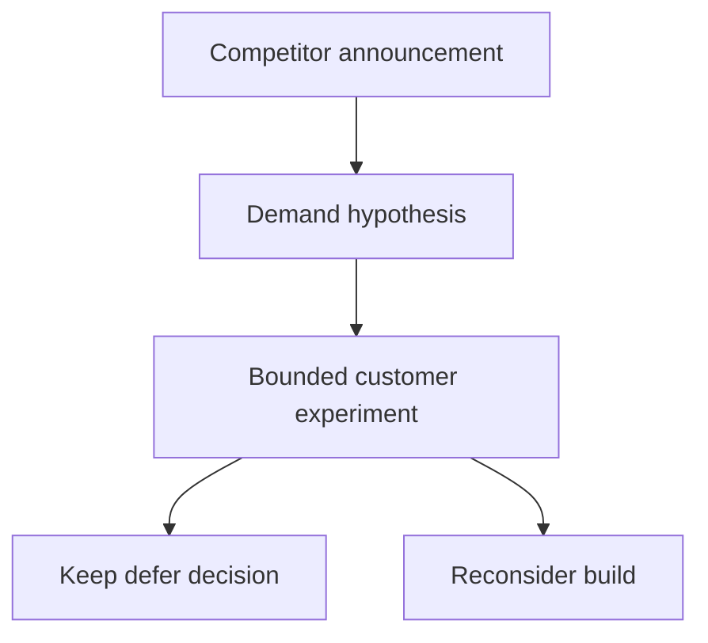

# 5. The thing you decided not to build

[Curriculum](../../../README.md) · [Technical decisions and engineering effectiveness](../README.md) · [Project index](../../../../indexes/projects.md)

## The reviewer's brief

> Your team wants to build a custom export scheduler. The pain may be solved by a smaller script or an existing service. Investigate first, then make a decision another engineer can disagree with specifically. What would change your mind?

This is a **constructed practice brief**, not an attributed company question.
Prerequisites: [project index](../../../../indexes/projects.md) and [prerequisite lesson](../scope-and-leverage.md). This page is a build brief; it does not ship a runnable application. The original build and prompt sequence below defines the implementation checkpoints.

| Case | Exact input or workload | Expected outcome |
|---|---|---|
| Small example | Toy estimates: custom system 6 engineer-weeks plus 1 day/month; simple script 3 days; observed demand 2 exports/month. | Compare the same required behaviors and maintenance horizon; a plausible decision is defer custom build and measure demand with the script. |
| Boundary / failure | Estimate excludes on-call support or assumes unverified service pricing. | Label the uncertainty and run a bounded spike/source check before treating cost as decisive. |
| Scope | Constructed numbers; independently verify real prices, capabilities and user demand for a real decision. | Explain any additional assumption before implementing it. |

Before looking at the guidance, state the invariant in one sentence and trace the example. In interview practice, implement or sketch independently, then reveal the reasoning. During AI-assisted practice, use the prompts below and verify each checkpoint before the next request.

## Baseline and the failure to explain



The baseline commits before comparing alternatives or identifying the cost of either mistake. A forced no despite contrary evidence would also be poor judgment.

<details>
<summary>Reveal the approach and decisions</summary>

State user need, compare buy/build/smaller intervention, and separate verified facts from estimates. The invariant is a decision traceable to assumptions with an observable reversal trigger. Preserve the strongest case for building and the cost of delaying it.

</details>

## Follow-up 1 · Demand changes

**Changed requirement:** Three teams now each need daily exports with an audit trail. Does the old no remain binding? Predict which boundary must change before opening the design.

<details>
<summary>Expected reasoning and changed diagram</summary>

Reopen because the specified trigger occurred. Reuse the original analysis, update workload and support costs, and evaluate whether the smaller intervention still meets the contract.



</details>

## Follow-up 2 · A competitor launches it

**Changed requirement:** A competitor advertises a similar feature, but your customers have not asked. Is that enough? State what evidence would make you reject your first design.

<details>
<summary>Expected reasoning and changed diagram</summary>

Treat it as new evidence to investigate, not proof of your demand. Seek user behavior and contract gaps, then bound a reversible experiment. State which downside cannot be recovered if you wait.



</details>

## Evidence to bring to review

Build in three stops: reproduce the small case and baseline failure; implement the protected boundary; then replay both changed requirements with captured outputs. Record commands, fixtures, and observed results in your implementation README. A diagram is a prediction until those checks run.

**Senior expectation:** Present sourced comparisons and one measurable reversal trigger. **Additional lead scope:** Own opportunity cost and explicitly accept the cost of being wrong. Completion demonstrates practice evidence; it does not establish interview readiness or multi-team delivery experience.

## Build and prompt sequence

*You end up with a written no that somebody could disagree with specifically.*

**Build**

Take a feature or a project you genuinely want to build. Investigate it properly.
Then write the decision **not** to — with the alternatives argued at their
strongest, the evidence, the cost of being wrong, and the one sentence that would
change your mind.

**The thought process**

This is the project people find hardest and it is the one that most resembles the
job. The staff skill is not building — it is **deciding what not to build**, and
doing it in a way that stops the question being reopened every quarter by
somebody who does not know it was asked.

The decision that makes it honest is **doing the investigation first.** A no
written from a feeling is an opinion. A no written after you have costed it,
found the existing options, and worked out who it would serve is a decision, and
it holds.

Then the part that separates it from a shrug: **name the sentence that would
change it.** "We are not building this" is a position. "We are not building this
until X, and here is what X looks like" is a decision with a trigger, and it is
the difference between a closed question and a buried one.

**How to organise the prompts**

```
I am considering building <the thing>. Before any opinion: what already
exists that does this, who pays for it, and what does it cost?

Be specific about whether anything you tell me is verified or inferred.
```

```
Make the strongest possible case FOR building it. Assume the person
arguing is better informed than me. What would they know about the
users or the cost that I do not?

Do not balance it. Argue one side.
```

```
Now the cost of being wrong in each direction: what does it cost me if I
build it and nobody wants it, and what does it cost me if I do not build
it and somebody else does?

Which of those two is recoverable?
```

That asymmetry — which mistake you can come back from — is usually the whole
decision, and it is the question nobody asks.

```
Write the decision as a document: context, the alternatives at their
strongest, the evidence, the decision, and the single observation that
would reverse it.
```

**On AWS**

The AWS content here is genuinely small, and saying so is more useful than
inventing some. Two real things:

**Cost the thing before you reject it on cost.** The **Pricing Calculator** and
a small spike with real numbers beat an intuition, and "it would be too
expensive" is the most common unexamined reason for a no. Ruling something out
on a price you never looked up is a preference wearing a number.

**And check what you already have.** Ask the account, not your memory: what is
running, what is costing money, what did you build and forget. A surprising share
of "should we build X" questions end with finding X, half-built, from six weeks
ago. **Cost Explorer** grouped by tag and a **Resource Groups** query are four
minutes and they have settled this more than once.

**What productionising it means**

The document exists where the next person will find it, so the question is closed
rather than merely unanswered. The trigger sentence is specific enough to notice
if it becomes true. And the investigation is attached, so a disagreer can argue
with your evidence rather than with your conclusion.

**The learning**

Saying no with a written reason is cheaper than building the wrong thing and
more useful than saying nothing. It is also the most durable artefact in this
act: a decision with its reasoning attached stays decided, and one without it
gets re-argued for years.

**How you would know it is wrong**

- Show the "for" case to somebody who wants the thing. If they say "that is not why I would argue for it", your steelman is a strawman.
- Check the trigger is observable. "If demand increases" is not; "if three people ask in a month" is.
- Come back in three months. Did the thing you predicted happen? This is the only calibration you will get on your own judgment, and it is almost never collected.
- Count how many times the question has been reopened since. That number is what the document was for.

**Stage it**

1. The investigation: what exists, who pays, what it costs.
2. The strongest case for, argued honestly.
3. The asymmetry: which mistake is recoverable.
4. The document, with the trigger sentence, somewhere findable.

---

[Back to the ordered project index](../../../../indexes/projects.md)
