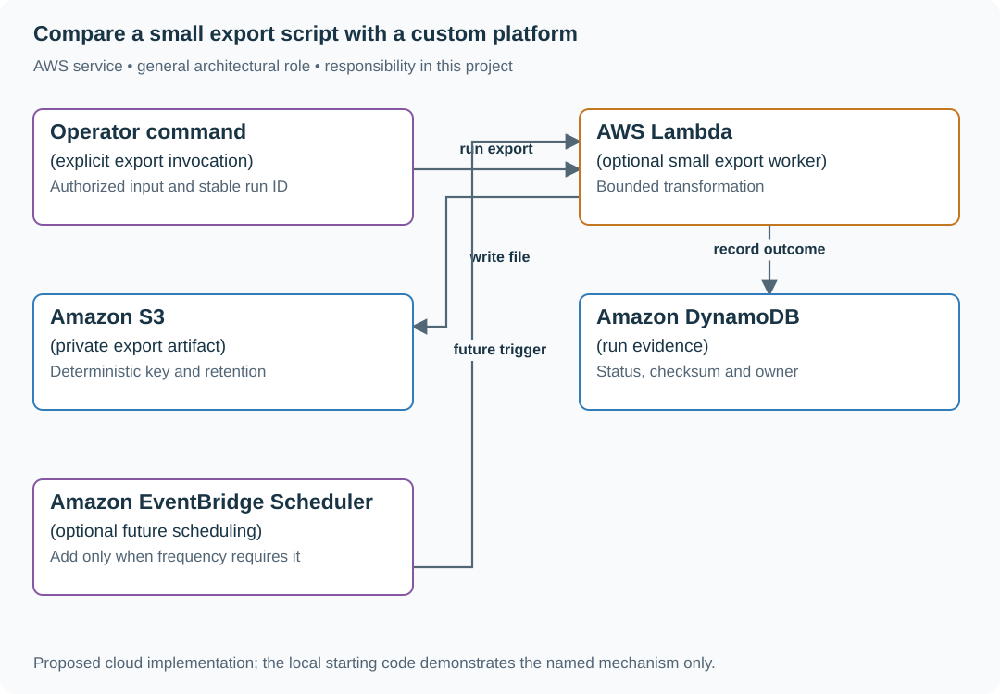

# Compare a small export script with a custom platform

## Application background

A team produces two data exports each month. An engineer proposes a custom scheduling platform, while another suggests a small command an operator can run. Both options need to provide the required file to an authorized recipient and make failures recoverable.

The platform takes much longer to build and will still need maintenance. Compare the options against the same user need before deciding that more software is the better answer. The deliverable is a reasoned decision backed by a small working example.

Include the time to operate and repair each option, not just initial coding time. A reconsideration trigger is a concrete change that would make the previous decision worth reopening.

## Your assignment

**Deliver:** Compare a script, a managed option and a custom platform against the same export need. Provide a usable small example, recommend an option and name the changes that would make you reconsider it.

**Required behavior:** Produce a concrete build/buy/simplify/defer decision with assumptions, required behaviors, ownership and a trigger for reconsideration. A decision not to build still includes a usable smaller solution and evidence that it meets today’s need.

The primary deliverable is the report or operational procedure named above, backed by a reproducible local demonstration. Build the smallest supporting code needed to make that evidence visible.

## Get the code and run the supplied example

The code is in the public [junior-to-staff repository](https://github.com/Soulful-Iris/junior-to-staff). Install Git and Python 3.12+. No AWS account or Python packages are required for this first run. If you already have a checkout, use it and skip cloning.

```bash
git clone https://github.com/Soulful-Iris/junior-to-staff.git
cd junior-to-staff
python3 examples/architecture-starts/the_thing_you_decided_not_to_build.py
```

**Supplied file:** [`examples/architecture-starts/the_thing_you_decided_not_to_build.py`](https://github.com/Soulful-Iris/junior-to-staff/blob/main/examples/architecture-starts/the_thing_you_decided_not_to_build.py). You can also [read or download the source here](../../../../examples/architecture-starts/the_thing_you_decided_not_to_build.py).

This program is a **mechanism demonstration**: it runs the small scenario in one process and prints the result. It is not an HTTP service, a complete application, or an AWS deployment. A successful run demonstrates this mechanism only. It does not establish the workload or failure guarantees of the application you will build.

**Example output from the supplied run:**

Generated IDs and timestamps may differ. Compare the state transitions and outcomes.

```text
{'custom_engineer_days_year': 42, 'script_engineer_days_year': 6.0, 'exports_year': 24}
Decision candidate: use the bounded script; revisit if demand or guarantees change.
```

### Set up your implementation workspace

Create `work/the-thing-you-decided-not-to-build/` in your checkout (or use a separate repository). Copy the supplied mechanism into that directory as `mechanism.py`, then extract its state transitions into functions you can call from your implementation. The record and module names below describe what you must implement. They are not a promise that files with those names already exist. Keep a `README.md` beside your implementation with its exact run commands and observed results.

## Local components and state to implement

This table names the records, interfaces or decision inputs for your deliverable. Unless a name is explicitly linked to supplied source above, it is something you create. Implement the local state transitions first, then connect the HTTP, storage or worker boundaries required by the steps.

| Record / module | Key or interface | Responsibility |
|---|---|---|
| requirements | export_format,access,frequency,retry,audit | The same required behavior for every option. |
| option_estimate | build_days,maintenance_days,service_cost,uncertainty | Comparable horizon and explicit unknowns. |
| decision | choice,owner,small_solution,revisit_trigger | Actionable result with a reversible next step. |

## Implement the assignment

### 1. Observe the actual export task

Sit with the operator, record inputs, recipients, file size, access checks and recovery steps. Distinguish scheduling from transformation, delivery and auditing. Two monthly exports may need a reliable command more than a platform.

### 2. Build the smallest useful spike

Implement one authorized export with a stable run ID, deterministic file naming and a visible success/failure record. Include retry and cleanup behavior. Time the real operator task before and after. Do not make a polished platform mockup the only evidence.

### 3. Compare equal requirements

Put script, managed service and custom system against the same permissions, audit, frequency and recovery needs. Include maintenance/on-call and verify current provider pricing only if it will decide the choice. Label uncertain estimates instead of converting them into false precision.

### 4. Record the decision and trigger

Choose the small solution if it meets current needs, name its owner and document how to run/repair it. Revisit if three teams need daily audited exports, required guarantees change or measured operator cost crosses the stated threshold. A competitor feature alone is not evidence of your customers’ demand.

## Demonstrate the completed local result

| Action | Expected visible result |
|---|---|
| Run the starting program | The constructed annual estimates are 42 engineer-days versus 6. |
| Run the small export twice with one identity | The operator gets one logical artifact/result. |
| Change demand to daily audited exports for three teams | Revisit the old decision against the new requirements. |

**Handoff:** In your implementation README, include the start command, one successful operation, the failure case above and the resulting stored state or decision. State which dependencies are simulated. Someone with a fresh checkout should be able to reproduce this without your chat history.

## Workload assumptions and capacity decisions

These are constructed exercise assumptions. The stated workload is a design target. The local demonstration does not establish that throughput. Use the [estimation constants](../../../01-code/01-problem-solving/estimation-constants.md) to check units before choosing capacity.

| Input or objective | Calculation / consequence |
|---|---|
| Custom: six five-day engineer-weeks + one day/month | Forty-two engineer-days over a year under these assumptions. |
| Script: three days + 0.25 day/month maintenance assumption | Six engineer-days/year. Include this explicit maintenance assumption in the comparison. |
| Two exports/month | Twenty-four annual exports. Current demand does not by itself justify a general scheduling platform. |

## Map the local implementation to AWS

**Deployment status: local only.** Running the supplied command creates no AWS resources and configures no cloud connections. The diagram is a proposed deployment of the completed application. Each box needs either a deployed runtime, a provisioned service or an explicitly external dependency.

Read the diagram by following the arrows from the entry point: application code accepts the request or event, the state owner commits it, and any worker produces the later result. The table ties those roles to code and adapter work. Multiple boxes do not imply multiple Python files already exist.



The optional AWS path is deliberately smaller than a custom scheduling platform. Scheduling can be added when demand requires it. No periodic export or monitor is created by the supplied local example.

| Local responsibility | Cloud destination and role | Implementation still required |
|---|---|---|
| Local manual decision or recovery function | Operator command: explicit export invocation | Implement an authenticated, scoped operational command with a recorded target, preconditions and visible result. |
| Python operation or worker function | AWS Lambda: optional small export worker | Write a Lambda event adapter, package its dependencies and give its role only the required resource actions. |
| Local file, object fixture or exported payload | Amazon S3: private export artifact | Implement upload/download and metadata adapters, scoped access, object naming, retention and incomplete-upload cleanup. |
| Local dictionary, SQLite records or state model | Amazon DynamoDB: run evidence | Design partition/sort keys and write a storage adapter with conditional updates or transactions. Python state and SQL are not uploaded as a database. |
| Manual invocation or local schedule input | Amazon EventBridge Scheduler: optional future scheduling | Create schedules targeting the dispatcher and preserve occurrence identity across retries and overlapping invocation. |

### Provision resources, then connect the application

| Resource or boundary | Initial configuration and reason |
|---|---|
| Initial choice | A local/operator-invoked script may be sufficient. The AWS diagram is a small managed alternative to evaluate. |
| Access | Restrict source reads and export downloads. Record the operator and run identity. |
| Cost | Compare one maintenance horizon and verify current prices before treating a managed-service cost as decisive. |

For this decision project, provision resources only if a bounded implementation spike needs them. The diagram is also usable as the concrete option being evaluated. Put the named resources in `infra/template.yaml` or your existing IaC tool, pass resource IDs through configuration, and scope each runtime role to its own tables, buckets and queues. The diagram is a design to implement. It is not a claim that these resources have been deployed. Record the commands you used to deploy and remove the exercise resources.

For concrete provisioning commands, configuration wiring and cleanup, use the [AWS foundation guide](../../../../examples/architecture-starts/infra/README.md). It includes a deployable table/queue/object-storage foundation and explains which application and service adapters you still implement.

A provisioned queue or table does not make the local program use it. Configure resource IDs in the deployed runtime, replace the local adapter, and replay the same successful and failing operation against that runtime. Record the deployed commit and observable result, then remove the disposable resources using your infrastructure tool.

## Extend the design after the baseline works


The script becomes business-critical while its author is unavailable. Treat ownership, documentation and recovery as part of the small solution. Small code does not mean zero operating responsibility.

<details>
<summary>Additional design reasoning and requirement changes</summary>

## Follow-up 1 · Demand changes

**Changed requirement:** Three teams now each need daily exports with an audit trail. Does the old no remain binding? Predict which boundary must change before opening the design.

<details>
<summary>Expected reasoning and changed diagram</summary>

Reopen because the specified trigger occurred. Reuse the original analysis, update workload and support costs, and evaluate whether the smaller intervention still meets the contract.

</details>

## Follow-up 2 · A competitor launches it

**Changed requirement:** A competitor advertises a similar feature, but your customers have not asked. Is that enough? State what evidence would make you reject your first design.

<details>
<summary>Expected reasoning and changed diagram</summary>

Treat it as new evidence to investigate, not proof of your demand. Seek user behavior and contract gaps, then bound a reversible experiment. State which downside cannot be recovered if you wait.

</details>

</details>
