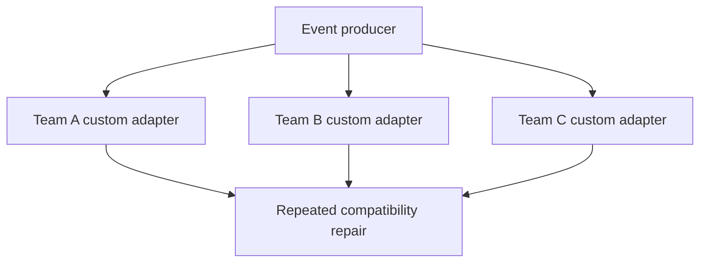
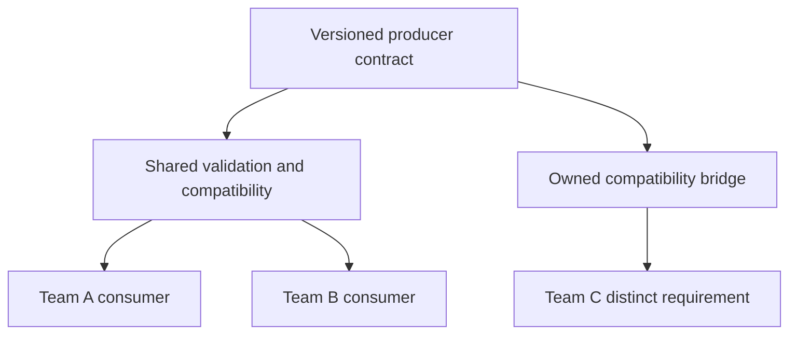
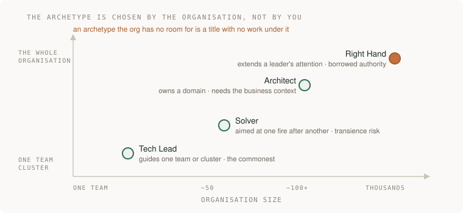
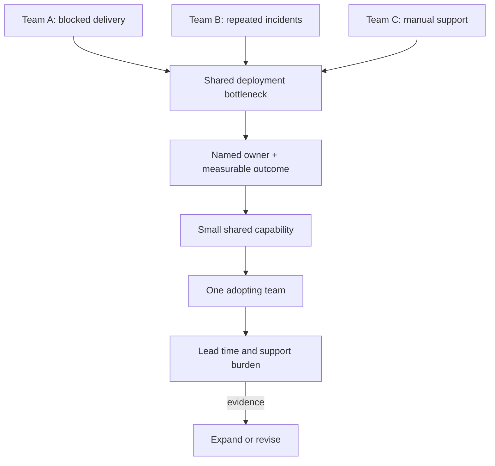

# Scope and leverage

[Curriculum](../../README.md) · [Make technical decisions and improve team workflows](README.md)

> Project connection · feeds **P5 (it changes safely)**

## At the whiteboard

> “Three teams each spend a day a week repairing incompatible event payloads.
> You can fix this week's failures or propose a shared contract. How do you
> decide whether the broader intervention is worth its cost?”

Scope is the boundary of the problem you own. Broader scope helps only if it
changes a repeated outcome; creating a platform is not automatically leverage.

| Constructed input | What to establish |
|---|---|
| Three teams, one day/week each on repair | Verify the baseline and causes |
| Proposal costs six team-days initially | Include maintenance and migration work |
| Teams deploy independently | Define backward compatibility and ownership |
| One consumer cannot migrate this quarter | Preserve a supported bridge or narrow scope |

## Decide where to intervene

1. Inspect examples of actual repair work. If causes differ, one abstraction
   may hide incompatible requirements rather than remove repetition.
2. Define a small shared contract and a versioning rule; retain domain-specific
   behavior with its owner.
3. Test hard consumer requirements early in a replay or controlled pilot. Choose
   live exposure with bounded impact; measure repair hours and adoption effort.
4. Assign ownership, support boundaries, and a stop condition. A shared service
   without an owner can become a new bottleneck.

**Follow-up:** “The pilot helps two teams but slows the third.” Draw the allowed
exception and the evidence that would justify convergence later.

Senior evidence is a sound implementation and measured local result. Lead/staff
evidence adds an agreed cross-team decision, adoption, and sustained outcomes.
A solo exercise practices the reasoning; it cannot manufacture that history.

## Match scope to the problem

Company ladders and staff titles differ. This guide uses senior, lead and staff
follow-ups to practice increasing ambiguity, coordination and ownership; they
are **not universal promotion criteria**. Deep specialist work, sustained technical
leadership and cross-team coordination can all matter. Coding quality does not
cease to matter when a title changes.

Treat the pictured archetypes as prompts for understanding a role, not a ranking
or a requirement to become all four. Verify the actual mandate, authority and
success measures of a role instead of inferring them from company size.

## Count the benefit and the work it creates

In the constructed three-team example above, compatibility repair consumes
three team-days per week. A shared contract costs six team-days to introduce.
If it removes two repair days per week and adds half a day of weekly support,
the net saving is **1.5 team-days/week**; the initial effort breaks even after
**four weeks**, before any additional migration or coordination cost.

This is a prediction to test, not a guaranteed platform return. The third team
may have a legitimate different requirement. Preserve an owned exception when
forcing convergence would cost more than it saves.

| Evidence | What it supports | What it does not prove |
|---|---|---|
| Fewer repair hours under comparable work | A useful local outcome | Universal staff readiness |
| Another team adopts and independently operates the contract | Adoption and reduced dependence | That every team should use it |
| A solo reference implementation passes tests | Reference correctness under those cases | Real cross-team leadership history |

## Mentorship and sponsorship are different contributions

Mentorship develops another person's capability through teaching, feedback or
practice. Sponsorship advocates for their access to an opportunity. Neither is
automatically cheap, effective or superior. Evaluate actual outcomes, time,
access and attribution. Successful mentoring need not produce a promotion story.

Coordination and maintenance are work too. Record who did them and who benefits;
do not claim a teammate's independent result as your own output.

## Practice on P5

Name a structural problem, verify examples, and compare a local fix with a
broader intervention. Include adoption, support and transition costs. Choose the
smallest scope that addresses the cause and identify what would reverse that
choice. A small well-targeted change can be more useful than a platform.

**Acceptance:** another reader can explain the problem, proposed boundary,
trade-off, owner and measure of success. They may approve unchanged. An exercise
can test that reasoning but cannot manufacture employment history or predict a
hiring outcome.

[Writing that decides](design-documents.md) · [Engineering effectiveness](engineering-effectiveness.md)

## Draw it from memory · Show who owns the shared constraint

**Redraw challenge:** Replace “build a platform” with the smallest shared constraint and an adoption measure.
