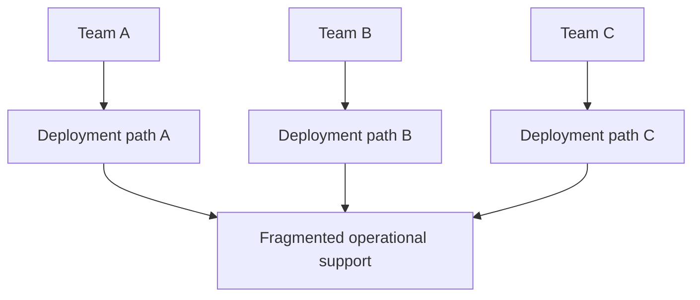
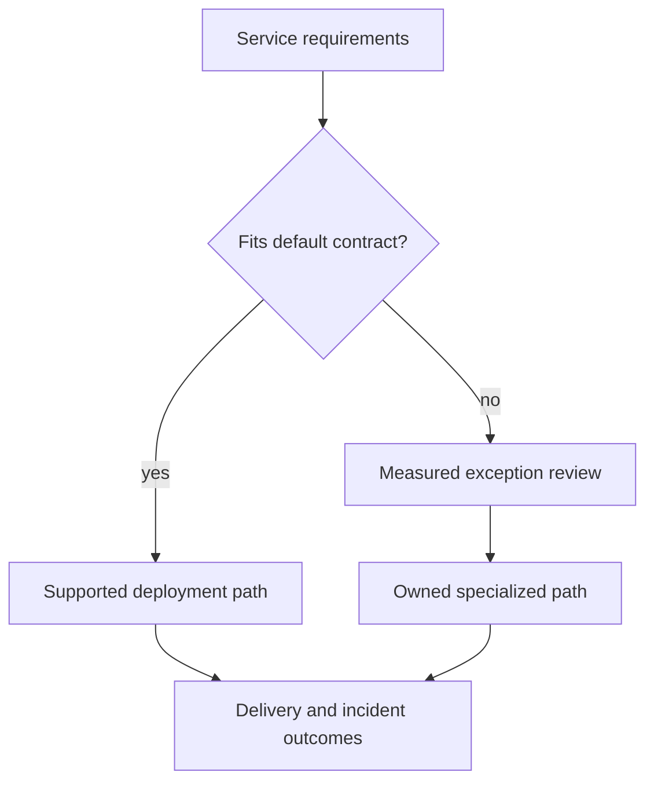
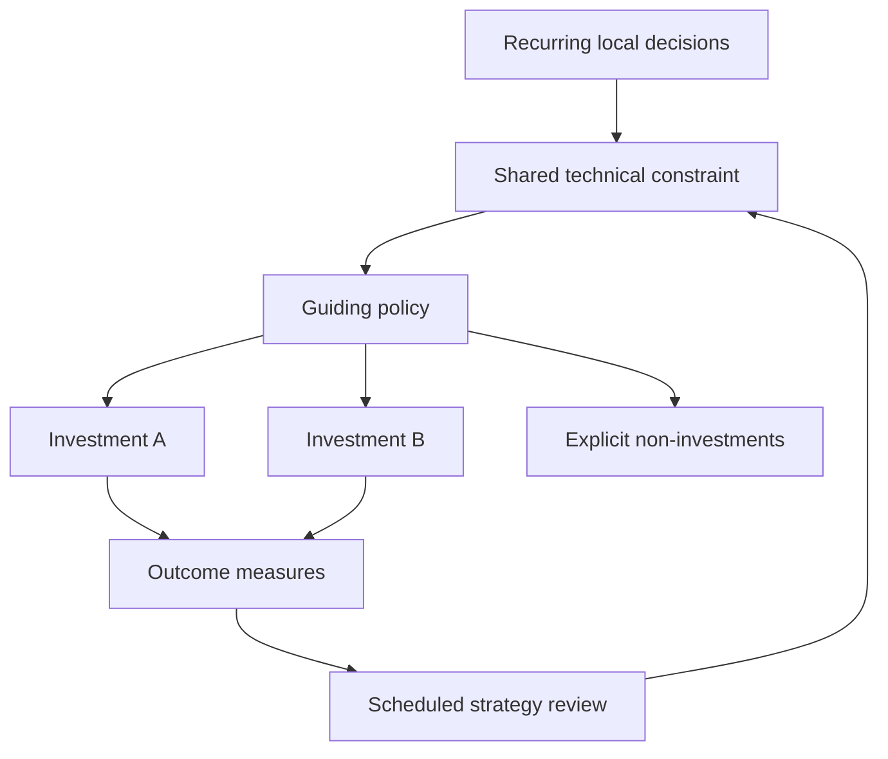

# Technical strategy

[Curriculum](../../README.md) · [Make technical decisions and improve team workflows](README.md)

> Project connection · feeds **P5 (it changes safely)**

## At the whiteboard

> “Five teams repeatedly choose different solutions for the same service needs.
> Operations now maintains five deployment paths. Should we standardize? Show
> the rule that makes the next team's decision easier without blocking a
> genuinely different workload.”

Technical strategy is a set of decisions that guides future work. A roadmap
lists work; strategy explains why that work is the useful direction.

| Teaching observation | Expected decision evidence |
|---|---|
| Five deployment paths | Measured support effort and distinct requirements |
| Four ordinary HTTP services | A supported default if requirements align |
| One long-running specialized workload | An explicit evaluated exception |
| New services continue appearing | A discoverable decision rule and owner |

## Derive a useful default

1. Collect repeated decisions and failures before choosing a platform. Count
   actual maintenance and onboarding costs rather than aesthetic inconsistency.
2. Separate common constraints from genuine exceptions. Define a default for
   the common case with a reason someone can challenge.
3. Pilot one existing service, including migration and rollback. A blank demo
   does not reveal adoption friction.
4. Measure whether teams can ship and operate more independently. Revisit a
   default when its assumptions change; exceptions need evidence and an owner.

**Follow-up:** “The specialized team cannot meet its latency goal on the default.”
Add an exception route with a support contract instead of silently forcing it in.

Lead depth is the rule, migration sequence, ownership, and feedback mechanism.
The number of teams adopting a tool is insufficient if their delivery worsens.

## Diagnosis → choices → coordinated action

A technical strategy connects a diagnosed constraint to a small set of guiding
choices and coherent actions. Insight can come from repeated decisions,
anticipated scale, a product direction, a contractual deadline or a new threat.
The origin does not substitute for evidence.

Reading several old design documents is **one useful synthesis exercise**, not a
prerequisite. Five unrelated documents do not automatically make a strategy, and
a future constraint can justify action before any such documents exist.

## Worked example: a second operating region

The product will need a second region. Assume, for this exercise, that existing
writers and recovery procedures are tied to one region.

| Strategy element | Concrete choice |
|---|---|
| Diagnosis | A regional outage currently leaves no exercised write-recovery path |
| Guiding policy | Establish one fenced write authority; replicas alone are not a failover protocol |
| Actions | Identify writers, define recovery objectives, rehearse authority transfer, measure data loss and restore time |
| Non-investment | Do not add active-active writes before their conflict contract is justified |
| Ownership | Named service owners and a coordinator for cross-service recovery |
| Revisit | Failed rehearsal, changed availability requirement or a scheduled review |

This may be justified by a future requirement even with no historical debate.
Conversely, “standardize on database X” is not enough without explaining the
constraint, adoption work, exceptions and expected result.

## Make the default useful, not absolute

A shared platform has operating and migration costs. State which workloads fit,
what support it provides and how a team can request a measured exception. An
exception needs an owner; the default needs a maintainer. Adoption counts alone
do not prove improved delivery or reliability.

Compare before and after using matched workloads and explicit outcomes. A policy
can reduce one risk while increasing another. Record opportunity cost and
uncertainty rather than manufacturing a loser just to demonstrate “trade-offs.”

## Practice and acceptance

Start with either a recurring decision from P1–P4 **or** a justified future
constraint. Write a short diagnosis, policy, actions, exclusions, owners and
review trigger. Ask someone to apply it to a new design and to one legitimate
exception. Ambiguous answers identify missing scope, not a need for more slogans.

A sound review may approve the strategy unchanged. A plain vision can be
ambitious or unsurprising; excitement and boredom are not correctness tests.

**Words to keep:** *diagnosis* identifies the constraint; *policy* guides choices;
*actions* make it operational; *vision* describes a desired future; *review
trigger* states when to reconsider. A roadmap schedules work; it does not by
itself explain why that work addresses the constraint.

[Writing that decides](design-documents.md) · [Engineering effectiveness](engineering-effectiveness.md)

## Draw it from memory · Make strategy a constraint on real decisions

**Redraw challenge:** Name a supported case and a case outside this policy’s scope. Explain which constraint separates them.
