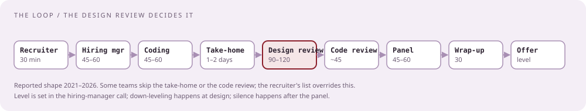
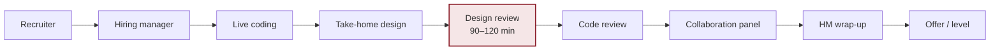

# The loop, end to end

[Curriculum](../../../README.md) · [Preparation](../README.md)

> "What happens between the recruiter's first email and an offer, and which of those steps actually decides it?"

The design review decides it, the hiring-manager call levels it, and the recruiter's inbox delays it. Everything below is dated evidence; the labels are explained in the [ledger](04-question-ledger.md).

## The reference role

Senior Engineer – Cloud, US Remote, req R30109, posted September 2026 `[Official]`. Its own words for the team: "endpoint management platforms," "sensor telemetry and system debuggability," "design event driven systems using modern messaging patterns," "conduct root cause analysis for critical issues." Stack named in the posting: Go, Python, or Java; Kafka; Redis; Postgres; ElasticSearch/OpenSearch; Docker/Kubernetes; Terraform; AWS managed services; Jaeger/Zipkin; Prometheus/Grafana; REST with JWT/OAuth and rate limiting. Base band $265,000–$285,000 plus bonus and equity. Fully remote within the US.

## The rounds

| Round | Length | Who | What is graded | Evidence |
|---|---|---|---|---|
| Recruiter screen | 30 min | Recruiter | Background, motivation, level, comp, remote fit; a Go/Python/AWS stack check; sometimes "your most complex project" | `[Reported]` Oct 2025, Feb 2025; guides |
| Hiring-manager call | 45–60 min | Hiring manager, often before coding | Your current system; microservices; event-driven design; scaling and error-handling scenarios; "why" chains on past decisions; sometimes one conceptual question | `[Reported]` Nov 2025 London; Aug 2025 ×2 |
| Live coding | 45–60 min | Senior engineer | 1–2 medium problems in a shared editor, your language; real-world framing; extended to streaming or concurrent workers | `[Reported]` Oct 2025 Cloud; Blind 2023–2025 |
| Design take-home | 1–2 days notice | You | A document describing a system; you bring diagrams and a written design | `[Reported]` 2019, 2022, 2023, 2025 ×3, 2026 |
| Design review | 90 min, up to 2 h | 2–3 engineers | Defend the take-home: scale, storage choices with pros and cons, concurrency, failure modes, cost | `[Reported]` 2020, 2022, 2025, Jan 2026 |
| Code review round | ~45 min | Engineer | Review example code aloud: what must change, what could, how severe; then implement an in-memory cache and sketch its design | `[Reported]` Jan 2026, Aug 2025 |
| Collaboration panel | 45–60 min | Teammates, sometimes a peer manager | Remote-first async work, incidents, persuasion, mentoring, values | guides; `[Reported]` Jan 2026 |
| Cloud/security round | 60 min, some loops | Engineer | Tenant isolation, encryption at rest, audit logging, deployment safety | guides |
| HM wrap-up | 30 min, some loops | Hiring manager | "Recap the process and answer questions"; precedes offers and reassignments | `[Reported]` Aug 2025 |
| Decision | days to weeks | Recruiter | 5 days to a verbal offer at best; multi-week silence and ghosting reported | `[Reported]` 2021–2025 |

## Three loops, side by side

| | Jan 2026, US senior, offer `[Reported]` | Oct 2025, Cloud senior, rejected `[Reported]` | Nov 2025, London, ghosted `[Reported]` |
|---|---|---|---|
| Screen | Recruiter | Recruiter: Go proficiency, most complex project | Hiring manager: current work, microservices, event-driven, scaling and errors |
| Coding | After design; "the remainder was just coding" | String templating; follow-up on worker pool and work assignment | Number of islands, DFS |
| Design | Take-home "real-time event message system"; 2-hour review with two engineers | Not reached | Take-home VirusTotal-like scanner |
| Extra | Code review round; implement a Redis-like cache; brief Redis design | — | — |
| Behavioral | HM: what you do; your mistakes; a project off track under your leadership | — | — |
| Outcome | Lateral Senior → Senior, ~15% more pay, one month of prep | Rejected in two days; team wanted US-Eastern hours | Told Engineer III would be considered, then silence |

## Numbers to know before you start

| Statistic | Value | Source |
|---|---|---|
| Senior SWE reports on Glassdoor | 15; difficulty 2.8/5; 29% positive; 30 days average | Glassdoor summary (individual reports login-walled) |
| SWE reports on Glassdoor | 36; difficulty 2.8/5; 26% positive; 17 days average; stages: phone 33%, one-on-one 21%, presentation 16%, skills test 12%, panel 9% | Glassdoor summary |
| US senior SWE on Taro | 26 reports; 0% reported pass; 58% negative | Self-selected: failures post |
| India on AmbitionBox | 16 reports; 80% "moderate"; 75% take 2–4 weeks | AmbitionBox |
| Time to verbal offer | 5 days at best; weeks common | Blind |

Read the low positivity as slow, thin recruiter communication, which is the complaint in nearly every negative report, not as hard questions.

## What decides it

| Round | Decides | Why |
|---|---|---|
| Design review | Hire or not, and level | Candidates report being down-leveled here; one CrowdStrike employee's advice: be "passable at leetcode" and show depth in design |
| Hiring-manager call | Level and team | The team owns the hire; the manager often goes first and sets the level the loop tests for |
| Coding | Pass/fail gate | Medium bar; the reported rejection came on the concurrency follow-up, not the code |
| Panel | Tie-breaker | Values and remote collaboration; rarely the reason for a no on its own |

## Check the mechanism

| Question | Answer to have ready |
|---|---|
| Design is a take-home or live? | Ask the recruiter; both exist. Take-home means 1–2 days notice and a 90–120 minute defense |
| Which language? | Yours; Python is fine. Go questions come as concepts, not code |
| AI tools allowed? | No public report either way; assume off unless told |
| Level? | Senior I or Senior II; the posted band suggests the higher end. Ask |
| Who grades design? | Two or three engineers; sometimes the hiring manager sits in |

Next: [Recruiter screen and hiring-manager call](02-recruiter-and-hiring-manager.md).
