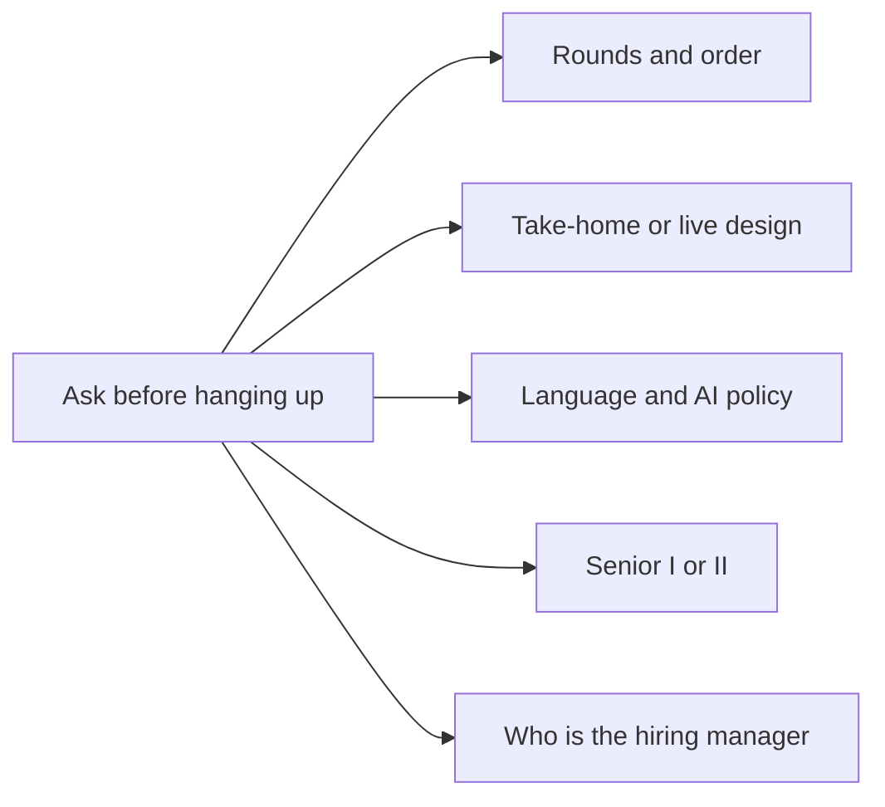
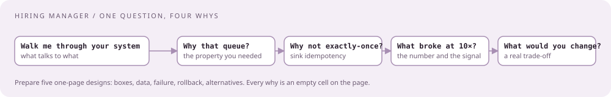
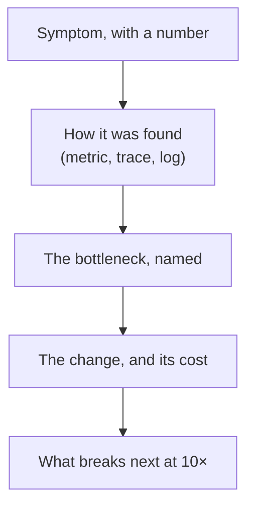

# Recruiter screen and hiring-manager call

[Curriculum](../../../README.md) · [Preparation](../README.md)

> "The hiring manager asks about your current system, then asks why four times. What are they actually deciding?"

Your level, and whether they want you on-call next to them. Two calls, two purposes.

## Recruiter screen · thirty minutes that set the level

| They cover | Say it in this shape |
|---|---|
| Background | One sentence of scope (a critical-path service you owned end to end), one of scale (events, tenants, records), one of what changed for customers |
| Why CrowdStrike, why now | Mission plus the specific team's work; the posting's own words are fine |
| Stack check: Go, Python, AWS, Kafka | List in the posting's order; be honest about Go depth `[Reported]` Oct 2025 asked Go proficiency directly |
| "Your most complex project" `[Reported]` | The migration or platform story, ninety seconds |
| Comp and level | Have a number; the band is public |
| Location and hours | Remote within the US; the Oct 2025 rejection cited a US-Eastern requirement for a European team |

**Reported rejection reasons at this stage:** comp misalignment, unclear about the role, poor communication, and one Feb 2025 report of a screen cut off after a single question. Nothing to prepare for that last one except not needing it.

## Hiring-manager call · past decisions and why

**Reported content** `[Reported]`, three independent 2025 reports: "current work experience, microservices architectures, event driven systems, scaling and error handling scenarios" (London); "present a past project, plenty of why questions, one conceptual technical question"; "past projects and decisions you made, how you handle conflict." The manager owns the hire and often interviews first.

### Question bank

| Theme | Questions | Weight |
|---|---|---|
| Current system | Walk me through what you own. What talks to what? Where does state live? What is the write path? Who calls you and what do they expect? | core `[Reported]` |
| Event-driven design | Where do you use a queue and why? What happens when a consumer falls behind? Poison message? At-least-once or exactly-once, and how do you know? | core `[Reported]` |
| Scaling | What stopped scaling last? How did you find it? What did you change, what did it cost, what breaks next at 10×? | core `[Reported]` |
| Error handling | A failure that crossed service boundaries: how did you localize it, what did you add so it is caught earlier? | core `[Reported]` |
| Decisions | Pick a design decision. Alternatives? Why this one? What would you change now? | core `[Reported]` |
| Mistakes | A mistake you made, what you learned, how you protect the team from repeating it | core `[Reported]` Jan 2026 |
| Ownership | Something nobody owned that you picked up | likely |
| Migration | Replaced a live system? Rollout and rollback? | likely |
| Conceptual (one) | Explain idempotency. What is backpressure? How does a consumer group commit offsets? Cache versus queue in your design? | likely `[Reported]` |
| Fit | Why CrowdStrike, why leave, two years from now, how you work across time zones | likely |

### Prepare it as five one-page designs

Every "why" is answered from a page you already wrote.

| Page | Boxes | Data | Failure | Rollback | Alternatives you rejected |
|---|---|---|---|---|---|
| The migration you owned | | | | | |
| The cross-system root cause | | | | | |
| The platform you designed | | | | | |
| The orphaned flow you took over | | | | | |
| The cost or performance fix | | | | | |

Fill each cell in one line. The manager's follow-ups are the empty cells; if the page has them, you never run out.

### Answer shape for a scaling question

## Check the mechanism

| Prompt | A strong answer contains |
|---|---|
| "Walk me through your system" | A drawn main path, where state lives, one number for scale |
| "Why that queue?" | The alternative you rejected and the property you needed (ordering, replay, fan-out) |
| "What happens when the consumer falls behind?" | Lag as the signal, bounded queue, autoscale on lag, shed by priority, never unbounded memory |
| "Tell me about a mistake" | The blast radius, how you found it, the fix, and the guard that now exists |

Next: [Collaboration panel and the cloud round](03-collaboration-panel.md).
