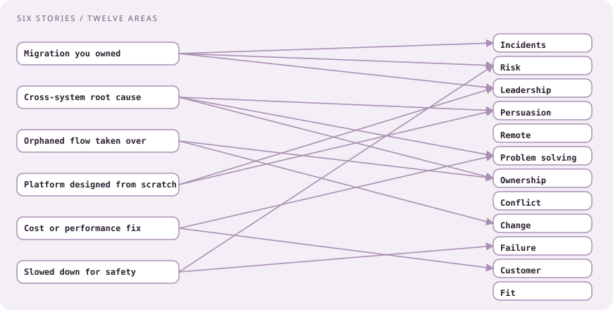

# Collaboration panel and the cloud round

[Curriculum](../../../README.md) · [Preparation](../README.md)

> "Tell me about a project under your leadership that wasn't going as planned, and how you persevered."

That one is verbatim from a January 2026 senior offer `[Reported]`. The panel is teammates grading whether they want you in their incident channel; the cloud round is a design conversation with a security lens.

## Their values, in their words `[Official]`

| Value | Company phrasing | What the panel listens for |
|---|---|---|
| Customer | "Fanatical About the Customer" | Customer impact in the result of every story |
| Innovation | "Relentlessly Focused on Innovation" | You changed how something worked, not only fixed it |
| People | "Limitless Passion drives Unlimited Potential" | Energy, ownership, learning |
| Team | "One Team. One Fight." | Cross-team stories where you pulled people together |
| Mission | "We stop breaches" | Safety over speed when they conflict |
| Hiring | "based on their merits and alignment to our mission"; people who "consider problems from all angles" | Trade-offs named, not hidden |

Employee quotes on record: "a high-trust environment where individuals are given a lot of autonomy, but also the tools they need" (an engineering manager); "a company where they actually do what they preach" (a principal engineer).

## Question bank

`[Reported]` is verbatim or a reported theme; `[Generated]` is the same shape.

| Area | Questions |
|---|---|
| Incidents | `[Reported]` Handle a major production incident. Your decision-making during a major incident. A time you asked for help early and avoided an outage. `[Generated]` An incident you caused, and what changed afterward |
| Risk and blast radius | `[Reported]` A time you caught, escalated, or shipped a risky change; blast radius versus speed. `[Generated]` A rollout you slowed on purpose; a rollback and how you decided |
| Leadership under trouble | `[Reported]` A project under your leadership not going as planned; how you persevered |
| Persuasion | `[Reported]` Convince a team to adopt a new direction; convince leadership to prioritize a security initiative. `[Generated]` A design review where you were wrong |
| Remote collaboration | `[Reported]` Mentor a junior engineer remotely; code review and cross-team dependencies across time zones. `[Generated]` Deciding while the other team sleeps |
| Problem solving | `[Reported]` Problems you have never seen before; a challenging issue you resolved |
| Ownership | `[Generated]` Work nobody owned that you picked up; a defect outside your team that you fixed anyway |
| Conflict | `[Reported]` A disagreement with a colleague; a difficult colleague |
| Change | `[Reported]` Significant change in the work environment; a leader or plan changed mid-project |
| Failure | `[Reported]` A failure and what you learned; strengths and weaknesses; your mistakes |
| Customer | `[Generated]` Traded elegance for a customer outcome; how you know a change helped |
| Fit | `[Reported]` Why CrowdStrike; why leave; tell me about yourself; negative feedback from a manager |

## Six stories, three minutes each

| Story | Covers | Ends with |
|---|---|---|
| A migration you owned end to end | Leadership, risk, incidents | The customer-visible change |
| A cross-system root cause | Problem solving, persuasion, team | What you changed so it recurs less |
| Something orphaned you took over | Ownership, change | What you found that nobody knew |
| A platform you designed from scratch | Innovation, decisions | A trade-off you still dislike |
| A cost or performance fix with a number | Customer, scaling | The number |
| A time you slowed down for safety, or owned a mistake | Risk, failure | The guard that now exists |

Tell each as: situation in one sentence, the decision you made and the alternative you rejected, what happened, what changed afterward. Stop at three minutes. The panel's follow-ups will find the rest.

## Post-July-2024, expect one safety question

Since the 2024 outage, guides report at least one question about a risky change and how you weighed blast radius against speed, and that "deployment deliberation is expected, not viewed as slowness." The company's own account of what changed is in [How CrowdStrike builds it](../../03-architecture/lessons/01-how-crowdstrike-builds-it.md). A story where you gated a rollout on a signal and had a rollback ready lands well here; so does one where you shipped something that hurt and owned the fix.

## The cloud and security round, for a cloud role

For sensor teams this round is operating-system internals. For cloud teams it is design with a security lens. You need to sound like someone who has protected customer data in production.

| Topic | The question behind it | A defensible answer |
|---|---|---|
| Tenant isolation | How is one customer's data kept from another? | Tenant ID in every key and query; partition-level isolation; per-tenant keys for stored bytes; per-tenant quotas |
| Encryption | Where are keys, who can read what? | KMS-managed keys, envelope encryption for blobs, TLS internally, rotation without redeploys |
| Audit | Can you prove who did what? | Append-only audit stream, separate from app logs, immutable storage, alerts on sensitive reads |
| False positives | Why does noise matter? | A false positive costs analyst time and trust; a false negative is a breach; say which you tune for and how you measure both |
| Least privilege | How do services authenticate to each other? | Short-lived identities, scoped JWT/OAuth tokens, mTLS via a mesh, no shared long-lived secrets |
| Threat model | What would an attacker do to this design? | Walk the data flow, name trust boundaries, top three abuses and the control for each |
| Deployment safety | How do you ship to millions of hosts? | Canary, rings, golden signals, automatic halt, customer pinning, rollback in minutes |

## Check the mechanism

| Prompt | Strong answer contains |
|---|---|
| "A project under your leadership went off plan" | The moment you noticed, the decision, who you told, the recovery, what you changed in how you run projects |
| "Convince leadership to prioritize security" | The risk in customer terms, the cost of doing nothing, the smallest first step you proposed |
| "How is tenant data isolated?" | Key design, query design, encryption keys, quotas: four layers, not one |

Next: [Every question found, labeled](04-question-ledger.md).
