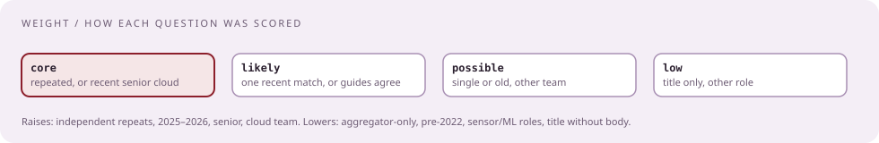

# Every question found, labeled

[Curriculum](../../../README.md) · [Preparation](../README.md)

> "Was this actually asked at CrowdStrike, when, to whom, and how much should I care?"

Every item carries four labels so you can judge it yourself.

| Label | Meaning |
|---|---|
| `[Reported]` | A first-person candidate account (LeetCode Discuss, Blind, Hello Interview, Taro, PracHub experiences, a public GitHub take-home) |
| `[Aggregator]` | A prep site that edits and summarizes reports; weaker, and sites copy each other |
| `[Official]` | The company: the posting, the engineering blog, company pages |
| `[Generated]` | Written for this track in a reported shape |
| **core** | Repeated across independent reports, or recent on a senior cloud loop |
| **likely** | A single recent report on a matching loop, or a shape the guides agree on |
| **possible** | Single or old report, or a different team |
| **low** | Old, other role, or title only |

## Coding, live rounds

| Problem | Source | Last documented | Role · place | Seen | Weight | Drill |
|---|---|---|---|---|---|---|
| String templating from a dictionary, then the same on dictionary values, then "large volumes, what mechanism for a worker pool, how would you assign work to workers" | `[Reported]` | Oct 2025 | Senior, Software Engineer – Cloud, US | 2 | **core** | [43](../../02-coding-problems/problems/43-string-templating/README.md), [56](../../02-coding-problems/problems/56-worker-pool/README.md) |
| Number of islands, DFS on a grid | `[Reported]` ×2 | Nov 2025 | Engineer III / Senior, London | 2 | **core** | [48](../../02-coding-problems/problems/48-number-of-islands/README.md) |
| Implement an in-memory cache like Redis, then a brief Redis design | `[Reported]` | Jan 2026 | Senior SDE, US, offer | 1 | **core** | [47](../../02-coding-problems/problems/47-lru-cache-ttl/README.md) |
| FIFO / LRU cache with insert, lookup, evict, pseudocode | `[Reported]` | Aug 2025 | EM loop | 1 | likely | [47](../../02-coding-problems/problems/47-lru-cache-ttl/README.md) |
| Time-based key-value store, then time complexity | `[Reported]` | 2023 | Platform loop | 1 | likely | [46](../../02-coding-problems/problems/46-time-based-kv/README.md) |
| Custom queue with thread-safe operations | `[Aggregator]` | 2026 | SWE | 1 | likely | [56](../../02-coding-problems/problems/56-worker-pool/README.md) |
| Shortest path from a start node to all others (network delay) | `[Aggregator]` ×2 | 2026 | SWE | 2 | likely | [54](../../02-coding-problems/problems/54-network-delay/README.md) |
| Balanced brackets | `[Aggregator]` | 2026 | SWE | 1 | likely | stack; see CH 01 |
| Timestamped log stream in Python or Go; group by machine, busiest, then endless stream with memory limit | `[Aggregator]` ×2 | 2026 | SWE | 2 | likely | [44](../../02-coding-problems/problems/44-busiest-host/README.md), [50](../../02-coding-problems/problems/50-log-parser/README.md) |
| Parse, fragment, and reassemble network packets by header and offset | `[Aggregator]` | 2026 | SWE | 1 | possible | [52](../../02-coding-problems/problems/52-length-prefix-codec/README.md) is the framing half |
| Encode and decode strings | `[Aggregator]` | 2025 | SWE | 1 | possible | [52](../../02-coding-problems/problems/52-length-prefix-codec/README.md) |
| Is subsequence | `[Aggregator]` + snippet | 2025 | SWE | 2 | possible | two pointers; CH 01 |
| Dice-roll target sums; n dice with m faces | `[Aggregator]` + snippet | 2025 | SWE | 2 | possible | recursion with memo; CH 01 |
| Primes up to N | snippet | undated | SWE | 1 | possible | sieve |
| Kth largest; LCS; palindrome; inorder traversal | `[Aggregator]` | 2025 | Senior I profile | 1 | possible | CH 01 |
| "Queries on handling race conditions" | snippet | undated | SWE | 1 | likely | [56](../../02-coding-problems/problems/56-worker-pool/README.md) |
| Access-control coding challenge (title only) | `[Reported]` 1point3acres, body login-walled | Oct 2024 | SWE screen | 1 | possible | — |
| Maximum-similarity string matching (title only) | `[Reported]` 1point3acres | Oct 2022 | New grad | 1 | low | — |
| "Design an OOP concept" in a phone screen | `[Reported]` Taro | Mar 2020 | Senior, Bengaluru | 1 | low | — |

## Take-homes and design reviews

| Problem | Source | Last documented | Role · place | Seen | Weight | Case |
|---|---|---|---|---|---|---|
| VirusTotal-like scanning platform: uploads, hashing, blob storage, sharding, scaling, async flow; requirements days ahead; Cassandra and consistent hashing discussed | `[Reported]` ×6 + Glassdoor question title + `[Aggregator]` | Jan 2026 | Senior / Engineer III; London, Dublin, US | 7+ | **core** | [File-scanning platform](../../03-architecture/problems/file-scanning-platform.md) |
| Real-time event message system take-home with supplied requirements; 2-hour review; "security and availability are the two priorities" | `[Reported]` | Jan 2026 | Senior SDE, US, offer | 1 + 3 aggregators | **core** | [Event message system](../../03-architecture/problems/event-message-system.md) |
| Design Redis, brief, after implementing the cache | `[Reported]` | Jan 2026 | Senior SDE, US | 1 | likely | [Design Redis](../../03-architecture/problems/design-redis.md) |
| Case study, 90 minutes, "billions of requests and big files"; second prompt: a site for millions of visitors | `[Reported]` | May 2020 | SWE onsite | 1 | possible | [File-scanning platform](../../03-architecture/problems/file-scanning-platform.md) follow-ups |
| Scalable worker pool for template jobs | `[Aggregator]` PracHub | Oct 2025 | SWE | 1 + live follow-up | likely | [Worker pool for template jobs](../../03-architecture/problems/worker-pool-template-jobs.md) |
| High-throughput logging service with real-time search | `[Aggregator]` | 2026 | SWE | 1 | likely | [Searchable event store](../../03-architecture/problems/searchable-event-store.md) |
| Threat-detection pipeline with backpressure and no data loss | `[Aggregator]` ×3 | 2026 | SWE | 3 | likely | [Telemetry ingestion](../../03-architecture/problems/telemetry-ingestion.md) |
| Multi-tiered file parser extracting sub-file identifiers | `[Aggregator]` | 2026 | SWE | 1 | possible | [File-scanning platform](../../03-architecture/problems/file-scanning-platform.md) |
| Idempotent endpoint returning one-time secrets | `[Aggregator]` | 2026 | SWE | 1 | likely | [Rate limiter and queue](../../03-architecture/problems/rate-limiter-and-queue.md) |
| Idempotent consumer under at-least-once delivery | `[Aggregator]` | 2026 | SWE | 1 | likely | [Event message system](../../03-architecture/problems/event-message-system.md) |
| Take-home: Cognito misconfiguration scanner, Python/boto3, severity report | `[Reported]` GitHub | undated | likely cloud-security | 1 | low | shape only |
| Take-home: SageMaker misconfiguration detector, Python/boto3, tested with Terraform | `[Reported]` GitHub | undated | likely cloud-security | 1 | low | shape only |
| Java take-home with tests (login-walled) | `[Reported]` 1point3acres | Jan 2024 | SDE | 1 | possible | — |

## Code review round

| Item | Source | Last documented | Weight |
|---|---|---|---|
| Review example code live: what must change, what could, how severe; then implement a cache and sketch its design | `[Reported]` ×2 | Jan 2026 | **core** |

## Systems knowledge

| Question | Source | Weight |
|---|---|---|
| Goroutines versus OS threads | `[Aggregator]` 2026 | likely, see [Go lesson](05-go-for-a-python-interviewer.md) |
| Canary versus blue-green with automated rollback | `[Aggregator]` 2026 | **core** given the post-2024 posture |
| Path of a network API call from application layer through the kernel | `[Aggregator]` 2026 | possible |
| Investigate an exposed S3 bucket with IAM, KMS, audit logs | `[Aggregator]` 2026 | possible |
| "Explain how the AWS technologies work, cost and trade-offs; don't rely on infinite scalability; don't use product names" | `[Reported]` CrowdStrike employees, 2024 | likely |

## Hiring manager and behavioral, verbatim where reported

| Question | Source | Weight |
|---|---|---|
| Current work; microservices; event-driven; scaling and error handling | `[Reported]` ×2 Nov 2025 | **core** |
| "Tell me about what you do"; your mistakes and what you learned | `[Reported]` Jan 2026 | **core** |
| Present a past project; repeated why; one conceptual question | `[Reported]` Aug 2025 | **core** |
| A project under your leadership not going as planned | `[Reported]` Jan 2026 | **core** |
| Asked for help early and avoided an outage; decision-making in a major incident; convince leadership on security; approach unseen problems | `[Aggregator]` Exponent 2026 | likely |
| A risky change and blast radius versus speed | `[Aggregator]` 2026 | likely |
| Why join after leaving; negative feedback from a manager; why the transition | `[Aggregator]` AmbitionBox 2026 | possible |
| Go proficiency; most complex project (recruiter) | `[Reported]` Oct 2025 | likely |

## What exists but could not be read

| Source | What is there | Why not |
|---|---|---|
| 1point3acres | 18 CrowdStrike SWE reports, Feb 2022 to Jul 2026, including "SDE-III: system design and security" (Feb 2026), a full onsite (Jan 2026), an offer write-up (Oct 2025) | Login wall |
| Glassdoor | 15 senior and 36 SWE reports | Bot-detection login wall |
| LeetCode company tag | 11 tagged questions | Premium |
| Blind | Two threads titled "senior engineer interviews at CrowdStrike" | Deleted |

If you hold a 1point3acres login, the 2025–2026 threads are the most valuable unread material.

## Sources

`[Official]`: [R30109 posting](https://crowdstrike.wd5.myworkdayjobs.com/en-US/crowdstrikecareers/job/USA---Sunnyvale-CA/Senior-Engineer---Cloud--Sunnyvale--CA--US-Remote-_R30109) · [values page](https://www.crowdstrike.com/en-us/about-us/sustainability/social-mission/). `[Reported]`: [Hello Interview, Jan 2026](https://www.hellointerview.com/experience/stories/cmkr7mrep0ibh08adakas46g7) · [PracHub, Oct 2025](https://prachub.com/interview-experiences/crowdstrike-senior-software-engineer-interview-experience-a-string-templating-coding-round-then-a-rejection) · [LeetCode, Nov 2025](https://leetcode.com/discuss/post/7349209/crowdstrike-interview-experience-by-anon-ltlw/) · [enginebogie 2025](https://enginebogie.com/interview/experience/crowdstrike-software-development-engineer-3/1092) · [Taro Feb 2025](https://www.jointaro.com/interviews/companies/crowdstrike/experiences/senior-software-engineer-united-states-february-1-2025-no-offer-negative-679fd2e4/) · [Taro Mar 2020](https://www.jointaro.com/interviews/companies/crowdstrike/experiences/senior-software-engineer-bengaluru-march-24-2020-no-offer-negative-f3d3dc95/) · Blind: [onsite prep Apr 2025](https://www.teamblind.com/post/crowdstrike-onsite-fz2nqrxp), [HM wrap-up Aug 2025](https://www.teamblind.com/post/crowdstrike-hm-call-after-interview-loop-88odsywb), [HM round Aug 2025](https://www.teamblind.com/post/crowdstrike-interview-bgj0l4js), [take-home design Mar 2025](https://www.teamblind.com/post/crowdstrike-interviews-axbquqdy), [design prep](https://www.teamblind.com/post/crowdstrike-system-design-prep-b3niqcox), [Sr SWE Aug 2023](https://www.teamblind.com/post/crowdstrike-sr-swe-interview-process-ctvediyn), [Dublin](https://www.teamblind.com/post/crowdstrike-interview-eo6zzmv3), [May 2020 case study](https://www.teamblind.com/post/crowdstrike-interview-qy5nkjnq), [Dec 2019 presentation](https://www.teamblind.com/post/crowdstrike-interview-mnxxp3ow), [EM coding Aug 2025](https://www.teamblind.com/post/crowdstrike-coding-interview-a838cwhe), [Senior 1 offer Aug 2025](https://www.teamblind.com/post/crowdstrike-senior-software-engineer-1-43njmfqz) · GitHub take-homes: [Cognito](https://github.com/darshalshah11/crowdstrike), [SageMaker](https://github.com/pparth1995/crowdStrike-take-home-assignment) · [1point3acres listing](https://www.1point3acres.com/interview/company/Crowdstrike). `[Aggregator]`: [PracHub 2026 guide](https://prachub.com/interview-guide/crowdstrike-software-engineer-interview-questions-guide-2026) · [PracHub design list](https://prachub.com/companies/crowdstrike/categories/system-design) · [Exponent](https://www.tryexponent.com/questions?company=crowdstrike) · [TechPrep](https://www.techprep.app/blog/crowdstrike-interview-process) · [techinterview](https://www.techinterview.org/companies/crowdstrike-interview-guide/) · [designgurus](https://www.designgurus.io/blog/crowdstrike-interview-guide) · [scaleengineer](https://scaleengineer.com/interviews/crowdstrike/senior-engineer-i-software-engineer) · [AmbitionBox](https://www.ambitionbox.com/interviews/crowdstrike-interview-questions) · [Glassdoor SWE summary](https://www.glassdoor.com/Interview/CrowdStrike-Software-Engineer-Interview-Questions-EI_IE795976.0,11_KO12,29.htm).

Next: [Go for a Python interviewer](05-go-for-a-python-interviewer.md).
