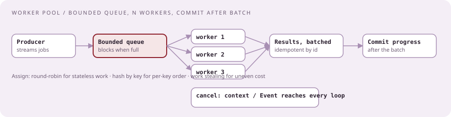
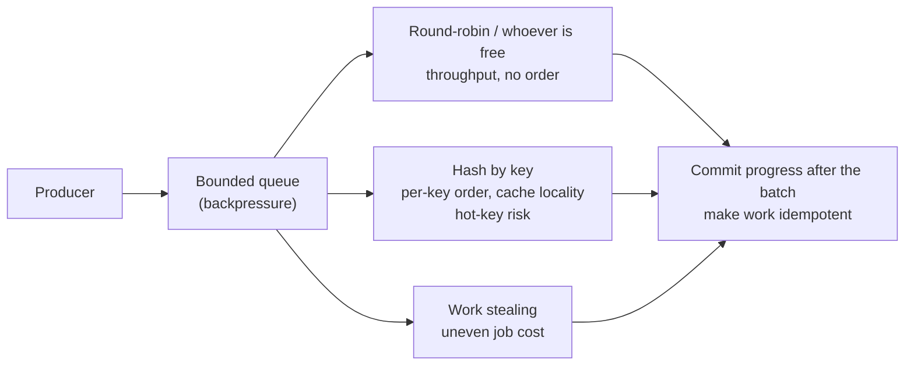

# Go for a Python interviewer

[Curriculum](../../../README.md) · [Preparation](../README.md)

> "You'll code in Python. The interviewer's team writes Go. They ask: what mechanism for a worker pool, and how would you assign work to workers?"

That follow-up ended a Cloud senior loop in October 2025 `[Reported]`. This lesson is enough Go to read it, discuss it, and answer the concurrency questions in it, with the Python equivalent beside each idea.



## Go in five sentences

Compiled, statically typed, garbage collected, built for services: one binary, fast start, small memory. Concurrency is in the language: goroutines are cheap runtime-scheduled threads, channels are typed queues between them. No exceptions; errors are returned values you check. No inheritance; a type satisfies an interface by having the methods. The standard library covers HTTP, JSON, testing, and profiling.

## Python to Go

| Python | Go | Note |
|---|---|---|
| `x = 5` | `x := 5` | declares and infers |
| `def f(a, b): return a + b` | `func f(a, b int) int { return a + b }` | `func f() (int, error)` returns two values |
| `list` | `[]int` slice | a view on an array; `append` may reallocate |
| `dict` | `map[string]int` | nil map write panics; iteration order random |
| class + methods | `type Job struct{...}`; `func (j *Job) Run()` | pointer receiver mutates |
| duck typing | `interface` | satisfied implicitly by method set |
| `try/except` | `v, err := f(); if err != nil { return fmt.Errorf("scan %s: %w", id, err) }` | `%w` wraps; `errors.Is` / `errors.As` |
| `with` / `finally` | `defer f.Close()` | runs at function return, LIFO |
| `None` | `nil` | pointers, slices, maps, channels, interfaces |
| `Thread(target=f).start()` | `go f()` | fire and forget |
| `queue.Queue(maxsize=n)` | `make(chan Job, n)` | buffered; `make(chan Job)` is a handoff |
| `threading.Lock()` | `sync.Mutex` | `RWMutex` for many readers |
| `ThreadPoolExecutor` / `asyncio.gather` | `sync.WaitGroup` / `errgroup.Group` | errgroup cancels on first error |
| `asyncio.wait_for(c, t)` | `context.WithTimeout(ctx, t)` | context is the first parameter |
| `TypeVar` | `func Map[T, U any]` taking `(xs []T, f func(T) U)` and returning `[]U` | Go 1.18+ |
| `pytest` | `go test -race ./...` | table-driven tests |

## Reading it in a code review round

| You see | It means |
|---|---|
| `go func() { ... }()` | start an anonymous goroutine now |
| `ch <- v` / `v := <-ch` / `v, ok := <-ch` | send / receive / receive and learn if closed |
| `close(ch)`; `for v := range ch` | producer closes; consumer drains until closed |
| `chan<- T` / `<-chan T` | send-only / receive-only parameter |
| `select { case <-ctx.Done(): ... case j := <-jobs: ... default: ... }` | wait on several channels; `default` makes it non-blocking |
| `struct{}{}`; `chan struct{}` | zero-size value; a signal channel |
| `*T`, `&x`, `*p` | pointer type, address, dereference |
| `_` | discard; unused variables are compile errors |

## The four questions they ask

### Goroutines versus OS threads `[Aggregator]`

| | Goroutine | OS thread |
|---|---|---|
| Stack | ~2–8 KB, grows | 1–8 MB, fixed |
| Scheduling | Go runtime, M:N onto a few threads, work-stealing | Kernel context switch |
| Count | hundreds of thousands per process | thousands |
| Blocking | channel wait parks the goroutine without a thread | blocks the thread |

Say: "cheap enough to give every message its own worker; the cost that remains is coordination and memory, so I still bound them."

### Channels versus mutexes

Channels move ownership between goroutines (a job queue, a stop signal). Mutexes protect shared state modified in place (a counter map, a cache). The senior answer: a mutex for shared state, a channel for handoff, never both for the same data.

### The worker pool `[Reported follow-up]`

```go
func process(ctx context.Context, jobs <-chan Job, workers int) error {
	g, ctx := errgroup.WithContext(ctx)
	results := make(chan Result, workers)
	for i := 0; i < workers; i++ {
		g.Go(func() error {
			for {
				select {
				case <-ctx.Done():
					return ctx.Err()
				case j, ok := <-jobs:
					if !ok {
						return nil // producer closed jobs: drained
					}
					r, err := j.Run(ctx)
					if err != nil {
						return fmt.Errorf("job %s: %w", j.ID, err) // cancels ctx for all
					}
					results <- r
				}
			}
		})
	}
	go func() { g.Wait(); close(results) }()
	for r := range results {
		store(r)
	}
	return g.Wait()
}
```

Python beside it: `queue.Queue(maxsize=n)` fed by a producer, `n` threads from `ThreadPoolExecutor` pulling from it, a sentinel or `queue.join()` for shutdown, an `Event` for cancellation. Coded in Python in [bundle 56](../../02-coding-problems/problems/56-worker-pool/README.md).

### How to assign work to workers `[Reported follow-up]`



CrowdStrike's own consumers use round-robin worker pools and commit offsets after the batch `[Official]`. Volunteer the three follow-ups before they ask: bound the queue, commit after the batch, make work idempotent.

## Stopping cleanly, and what a reviewer looks for

| Rule | Why |
|---|---|
| Producer closes the channel; workers drain and return; wait; close results | Otherwise workers block forever on a channel nobody feeds: a goroutine leak |
| `select` on `ctx.Done()` in every loop | Cancellation has to reach every blocking point |
| Recover panics inside long-lived workers | An unrecovered panic in any goroutine kills the process; their Kafka post: a malformed event must not stop the consumer `[Official]` |
| `go test -race` | Detects unsynchronized shared writes at runtime |

**Planted gotchas:** loop variable captured by goroutines (pre-1.22); nil map write; double close; unbuffered send with no receiver ("all goroutines are asleep"); appending to a slice another goroutine reads; ignored `error`; `defer` inside a loop; `time.After` leaking timers in a hot loop.

## The rest in one table

| Topic | What to know |
|---|---|
| Packages, modules | one directory, one package; `go.mod`; `internal/` is private; exported names are capitalized |
| Errors | sentinel `var ErrNotFound = errors.New(...)`; typed errors with `Error()`; wrap with `%w`; libraries return, `main` decides |
| Structs, JSON | struct tags such as json:"host" name the wire field; `json.Unmarshal(b, &e)` |
| HTTP | `net/http` handlers `func(w http.ResponseWriter, r *http.Request)`; middleware wraps a handler; the posting names Gin |
| Testing | table-driven with `t.Run`; `go test -race -cover ./...`; `BenchmarkX(b *testing.B)` |
| Performance | `pprof`; concurrent GC with sub-millisecond pauses; avoid allocations in hot paths; CrowdStrike moved to zerolog for this `[Official]` |
| Generics | `[T comparable]`, `[T constraints.Ordered]`; containers and helpers, not everywhere |

## Two hours of practice

1. `go run` a file that starts 3 goroutines, sends 10 jobs down a buffered channel, waits with a `WaitGroup`, prints results. Then forget to close the channel and read the deadlock message.
2. Add `context.WithTimeout`; make one job sleep past the deadline; confirm the others stop.
3. `go test -race` on a version with an unlocked shared counter; read the report.
4. Read the [Kafka consumer post](https://www.crowdstrike.com/en-us/blog/improving-fault-tolerance-in-apache-kafka-best-practices/) `[Official]` and redraw its retry tiers in your own words.

Next: [The two-week plan, the reading list, and the day of](06-study-plan.md).
