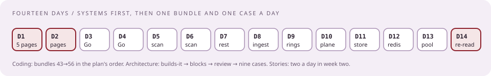

# The two-week plan, the reading list, and the day of

[Curriculum](../../../README.md) · [Preparation](../README.md)

> "The loop is in two weeks. What is the order of work?"

Your own systems first, because they answer the hiring manager and seed every story. Then one coding bundle and one design case a day. The Go lesson once. Six stories rehearsed. Sleep.

## The fourteen days

| Day | Coding ([CH 20](../../02-coding-problems/README.md)) | Architecture ([CH 21](../../03-architecture/README.md)) | Preparation |
|---|---|---|---|
| 1 | — | — | Write your five one-page systems ([lesson 2](02-recruiter-and-hiring-manager.md)) |
| 2 | [43 string templating](../../02-coding-problems/problems/43-string-templating/README.md) | [How CrowdStrike builds it](../../03-architecture/lessons/01-how-crowdstrike-builds-it.md) | Finish the five pages |
| 3 | [56 worker pool](../../02-coding-problems/problems/56-worker-pool/README.md) | [Building blocks](../../03-architecture/lessons/02-building-blocks.md) | [Go lesson](05-go-for-a-python-interviewer.md), part 1 |
| 4 | [48 islands](../../02-coding-problems/problems/48-number-of-islands/README.md) | [The ninety-minute review](../../03-architecture/lessons/03-the-ninety-minute-review.md) | Go practice, two hours |
| 5 | [47 LRU with TTL](../../02-coding-problems/problems/47-lru-cache-ttl/README.md) | [File-scanning platform](../../03-architecture/problems/file-scanning-platform.md), first pass | Story 1 and 2 |
| 6 | [46 time-based KV](../../02-coding-problems/problems/46-time-based-kv/README.md) | File-scanning platform, defended aloud | Story 3 |
| 7 | [44 busiest host](../../02-coding-problems/problems/44-busiest-host/README.md) + streaming | [Event message system](../../03-architecture/problems/event-message-system.md) | Rest |
| 8 | [49 token bucket](../../02-coding-problems/problems/49-token-bucket/README.md) | [Telemetry ingestion](../../03-architecture/problems/telemetry-ingestion.md) | Story 4 |
| 9 | [50 log parser](../../02-coding-problems/problems/50-log-parser/README.md) | [Content rollout with rings](../../03-architecture/problems/content-rollout-rings.md) | Story 5 |
| 10 | [51 merge k streams](../../02-coding-problems/problems/51-merge-k-streams/README.md) | [Endpoint control plane](../../03-architecture/problems/endpoint-control-plane.md) | Story 6 |
| 11 | [45 telemetry dedupe](../../02-coding-problems/problems/45-telemetry-dedupe/README.md) | [Searchable event store](../../03-architecture/problems/searchable-event-store.md) | Code review drill: a 100-line PR aloud |
| 12 | [53 dependency order](../../02-coding-problems/problems/53-dependency-order/README.md), [54 network delay](../../02-coding-problems/problems/54-network-delay/README.md) | [Rate limiter and queue](../../03-architecture/problems/rate-limiter-and-queue.md), [Design Redis](../../03-architecture/problems/design-redis.md) | Cloud round table ([lesson 3](03-collaboration-panel.md)) |
| 13 | [52 codec](../../02-coding-problems/problems/52-length-prefix-codec/README.md), [55 intervals](../../02-coding-problems/problems/55-interval-merge/README.md) | [Worker pool for template jobs](../../03-architecture/problems/worker-pool-template-jobs.md) | Mock: HM call with a friend asking why |
| 14 | Timed mixed set, three problems in 90 minutes | Re-read your take-home design | Re-read the posting and your five pages; stop by evening |

If the loop is sooner, keep days 1–6 and compress the rest: the string-templating and worker-pool bundles, the file-scanning case, and the five pages are the non-negotiables.

## Reading list, in order

| Read | Take from it |
|---|---|
| *Designing Data-Intensive Applications*, ch. 3, 6, 11, then 5 and 7 | LSM trees and compaction; partitioning and consistent hashing; stream processing and exactly-once as a sink property |
| CrowdStrike engineering blog, seven posts (linked in [How CrowdStrike builds it](../../03-architecture/lessons/01-how-crowdstrike-builds-it.md)) | Their numbers, their vocabulary, their retry tiers, their post-2024 rollout model |
| *System Design Interview* vol. 1: rate limiter, consistent hashing, key-value store, notification system; vol. 2: distributed message queue, metrics and alerting | The building blocks in interview form |
| Hello Interview free guides (credited by the Jan 2026 offer) | Core concepts; rate limiter; message queue; alerting |
| *Kafka: The Definitive Guide*, consumer and reliability chapters | Consumer groups, commits, rebalancing |
| Cassandra docs: data modeling, TimeWindowCompactionStrategy | The store behind Threat Graph; CrowdStrike contributed TWCS |
| *Site Reliability Engineering*: monitoring, release engineering, overload | Golden signals, staged releases, shedding |
| "Go by Example," "A Tour of Go" concurrency, *Effective Go* once | Enough to read Go |
| Fowler, "Patterns of Distributed Systems": lease, fencing token, idempotent receiver, write-ahead log | The words for what you already built |

Skip for this loop: Kubernetes internals, Terraform module design, OS internals, ML system design.

## Questions to ask them

| Round | Ask |
|---|---|
| Recruiter | Round list and order; take-home or live design; language; AI policy; Senior I or II; who the hiring manager is |
| Hiring manager | What does the team own, in one sentence? What broke last quarter? How do releases to endpoints work here after 2024? What does a great first ninety days look like? |
| Coding | What is the production version of this problem on your team? |
| Design review | Which part would your team push back on hardest? Which scale number did I get most wrong? |
| Panel | How does a decision get made across three time zones? On-call: rotation length, pages per week, the last bad night? |
| Wrap-up | Senior I or II, and what distinguishes them on this team? |

## Leveling and negotiation, from reports

| Fact | Source |
|---|---|
| Levels: Engineer I/II/III → Senior I → Senior II → Principal; Senior I is not terminal | Blind |
| Design is where down-leveling happens | Blind 2025; LeetCode Nov 2025 |
| A Senior 1 offer in Redmond moved from an unstated mid-$300K package to $435K ($225K base, $183K equity, $27K bonus) using competing final loops; "all the negotiation happened in the initial recruiter call after the final loop"; base moved above the posted cap | Blind Aug 2025 |
| Equity is CRWD RSUs, four-year vest, one-year cliff; ask about first-year cliff mitigation | public filings, Blind |
| Recruiter silence after positive feedback is common; follow up weekly | Blind 2021–2025 |

## The day of

| Before | During | After |
|---|---|---|
| Shared editor tested; language chosen | State assumptions before answering | One-line note to the recruiter |
| Take-home diagram exported as image and PDF; numbers on the first slide; one slide of trade-offs you dislike | Baseline before optimization | Write down every question asked while it is fresh |
| Five pages and six stories re-read | Say the failure mode before they ask | Keep the other processes moving |

Next chapter: [Coding problems in their shapes](../../02-coding-problems/README.md).
