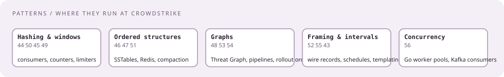
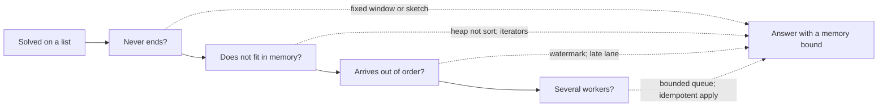

# Patterns to their stack

[Curriculum](../../../README.md) · [Coding problems](../README.md)

> "Which patterns show up in their coding rounds, and where do those same patterns run in production at CrowdStrike?"

The same handful serves both. The interview column is how it is asked; the job column is where it lives in the systems they publish `[Official]`.

| Pattern | Interview shape | At CrowdStrike | Bundle |
|---|---|---|---|
| Hash-map aggregation | Busiest host; errors per service per minute | Every consumer rolling up telemetry; per-tenant counters | [44](../problems/44-busiest-host/README.md), [50](../problems/50-log-parser/README.md) |
| Top-k with a heap | K busiest hosts from a stream | Alerting on the noisiest endpoints without a full sort | [44](../problems/44-busiest-host/README.md) |
| Merge k sorted streams | Merge events by timestamp | Compaction merges sorted SSTables; ordered multi-partition reads | [51](../problems/51-merge-k-streams/README.md) |
| Sliding window | Rate over the last N seconds | Windowed detection rules; rate limiters | [49](../problems/49-token-bucket/README.md) |
| Binary search on sorted history | Time-based key-value store | Lookups in time-ordered SSTables and indexes | [46](../problems/46-time-based-kv/README.md) |
| BFS / DFS / union-find | Number of islands; connected hosts | Threat Graph is an adjacency-list store; traversal is the product | [48](../problems/48-number-of-islands/README.md) |
| Dijkstra and topological sort | Network delay time; task order | Pipeline dependency ordering; rollout ordering across rings | [53](../problems/53-dependency-order/README.md), [54](../problems/54-network-delay/README.md) |
| Interval merge and sweep | Merge outage windows | Maintenance windows; host-group update schedules | [55](../problems/55-interval-merge/README.md) |
| LRU / LFU cache | Implement a cache like Redis | Redis in front of hash lookups and sessions | [47](../problems/47-lru-cache-ttl/README.md) |
| Token bucket | Per-tenant `allow(t)` | Per-engine and per-tenant limits; gateway rate limiting | [49](../problems/49-token-bucket/README.md) |
| Consistent hashing | "How would you shard?" | Kafka partitions by key; Cassandra ring; their sharded clusters | CH 21 |
| Streaming hashes | Dedupe a 2 GB upload by SHA-256 | Content-addressed file analysis | CH 21 |
| Bloom filters | "Have we seen this hash?" in bounded memory | LSM read path skips SSTables with bloom filters | [45](../problems/45-telemetry-dedupe/README.md) follow-up |
| Count-min sketch, HyperLogLog | Approximate counts over endless streams | Cardinality per tenant without a giant set | [44](../problems/44-busiest-host/README.md) follow-up |
| Length-prefix framing | Encode and decode; packet reassembly | Record framing on the wire and on disk | [52](../problems/52-length-prefix-codec/README.md) |
| Dedupe windows and idempotency | Apply each event once | Every consumer; idempotent endpoints | [45](../problems/45-telemetry-dedupe/README.md) |
| Producer–consumer, bounded queue | "Now there are many workers" | The worker pool in every Go consumer | [56](../problems/56-worker-pool/README.md) |
| Templating and string scanning | Replace `{{key}}` placeholders | Config rendering; the reported Oct 2025 screen | [43](../problems/43-string-templating/README.md) |

## The streaming extension, which they add to almost anything

Next: [String templating, then a worker pool](../problems/43-string-templating/README.md).
