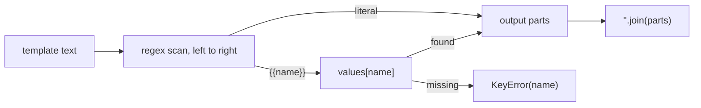
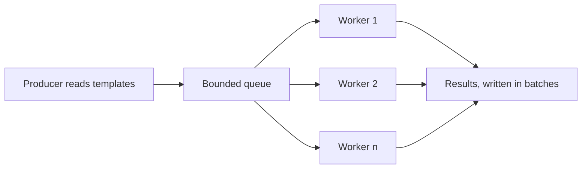

# String templating, then a worker pool

[Curriculum](../../../../README.md) · [Coding problems](../../README.md) · [All coding problems](../../../../../indexes/coding.md)

`[Reported]` October 2025, Senior, Software Engineer – Cloud, US: this exact problem, then "apply it to dictionary values," then "how would you handle large volumes, what mechanism for a worker pool, how would you assign work to workers." The candidate's code passed; the follow-up did not. Prerequisites: [strings and maps](../../../../01-code/02-data-structures-algorithms/README.md).

## Candidate brief

> A configuration service stores templates such as `"connecting to {{db_host}}:{{db_port}}"` and a dictionary of values. Render a template by replacing each `{{name}}` with the dictionary's value. Then render every string value inside a nested configuration dictionary the same way. Then tell us what changes when there are a hundred million templates.

| Contract | Decision |
|---|---|
| Input | `render(template: str, values: dict) -> str`; `render_config(config: dict, values: dict) -> dict` |
| Placeholder | `{{` + name + `}}`; names are letters, digits, underscore; whitespace inside braces is trimmed |
| Missing name | Raise `KeyError` naming the placeholder |
| Non-string values | Rendered with `str()`; `5001` becomes `"5001"` |
| Escaping | A single `{` or `}` is literal; `{{` not followed by a closing `}}` is literal text |
| Nested config | Strings are rendered; dicts and lists are walked; other values are returned unchanged; input is not mutated |
| Invalid input | Non-string template or non-dict values raises `ValueError` |

## The tool before the challenge

Scan once, left to right, copying literal text into a list of parts and replacing each placeholder as it closes. A regular expression does the scan in one call:

```python
import re
PLACEHOLDER = re.compile(r"\{\{\s*([A-Za-z0-9_]+)\s*\}\}")
```

`re.sub` with a function is the idiom: the function receives each match and returns the replacement. Avoid `str.replace` in a loop over the dictionary: it is O(templates × keys) and it re-scans text that was already substituted.

<!-- interview-rehearsal:start -->

## What the interviewer expects

State what a rendered string looks like for one example, say what happens on a missing key and on a stray brace, and name the scan you will do before coding.

**Done means:** every `{{name}}` replaced by `str(values[name])`, literal text untouched, `KeyError` on an unknown name, and nested configs rendered without mutating the input.

### Test-case scenarios to settle before coding

| Case | Exact input or state | Expected result | What it is testing |
|---|---|---|---|
| Representative | `"app -> {{db_host}}:{{db_port}}"`, `{"db_host": "example.com", "db_port": 5001}` | `"app -> example.com:5001"` | Substitution and `str()` of an int |
| Whitespace in braces | `"{{ db_host }}"`, same values | `"example.com"` | Trim inside the braces |
| Missing name | `"{{nope}}"`, `{}` | `KeyError('nope')` | Fail loudly, name the placeholder |
| Literal braces | `"{x} and {{ open"`, `{}` | unchanged | Single braces and an unclosed `{{` are text |
| Nested config | `{"db": {"url": "{{db_host}}"}, "ports": ["{{db_port}}", 1]}` | `{"db": {"url": "example.com"}, "ports": ["5001", 1]}`; input unchanged | Walk dicts and lists; leave non-strings |
| Invalid | `render(5, {})` | `ValueError` | Validation before scanning |

For each case, show which branch produces the result.

<!-- interview-rehearsal:end -->

`render("{{a}}-{{a}}", {"a": 1}) == "1-1"`; `render("{{a}}", {}) ` raises `KeyError`; `render_config({"k": "{{a}}"}, {"a": 2}) == {"k": "2"}`.

Before opening the explanation, restate the contract, trace the representative case, implement the single-scan baseline, and run the tests. Then answer the follow-up aloud before reading it.

<details>
<summary>Worked lesson, changed requirements, and reference</summary>

### One scan, one replacement per match



`re.sub(PLACEHOLDER, lookup, template)` visits each placeholder once and copies literal spans verbatim. Time O(n + total replacement length); space O(output). The pattern requires `}}` to close, so `{{` alone never matches and is copied as text, which satisfies the escaping rule without special cases.

### Rendering a nested config without mutating it

Recurse on type: `dict` → new dict with rendered values; `list` → new list; `str` → `render`; anything else → itself. Building new containers is the mutation guarantee; a reviewer will ask about it.

| Value | Action |
|---|---|
| `"{{db_host}}"` | render |
| `{"url": ...}` | new dict, recurse |
| `["{{db_port}}", 1]` | new list, recurse per element |
| `1`, `None`, `True` | unchanged |

### Follow-up 1 (senior, `[Reported]`): a hundred million templates

The question is not about the regex. It is about a worker pool and how work is assigned.



Say all four: (1) a bounded queue between the reader and the workers so memory stays flat when workers are slower than the reader; (2) round-robin or "whoever is free" assignment for stateless rendering, which this is; (3) hash by key only if per-key order or locality matters, which it does not here, and note the hot-key risk if you did; (4) progress committed after each batch so a crash replays a batch rather than losing one, which is safe because rendering is idempotent. The Python version of that pool is [bundle 56](../56-worker-pool/README.md). In Go it is goroutines on a channel, in the [Go lesson](../../../01-preparation/lessons/05-go-for-a-python-interviewer.md).

### Follow-up 2 (staff): templates reference other templates

`{{db_url}}` may expand to `"{{db_host}}:{{db_port}}"`. Render to a fixed point with a depth limit and a cycle check (a name already on the expansion stack raises). Without the limit, `a -> {{b}}`, `b -> {{a}}` never terminates.

### Run and check

```bash
cd curriculum/05-crowdstrike/02-coding-problems/problems/43-string-templating
python -m unittest -v test_solution.py
```

[Reference implementation](solution.py) · [Contract and oracle tests](test_solution.py).

</details>

Next: [Busiest host, then an endless stream](../44-busiest-host/README.md).
