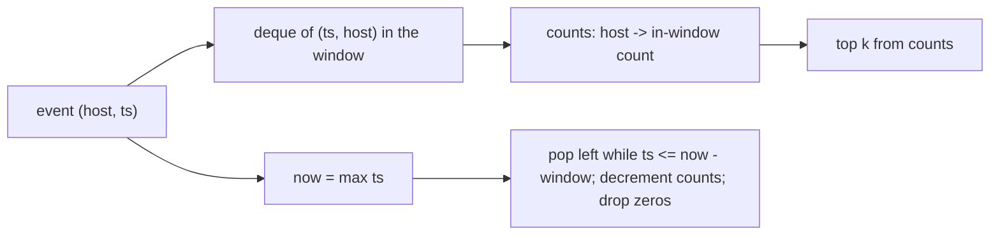

# Busiest host, then an endless stream

[Curriculum](../../../../README.md) · [Coding problems](../../README.md) · [All coding problems](../../../../../indexes/coding.md)

`[Aggregator]` The reported shape: "read log records, group by machine, return the busiest; then iterate to handle endless streams with memory limits." Prerequisites: [maps](../../../../01-code/02-data-structures-algorithms/README.md) and [heaps](../../../../01-code/02-data-structures-algorithms/README.md).

## Candidate brief

> Telemetry arrives as `(host, timestamp)` records. Return the host with the most records; on a tie, the host whose name sorts first. Then return the k busiest hosts. Then the records never stop and you may keep only a bounded amount of state.

| Contract | Decision |
|---|---|
| Input | `busiest(records) -> str or None`; `top_k(records, k) -> list[str]` where records is any iterable of `(host, ts)` |
| Output | Host with the highest count; ties by lexicographic host; `None` for no records; `top_k` returns up to k hosts, most frequent first, ties by name |
| Streaming | `TopKWindow(k, window_seconds)`: `add(host, ts)` and `current()`; counts only records with `ts > now - window`, where `now` is the largest `ts` seen |
| Invalid input | k < 0 raises `ValueError`; a record that is not a 2-tuple raises `ValueError` |
| Excluded | Sorting all records; keeping every record in memory in the streaming version |

## The tool before the challenge

```python
from collections import Counter
counts = Counter(host for host, _ in records)
best = max(counts.items(), key=lambda kv: (kv[1], -ord(kv[0][0]) if kv[0] else 0))
```

The `max` above is wrong for ties on multi-character names; the reference uses `min(counts.items(), key=lambda kv: (-kv[1], kv[0]))`, which sorts count descending and name ascending in one key. State the key before coding: it is where tie bugs live.

<!-- interview-rehearsal:start -->

## What the interviewer expects

Say what "busiest" means on a tie, name the one pass you will make, and give the memory cost in terms of distinct hosts, not records.

**Done means:** one pass with a hash map of counts; the tie rule stated and tested; top-k without sorting every host; a windowed streaming version whose memory is bounded by distinct hosts in the window.

### Test-case scenarios to settle before coding

| Case | Exact input or state | Expected result | What it is testing |
|---|---|---|---|
| Representative | `[("a",1),("b",2),("a",3)]` | `"a"` | Counting by host |
| Tie | `[("b",1),("a",2)]` | `"a"` | Name breaks ties, not arrival order |
| Empty | `[]` | `None` | Absence is part of the contract |
| Top-k | same as representative, k=2 | `["a","b"]` | Most frequent first |
| k larger than hosts | k=5 on two hosts | both hosts | Never pad or fail |
| Window | window 10, add `("a",0)`×3, `("b",11)`; `current()` | `["b"]` | Records at ts 0 fall out when now is 11 |
| Invalid | k=-1 | `ValueError` | Validate before scanning |

For each case, show which branch or state change produces that result.

<!-- interview-rehearsal:end -->

`busiest([("a",1),("b",2),("a",3)]) == "a"`; `top_k([("a",1),("b",2),("a",3)], 2) == ["a","b"]`; `busiest([]) is None`.

Before opening the explanation, restate the tie rule, implement the counting pass, then the top-k with a heap, then the window with a deque.

<details>
<summary>Worked lesson, changed requirements, and reference</summary>

### Count once, select without sorting

| Records seen | counts | busiest so far |
|---|---|---|
| `("a",1)` | `{a:1}` | a |
| `("b",2)` | `{a:1, b:1}` | a (tie by name) |
| `("a",3)` | `{a:2, b:1}` | a |

Counting is O(n) time, O(h) space for h distinct hosts. Selecting the top k with `heapq.nlargest(k, counts.items(), key=lambda kv: (kv[1], negname))` costs O(h log k) rather than O(h log h) for a full sort; for k=1 use `min` with the combined key. Names cannot be negated for a max-heap, so the reference uses a min-heap of `(-count, name)` and pops the front, which gives count descending and name ascending together.

### Follow-up 1 (senior, `[Aggregator]`): the stream never ends



Keep a deque of `(ts, host)` in arrival order and a count map. On each add, advance `now`, evict from the left while `ts <= now - window`, decrementing counts and deleting zero entries. Memory is O(records in the window), bounded by the window and the arrival rate, not by the stream's length; distinct hosts bound the count map. If even the window's records cannot be held, drop the deque and keep per-host counts in fixed buckets (one Counter per minute, evict whole minutes), trading exactness at the boundary for O(h × buckets) memory.

### Follow-up 2 (staff): a billion hosts

A count map over a billion hosts does not fit. Use a count-min sketch for frequencies (bounded memory, over-estimates only) with a small exact heap of the current top k, and accept that a host that briefly spikes may be missed. Say the error bound and the memory: width × depth counters, independent of host count.

### Run and check

```bash
cd curriculum/05-crowdstrike/02-coding-problems/problems/44-busiest-host
python -m unittest -v test_solution.py
```

[Reference implementation](solution.py) · [Contract and oracle tests](test_solution.py).

</details>

Next: [Telemetry dedupe in a time window](../45-telemetry-dedupe/README.md).
