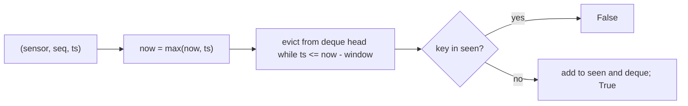

# Telemetry dedupe in a time window

[Curriculum](../../../../README.md) · [Coding problems](../../README.md) · [All coding problems](../../../../../indexes/coding.md)

`[Generated]` from CrowdStrike's published pipeline: Kafka is at-least-once, consumers retry, so the same event can arrive twice and downstream must apply it once `[Official]`. Prerequisites: [maps and queues](../../../../01-code/02-data-structures-algorithms/README.md).

## Candidate brief

> Sensors send events with a `sensor_id` and a per-sensor `seq` number, and the transport may deliver an event more than once. Emit each `(sensor_id, seq)` at most once. You may only remember what arrived in the last `window` seconds of event time; anything older is forgotten and a late duplicate beyond that window may be re-emitted. State that trade-off.

| Contract | Decision |
|---|---|
| Input | `Deduper(window_seconds)`; `accept(sensor_id, seq, ts) -> bool` returns `True` when the event is new and should be emitted |
| Time | Event time `ts`; `now` is the largest `ts` seen; entries with `ts <= now - window` are evicted |
| Duplicate | Same `(sensor_id, seq)` seen within the window: `False` |
| Out of order | A lower `seq` arriving after a higher one is still new if unseen: `True` |
| Memory | O(distinct keys in the window); `size()` reports it |
| Invalid input | Non-positive window, or `seq` that is not an int, raises `ValueError` |

## The tool before the challenge

A set answers "seen?" in O(1); a deque in arrival order answers "what is oldest?" in O(1). Together they make a window:

```python
from collections import deque
seen = {}                 # (sensor, seq) -> ts of first sighting
order = deque()           # (ts, sensor, seq) in arrival order
```

Eviction pops from the left while the head is older than the cutoff. Because arrival order is not timestamp order, an evicted entry may not be the smallest `ts`; the reference keeps the entry alive while any sighting is inside the window, which is the conservative rule.

<!-- interview-rehearsal:start -->

## What the interviewer expects

Define "duplicate" precisely, say what state you keep and when it shrinks, and name the failure mode when a duplicate arrives after the window has forgotten it.

**Done means:** `accept` is `True` exactly once per `(sensor, seq)` within the window, memory is bounded by the window, and the late-duplicate trade-off is stated.

### Test-case scenarios to settle before coding

| Case | Exact input or state | Expected result | What it is testing |
|---|---|---|---|
| First sighting | `accept("s1", 7, 100)` | `True` | New key is emitted |
| Exact duplicate | then `accept("s1", 7, 100)` | `False` | Same key in window |
| Other sensor, same seq | `accept("s2", 7, 100)` | `True` | Key is the pair |
| Out of order | `accept("s1", 6, 101)` after seq 7 | `True` | Lower seq is not a duplicate |
| Evicted, then late duplicate | window 10; `accept("s1", 7, 100)`; `accept("s1", 8, 120)`; `accept("s1", 7, 120)` | `True` | Forgotten keys are re-emitted; trade-off |
| Size shrinks | after the eviction above, `size()` | `2` | Memory bounded by the window |
| Invalid | `Deduper(0)` | `ValueError` | Validate before use |

For each case, show which state change produces that result.

<!-- interview-rehearsal:end -->

`d = Deduper(10); d.accept("s1", 7, 100) is True; d.accept("s1", 7, 100) is False; d.accept("s1", 8, 120) is True; d.size() == 1` after eviction of seq 7.

Before opening the explanation, define the key, choose the two structures, and decide the eviction rule.

<details>
<summary>Worked lesson, changed requirements, and reference</summary>

### A set for identity, a deque for age



| Event | now | deque (ts,key) | seen | result |
|---|---|---|---|---|
| s1,7 @100 | 100 | [(100,s1:7)] | {s1:7} | True |
| s1,7 @100 | 100 | same | same | False |
| s1,8 @120 | 120 | evict 100 → [(120,s1:8)] | {s1:8} | True |
| s1,7 @120 | 120 | [(120,s1:8),(120,s1:7)] | {s1:8, s1:7} | True (late duplicate re-emitted) |

Each event does O(1) amortized work; eviction pops each entry once. Memory is O(keys with a sighting inside the window).

### Follow-up 1 (senior): the window's keys do not fit in memory

Replace the exact set with a bloom filter per time bucket: a false positive drops a genuinely new event (bounded probability, stated), a false negative is impossible, and memory is fixed per bucket. Rotate buckets by time to get eviction for free. This is the same structure the LSM read path uses to skip SSTables `[Official]`.

### Follow-up 2 (staff): many consumer instances

Deduplication state must be shared or partitioned. Partition by `sensor_id` so one instance owns each sensor's keys (Kafka gives this by partition key), and the state stays local. Say what happens on rebalance: the new owner starts with an empty window, so duplicates can leak for one window length; make the sink idempotent so a leak is waste, not corruption.

### Run and check

```bash
cd curriculum/05-crowdstrike/02-coding-problems/problems/45-telemetry-dedupe
python -m unittest -v test_solution.py
```

[Reference implementation](solution.py) · [Contract and oracle tests](test_solution.py).

</details>

Next: [Time-based key-value store](../46-time-based-kv/README.md).
