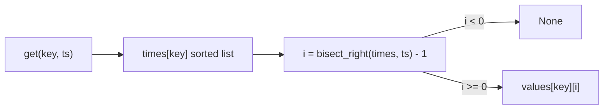

# Time-based key-value store

[Curriculum](../../../../README.md) · [Coding problems](../../README.md) · [All coding problems](../../../../../indexes/coding.md)

`[Reported]` A Blind commenter used a tree map for this at CrowdStrike and was rejected on the time-complexity discussion, not the code. Prerequisites: [binary search](../../../../01-code/02-data-structures-algorithms/README.md).

## Candidate brief

> Store `set(key, value, ts)` and answer `get(key, ts)` with the value whose timestamp is the largest one at or before `ts`, or nothing. Timestamps for a given key are set in non-decreasing order. Then say what changes when they are not, and when one key has a billion versions.

| Contract | Decision |
|---|---|
| Input | `TimeMap()`; `set(key, value, ts)`; `get(key, ts) -> value or None` |
| Ordering | For each key, `set` timestamps are non-decreasing; a `set` with a smaller `ts` than the key's last raises `ValueError` in the baseline |
| Get | Largest stored `ts' <= ts`; `None` if none, or the key is unknown |
| Equal timestamps | A later `set` at the same `ts` overwrites the value |
| Invalid input | Non-int timestamps raise `ValueError` |
| Complexity | `set` O(1) amortized; `get` O(log n) in the key's version count |

## The tool before the challenge

Per key, keep two parallel lists: timestamps (sorted, because sets arrive in order) and values. `bisect.bisect_right(times, ts)` returns the number of timestamps `<= ts`; subtract one for the index of the newest qualifying version.

```python
import bisect
times = [1, 5, 9]; values = ["a", "b", "c"]
i = bisect.bisect_right(times, 7) - 1   # 1 -> "b"
```

A tree map works too, but say why the list is enough: the input guarantees sorted inserts, so an append keeps order for free.

<!-- interview-rehearsal:start -->

## What the interviewer expects

State the ordering guarantee you rely on, name the search, and give both complexities before coding. The reported rejection was for hand-waving the second part.

**Done means:** `get` returns the newest version at or before `ts` in O(log n) using binary search over a per-key sorted list; `set` appends in O(1).

### Test-case scenarios to settle before coding

| Case | Exact input or state | Expected result | What it is testing |
|---|---|---|---|
| Representative | `set(a,"x",1); set(a,"y",5); get(a,7)` | `"y"` | Newest at or before |
| Exact hit | `get(a,5)` | `"y"` | `<=`, not `<` |
| Before first | `get(a,0)` | `None` | Nothing qualifies |
| Unknown key | `get(b,9)` | `None` | Missing key is not an error |
| Same timestamp | `set(a,"z",5); get(a,5)` | `"z"` | Overwrite rule |
| Out of order set | `set(a,"w",3)` after ts 5 | `ValueError` | The guarantee is enforced, not assumed |
| Invalid | `get(a,"5")` | `ValueError` | Validate types |

For each case, show which branch produces that result.

<!-- interview-rehearsal:end -->

`m = TimeMap(); m.set("a","x",1); m.set("a","y",5); m.get("a",7) == "y"; m.get("a",0) is None`.

Before opening the explanation, write the two-list layout, the `bisect_right` call, and the equal-timestamp branch.

<details>
<summary>Worked lesson, changed requirements, and reference</summary>

### Two lists and one binary search



| Stored (ts→value) | get ts | bisect_right | index | result |
|---|---|---|---|---|
| 1→x, 5→y | 7 | 2 | 1 | y |
| 1→x, 5→y | 5 | 2 | 1 | y |
| 1→x, 5→y | 0 | 0 | -1 | None |

`set` compares the new `ts` with the last stored one: equal → overwrite in place; greater → append; smaller → `ValueError`. O(1). `get` is O(log n) per key; memory O(total versions).

### Follow-up 1 (senior): sets arrive out of order

Appending no longer keeps the list sorted. Options with their costs: insert with `bisect.insort` (O(n) per set, fine for small histories); a balanced tree or skip list (O(log n) both ways, which is what a memtable is `[Official]`); or buffer out-of-order writes and merge them in batches, which is how LSM stores turn random writes into sequential ones. Say which one and why for the workload: write-heavy telemetry favors the buffered merge.

### Follow-up 2 (staff): a billion versions of one key

The per-key list no longer fits. Segment the history by time into immutable sorted runs on disk with an in-memory index of run boundaries; `get` binary-searches the index to pick a run, then binary-searches inside it. Add a TTL so old runs are dropped whole. This is an SSTable with a sparse index, and TTL compaction is how CrowdStrike expires telemetry `[Official]`.

### Run and check

```bash
cd curriculum/05-crowdstrike/02-coding-problems/problems/46-time-based-kv
python -m unittest -v test_solution.py
```

[Reference implementation](solution.py) · [Contract and oracle tests](test_solution.py).

</details>

Next: [LRU cache with TTL, like Redis](../47-lru-cache-ttl/README.md).
