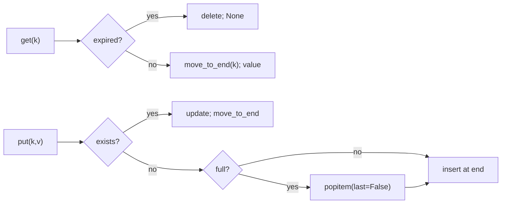

# LRU cache with TTL, like Redis

[Curriculum](../../../../README.md) · [Coding problems](../../README.md) · [All coding problems](../../../../../indexes/coding.md)

`[Reported]` January 2026, senior offer: "implement an in memory cache like Redis" after the code-review round, then a brief design of Redis. `[Reported]` August 2025, an EM loop: "design a FIFO cache, insert, lookup, eviction, pseudocode." Prerequisites: [maps and linked structures](../../../../01-code/02-data-structures-algorithms/README.md).

## Candidate brief

> Build an in-memory cache with a fixed capacity. `get` returns the value and marks the key most recently used; `put` inserts or updates and evicts the least recently used key when full. Keys may carry a time-to-live; an expired key behaves as absent. Then: many threads; then: what Redis does that this does not.

| Contract | Decision |
|---|---|
| Input | `LRUCache(capacity, clock=None)`; `get(key)`; `put(key, value, ttl=None)`; `size()` |
| Capacity | Positive int; when full, `put` of a new key evicts the least recently used live key |
| Recency | `get` and `put` on an existing key make it most recent |
| TTL | Seconds; `None` means never expires; expiry is `now >= inserted + ttl`; expired keys are not returned and do not count toward size once touched |
| Clock | Injected callable returning seconds, default `time.monotonic`; tests pass a fake |
| Invalid input | capacity < 1, or ttl <= 0, raises `ValueError` |

## The tool before the challenge

`collections.OrderedDict` gives O(1) `move_to_end` and `popitem(last=False)`. That is the doubly linked list plus hash map in one object. Say so, then say how you would build it from a dict and a linked list if asked.

```python
from collections import OrderedDict
d = OrderedDict(); d["a"] = 1; d["b"] = 2
d.move_to_end("a")          # a is now most recent
d.popitem(last=False)       # evicts b, the oldest
```

<!-- interview-rehearsal:start -->

## What the interviewer expects

Say what "least recently used" means for `put` on an existing key, how expiry is checked, and the cost of every operation before writing code.

**Done means:** `get` and `put` are O(1); the least recently used live key is evicted first; expired keys read as absent and free their slot; an injected clock makes it testable.

### Test-case scenarios to settle before coding

| Case | Exact input or state | Expected result | What it is testing |
|---|---|---|---|
| Representative | cap 2: `put a; put b; get a; put c` | `b` evicted; `get b` is `None` | Recency by access |
| Update refreshes | cap 2: `put a; put b; put a=2; put c` | `b` evicted; `get a == 2` | Update counts as use |
| Miss | `get z` | `None` | Absence |
| TTL expiry | `put a ttl=5` at t=0; `get a` at t=5 | `None` | `>=` boundary |
| Expired frees the slot | cap 1: `put a ttl=1` at 0; at t=2 `put b`; `size()` | `1`, and `get a` is `None` | Expired key does not cause eviction of a live one |
| Capacity one | cap 1: `put a; put b; get a` | `None` | Smallest boundary |
| Invalid | `LRUCache(0)`; `put a, ttl=0` | `ValueError` | Validate |

For each case, show which branch produces that result.

<!-- interview-rehearsal:end -->

`c = LRUCache(2); c.put("a",1); c.put("b",2); c.get("a"); c.put("c",3); c.get("b") is None`.

Before opening the explanation, write the eviction order for the representative case by hand, then implement with `OrderedDict`.

<details>
<summary>Worked lesson, changed requirements, and reference</summary>

### Recency order is the whole data structure



| Step (cap 2) | order (old → new) | note |
|---|---|---|
| put a | a | |
| put b | a, b | |
| get a | b, a | a refreshed |
| put c | a, c | b was oldest |

Every operation is O(1). TTL is stored beside the value; expiry is checked lazily on access, so an expired key costs nothing until touched. Before evicting a live key on `put`, the reference first drops the oldest key if it is expired, so a full cache of expired entries never evicts a live one.

### Follow-up 1 (senior): many threads

Wrap the whole operation in one lock: `get` mutates order, so a read lock is not enough. Contention becomes the limit at high QPS; shard the cache by hash of key into N independent caches with N locks, and accept that "least recently used" is now per shard. This is the "what mechanism for concurrency" question in cache form; the Go version is a mutex per shard.

### Follow-up 2 (staff, `[Reported]`): what Redis does that this does not

Redis is single-threaded per core on purpose (no lock contention; commands are serialized), keeps several data types (lists, sets, sorted sets, hashes), expires keys both lazily and by sampling, persists with snapshots and an append-only log, and replicates asynchronously with optional failover. Its eviction policies include LRU and LFU approximations by sampling rather than exact ordering, which trades precision for memory. For the CrowdStrike use in the posting, Redis fronts hash lookups and sessions; say what happens to your design when the cache is unavailable: fall through to the store and rate-limit the misses.

### Run and check

```bash
cd curriculum/05-crowdstrike/02-coding-problems/problems/47-lru-cache-ttl
python -m unittest -v test_solution.py
```

[Reference implementation](solution.py) · [Contract and oracle tests](test_solution.py).

</details>

Next: [Number of islands on a large grid](../48-number-of-islands/README.md).
