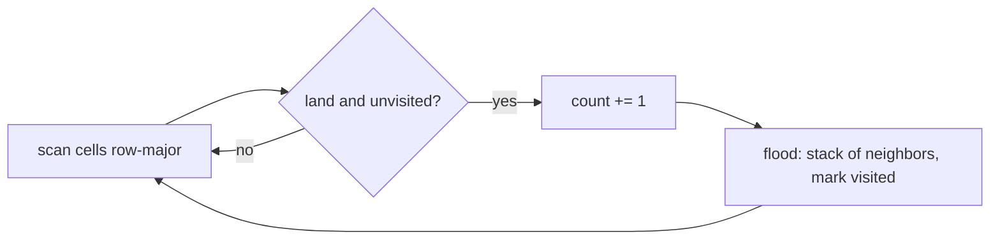

# Number of islands on a large grid

[Curriculum](../../../../README.md) · [Coding problems](../../README.md) · [All coding problems](../../../../../indexes/coding.md)

`[Reported]` November 2025, London, two independent accounts of the same loop: "given an m x n binary grid of 1s (land) and 0s (water), return the number of islands," solved with DFS. Prerequisites: [graphs](../../../../01-code/02-data-structures-algorithms/README.md).

## Candidate brief

> Count the connected regions of `1`s in a grid, where cells connect up, down, left, and right. Then the grid is 50,000 by 50,000 and recursion is not an option. Then the grid arrives one row at a time.

| Contract | Decision |
|---|---|
| Input | `count_islands(grid: list[list[int]]) -> int`; cells are `0` or `1` |
| Connectivity | Four-directional; diagonals do not connect |
| Empty | `[]` or `[[]]` returns `0` |
| Mutation | The input grid is not modified |
| Invalid input | Ragged rows, or a cell that is not `0`/`1`, raises `ValueError` |
| Complexity | O(rows × cols) time; O(rows × cols) worst-case space for visited, without recursion |

## The tool before the challenge

A visited set plus an explicit stack is DFS without recursion; a deque instead of a stack is BFS. Both visit each cell once:

```python
stack = [(r, c)]
while stack:
    r, c = stack.pop()
    for dr, dc in ((1,0),(-1,0),(0,1),(0,-1)):
        ...
```

Recursion on a 50,000-wide grid blows the Python call stack at a depth of about a thousand; say that before the interviewer does.

<!-- interview-rehearsal:start -->

## What the interviewer expects

Define connectivity, say how you avoid counting a cell twice, and choose iterative traversal with a reason.

**Done means:** each land cell is visited once, each component increments the count once, no recursion, the input is untouched.

### Test-case scenarios to settle before coding

| Case | Exact input or state | Expected result | What it is testing |
|---|---|---|---|
| Representative | `[[1,1,0],[0,0,1],[1,0,1]]` | `3` | Two separate regions on the right are joined vertically; bottom-left is alone |
| Diagonal only | `[[1,0],[0,1]]` | `2` | Diagonals do not connect |
| All water | `[[0,0],[0,0]]` | `0` | No components |
| All land | `[[1,1],[1,1]]` | `1` | One component |
| Empty | `[]`, `[[]]` | `0` | Boundaries |
| Snake | a 1×1000 row of `1`s | `1` | Long components without recursion |
| Invalid | `[[1,2]]`; `[[1],[1,1]]` | `ValueError` | Validate shape and values |

For each case, show which visit produces that result.

<!-- interview-rehearsal:end -->

`count_islands([[1,1,0],[0,0,1],[1,0,1]]) == 3`; `count_islands([[1,0],[0,1]]) == 2`; `count_islands([]) == 0`.

Before opening the explanation, trace the representative grid by hand, marking which cell starts each component.

<details>
<summary>Worked lesson, changed requirements, and reference</summary>

### Scan, and flood from every unvisited land cell



| Scan reaches | Action | count |
|---|---|---|
| (0,0) | flood marks (0,0),(0,1) | 1 |
| (1,2) | flood marks (1,2),(2,2) | 2 |
| (2,0) | flood marks (2,0) | 3 |

Each cell is pushed at most once because it is marked when pushed, not when popped; marking on pop lets a cell be pushed by two neighbors and doubles the work. Time O(R×C), space O(R×C) for the visited set in the worst case (all land).

### Follow-up 1 (senior, `[Reported]`): 50,000 × 50,000 and no recursion

2.5 billion cells do not fit as Python lists, and a visited set of tuples costs ~100 bytes per entry. Store the grid as a bytearray per row (one byte per cell) and mark visited by writing into a copy of the row, or a bit array; use the explicit stack from the baseline. If it still does not fit, process the grid in row bands and stitch components across band boundaries with union-find on the boundary cells, which is the streaming answer below.

### Follow-up 2 (staff): rows arrive as a stream

Keep only the previous row and a union-find over component labels. For each new row, label runs of land, union with the labels directly above, and count labels that have no descendant in the next row as completed islands. Memory is O(width) plus the union-find over live labels. This is the shape of connected-component labeling in one pass, and it is how graph-shaped telemetry gets summarized without holding the graph.

### Run and check

```bash
cd curriculum/05-crowdstrike/02-coding-problems/problems/48-number-of-islands
python -m unittest -v test_solution.py
```

[Reference implementation](solution.py) · [Contract and oracle tests](test_solution.py).

</details>

Next: [Per-tenant token-bucket rate limiter](../49-token-bucket/README.md).
