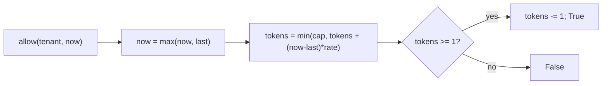

# Per-tenant token-bucket rate limiter

[Curriculum](../../../../README.md) · [Coding problems](../../README.md) · [All coding problems](../../../../../indexes/coding.md)

`[Aggregator]` Rate limiter appears on every CrowdStrike design list, and the posting names "rate limiting" in the API requirements `[Official]`. As a coding problem it is the sliding-window pattern with a clock. Prerequisites: [windows](../../../../01-code/02-data-structures-algorithms/README.md).

## Candidate brief

> Each tenant may make `capacity` requests in a burst and `rate` requests per second sustained. `allow(tenant, now)` returns whether a request at time `now` is admitted. Then: several API instances share the limit. Then: the shared store is unavailable.

| Contract | Decision |
|---|---|
| Input | `TokenBucket(capacity, refill_per_second)`; `allow(tenant, now) -> bool`; `now` is seconds as a float |
| Semantics | A bucket starts full; each admitted request consumes one token; tokens refill continuously at `refill_per_second` up to `capacity` |
| Time | Callers pass `now`; a `now` earlier than the tenant's last `now` is treated as the last `now` (clock never goes backward) |
| Tenants | Independent buckets, created on first sight; memory O(tenants) |
| Invalid input | capacity < 1 or rate <= 0 raises `ValueError` |
| Excluded | Sleeping or blocking; queuing rejected requests |

## The tool before the challenge

Refill lazily: store `(tokens, last)` per tenant and, on each call, add `(now - last) × rate` capped at capacity. No timer, no background thread.

```python
tokens = min(capacity, tokens + (now - last) * rate)
```

Floats accumulate error; for a job interview say so and either use integer micro-tokens or accept the drift.

<!-- interview-rehearsal:start -->

## What the interviewer expects

Explain burst versus sustained rate in one sentence, say the state per tenant, and choose lazy refill with a reason.

**Done means:** a full bucket admits `capacity` back-to-back requests, then one per `1/rate` seconds; tenants do not interfere; the clock never runs backward.

### Test-case scenarios to settle before coding

| Case | Exact input or state | Expected result | What it is testing |
|---|---|---|---|
| Burst | cap 2, rate 1: `allow(t,0)`×3 | `T, T, F` | Capacity bounds the burst |
| Refill | then `allow(t,0.5)`; `allow(t,1.0)` | `F, T` | Half a token is not a token; one full second refills one |
| Cap on refill | idle from 1.0 to 100.0 then `allow(t,100)`×3 | `T, T, F` | Refill never exceeds capacity |
| Independent tenants | cap 1: `allow(a,0)`, `allow(b,0)` | `T, T` | Separate buckets |
| Backward clock | `allow(t,5)` then `allow(t,3)` | treated as `now=5`; no extra tokens | Monotonic guard |
| Exact boundary | cap 1, rate 2: `allow(t,0)`, `allow(t,0.5)` | `T, T` | `>=` on a full token |
| Invalid | `TokenBucket(0, 1)`; `TokenBucket(1, 0)` | `ValueError` | Validate |

For each case, show the token arithmetic that produces the result.

<!-- interview-rehearsal:end -->

`b = TokenBucket(2, 1); [b.allow("t",0) for _ in range(3)] == [True, True, False]; b.allow("t", 1.0) is True`.

Before opening the explanation, write the refill line and the two-branch admit.

<details>
<summary>Worked lesson, changed requirements, and reference</summary>

### Lazy refill, then admit



| call | elapsed | tokens before | admitted | tokens after |
|---|---|---|---|---|
| t=0 | 0 | 2.0 | yes | 1.0 |
| t=0 | 0 | 1.0 | yes | 0.0 |
| t=0 | 0 | 0.0 | no | 0.0 |
| t=0.5 | 0.5 | 0.5 | no | 0.5 |
| t=1.0 | 0.5 | 1.0 | yes | 0.0 |

O(1) per call, O(tenants) memory. Compare with a sliding log (store every timestamp, O(rate) memory per tenant, exact) and a fixed window (O(1), allows 2× bursts at the boundary); token bucket is the common middle.

### Follow-up 1 (senior): several API instances share the limit

Per-instance buckets multiply the limit by the instance count. Move the state to a shared store keyed by tenant: in Redis, a Lua script does refill-and-decrement atomically in one round trip, which is what the gateway rate limiting in the posting implies. Say the latency cost (one Redis call per request) and the mitigation (local pre-check with a small per-instance allowance, then the shared check).

### Follow-up 2 (staff): the shared store is unavailable

Decide the failure mode out loud: fail open (admit everything, protect availability, risk overload) or fail closed (reject everything, protect the backend, risk an outage of your own making). For a security product front door, fail open with a local emergency bucket and an alert; for an expensive backend, fail closed. The wrong answer is not choosing.

### Run and check

```bash
cd curriculum/05-crowdstrike/02-coding-problems/problems/49-token-bucket
python -m unittest -v test_solution.py
```

[Reference implementation](solution.py) · [Contract and oracle tests](test_solution.py).

</details>

Next: [Log parser: errors per service per minute](../50-log-parser/README.md).
