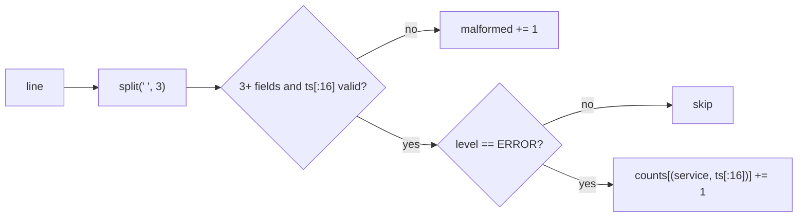

# Log parser: errors per service per minute

[Curriculum](../../../../README.md) · [Coding problems](../../README.md) · [All coding problems](../../../../../indexes/coding.md)

`[Aggregator]` "Log parsing and string handling" is the most-repeated coding theme across CrowdStrike guides, and their take-homes are reported as "a log parser or a tool that processes security events." Prerequisites: [strings and maps](../../../../01-code/02-data-structures-algorithms/README.md).

## Candidate brief

> Lines look like `2026-09-25T10:14:03Z ERROR auth-api token expired for tenant 42`. Count ERROR lines per service per minute. Malformed lines are counted, not fatal. Then the file is 40 GB. Then a line can continue onto the next lines (a stack trace).

| Contract | Decision |
|---|---|
| Input | `count_errors(lines) -> (counts, malformed)` where `lines` is any iterable of strings |
| Line format | `<ISO-8601 UTC timestamp> <LEVEL> <service> <message...>`, single spaces between the first three fields |
| Output | `counts` is a dict `{(service, "YYYY-MM-DDTHH:MM"): n}` for ERROR lines; `malformed` is the number of lines that do not parse |
| Levels | Only `ERROR` counts; other levels parse fine and are ignored |
| Malformed | Fewer than three fields, or a timestamp that does not start `YYYY-MM-DDTHH:MM` |
| Memory | O(distinct (service, minute) pairs), not O(lines) |
| Invalid input | A non-string line raises `ValueError` |

## The tool before the challenge

`str.split(" ", 3)` gives at most four parts without allocating the whole message split; slicing the timestamp to 16 characters gives the minute key without parsing a datetime. Generators keep memory flat:

```python
with open(path) as f:
    counts, malformed = count_errors(f)   # f yields one line at a time
```

<!-- interview-rehearsal:start -->

## What the interviewer expects

Say what "malformed" means, what the key of the count map is, and why you never hold the file in memory.

**Done means:** one pass, O(1) work per line, counts keyed by `(service, minute)`, malformed lines counted and skipped, and the function accepts a file object without reading it whole.

### Test-case scenarios to settle before coding

| Case | Exact input or state | Expected result | What it is testing |
|---|---|---|---|
| Representative | two ERROR lines for `auth-api` at 10:14, one at 10:15 | `{("auth-api","2026-09-25T10:14"):2, ("auth-api","2026-09-25T10:15"):1}`, malformed 0 | Minute bucketing |
| Other levels | an INFO line | not counted; malformed 0 | Level filter |
| Malformed | `"garbage"` and `"2026-09-25 ERROR svc x"` | counted in malformed | Field count and timestamp shape |
| Message with spaces | `... ERROR svc a b c d` | one count for svc | `split(" ", 3)` keeps the message whole |
| Empty input | `[]` | `({}, 0)` | Boundaries |
| Trailing newline | lines ending in `\n` | same counts | Strip before parsing |
| Invalid | `[42]` | `ValueError` | Type check |

For each case, show which branch produces that result.

<!-- interview-rehearsal:end -->

`count_errors(["2026-09-25T10:14:03Z ERROR auth-api x", "2026-09-25T10:14:59Z ERROR auth-api y"]) == ({("auth-api","2026-09-25T10:14"): 2}, 0)`.

Before opening the explanation, write the parse of one line and the malformed test, then the loop.

<details>
<summary>Worked lesson, changed requirements, and reference</summary>

### One line at a time, one dictionary



Time O(lines × line length); memory O(distinct keys). Validation is a shape check (`len == 4`-ish, `ts[4] == '-'`, `ts[10] == 'T'`, digits in the right places) rather than a full datetime parse, which is ten times slower and unnecessary for bucketing.

### Follow-up 1 (senior): the file is 40 GB

The baseline already streams; say so, then say what still costs: the distinct-key map grows with services × minutes, which for a day of 500 services is 720,000 keys, fine. If it were per host instead of per service (millions of hosts), flush completed minutes to output once the timestamp moves past them, keeping only the current minute's keys in memory. That needs the input to be roughly time-ordered, which log files are. Parallelize by splitting the file at newline boundaries and merging the per-chunk maps.

### Follow-up 2 (staff): multi-line records

A stack trace continues on indented lines. Treat a line as a continuation when it does not start with a timestamp shape; attach it to the previous record; count the record once. The malformed count then means "a record whose first line has no timestamp," and a continuation line before any record is malformed. Say how this changes chunked parallelism: chunk boundaries must fall at record starts, so each worker scans forward to the next timestamped line before parsing.

### Run and check

```bash
cd curriculum/05-crowdstrike/02-coding-problems/problems/50-log-parser
python -m unittest -v test_solution.py
```

[Reference implementation](solution.py) · [Contract and oracle tests](test_solution.py).

</details>

Next: [Merge k sorted event streams](../51-merge-k-streams/README.md).
