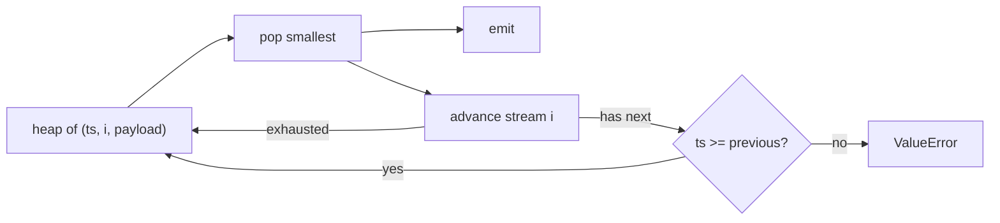

# Merge k sorted event streams

[Curriculum](../../../../README.md) · [Coding problems](../../README.md) · [All coding problems](../../../../../indexes/coding.md)

`[Generated]` from CrowdStrike's storage: LSM compaction is a k-way merge of sorted runs, and reading several Kafka partitions in time order is the same merge `[Official]`. Prerequisites: [heaps](../../../../01-code/02-data-structures-algorithms/README.md).

## Candidate brief

> Each sensor delivers its events in timestamp order. Merge k such streams into one stream in timestamp order, without dropping events that share a timestamp, and without reading any stream past what you have emitted. Then one stream stalls. Then an event arrives later than its timestamp allows.

| Contract | Decision |
|---|---|
| Input | `merge(streams) -> iterator` where each stream is an iterator of `(ts, payload)` sorted by `ts` |
| Output | All events in non-decreasing `ts`; equal timestamps keep stream order (lower stream index first) |
| Laziness | Pull from a stream only when its head is needed; the merged output is an iterator |
| Empty | Any subset of streams may be empty; no streams yields nothing |
| Invalid input | A stream whose next `ts` is smaller than its previous `ts` raises `ValueError` at that point |
| Complexity | O(N log k) time for N total events; O(k) memory beyond the output |

## The tool before the challenge

A min-heap of `(ts, stream_index, payload)` holds one head per stream. Pop the smallest, emit it, push that stream's next head. `stream_index` in the key breaks timestamp ties deterministically and keeps payloads out of the comparison:

```python
import heapq
heap = [(ts, i, payload) for i, (ts, payload) in enumerate(heads)]
heapq.heapify(heap)
```

`heapq.merge` does this in the standard library; know it, and know why you can write it.

<!-- interview-rehearsal:start -->

## What the interviewer expects

State the tie rule, the memory bound, and why the heap key must not compare payloads.

**Done means:** an iterator that yields every event in timestamp order with stable ties, holding one head per stream, and refusing an out-of-order stream loudly.

### Test-case scenarios to settle before coding

| Case | Exact input or state | Expected result | What it is testing |
|---|---|---|---|
| Representative | `[(1,a),(3,b)]`, `[(2,c)]` | `1a, 2c, 3b` | Interleave |
| Equal timestamps | `[(1,a)]`, `[(1,b)]` | `1a, 1b` | Stable ties by stream index |
| Duplicate timestamps within one stream | `[(1,a),(1,b)]`, `[]` | `1a, 1b` | Nothing dropped |
| Empty streams | `[]`, `[(5,x)]`, `[]` | `5x` | Empties are fine |
| No streams | `[]` | nothing | Boundary |
| Lazy | a stream that raises when advanced past its second element; take 2 outputs | no error | Pulls only what it emits |
| Invalid | `[(2,a),(1,b)]` | `ValueError` when reaching `(1,b)` | Order is checked, not trusted |

For each case, show the heap state that produces the result.

<!-- interview-rehearsal:end -->

`list(merge([iter([(1,"a"),(3,"b")]), iter([(2,"c")])])) == [(1,"a"),(2,"c"),(3,"b")]`.

Before opening the explanation, draw the heap after each pop for the representative case.

<details>
<summary>Worked lesson, changed requirements, and reference</summary>

### One head per stream in a heap



| Heap (ts,i) | pop | emit |
|---|---|---|
| (1,0),(2,1) | (1,0) | 1a; push (3,0) |
| (2,1),(3,0) | (2,1) | 2c; stream 1 exhausted |
| (3,0) | (3,0) | 3b |

Each event is pushed and popped once: O(N log k). Memory is the heap, O(k), plus whatever the caller buffers. Reading is lazy because `next()` on a stream happens only after its previous head was emitted.

### Follow-up 1 (senior): one stream stalls

A lazy merge blocks on the stalled stream's `next()` and every other stream waits behind it. That is correct for a total order and unacceptable for latency. Options: a per-stream timeout that emits a "gap" marker and continues (order is no longer total across the gap); or a watermark: emit events with `ts` below the minimum of all live heads and treat a stalled stream as having a head at its last known `ts` plus an allowed lateness. Say which invariant you gave up.

### Follow-up 2 (staff): a late event

An event arrives on stream i with `ts` smaller than what was already emitted. The baseline raises; a production merge cannot. Route it to a late lane (a separate output) with its lateness recorded, and let the consumer decide (recompute the window, or drop). This is the watermark design in the stream-processing literature and in CrowdStrike's event-time detections `[Official]`.

### Run and check

```bash
cd curriculum/05-crowdstrike/02-coding-problems/problems/51-merge-k-streams
python -m unittest -v test_solution.py
```

[Reference implementation](solution.py) · [Contract and oracle tests](test_solution.py).

</details>

Next: [Length-prefix codec for framed records](../52-length-prefix-codec/README.md).
