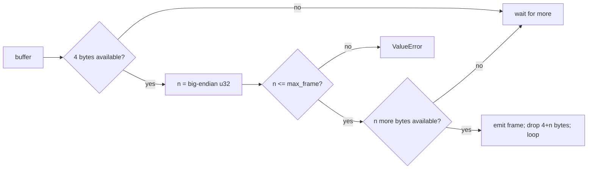

# Length-prefix codec for framed records

[Curriculum](../../../../README.md) · [Coding problems](../../README.md) · [All coding problems](../../../../../indexes/coding.md)

`[Aggregator]` "Encode and decode strings" is on two CrowdStrike lists, and "parse, fragment, and reassemble network packets" on a third; both are framing. Prerequisites: [strings](../../../../01-code/02-data-structures-algorithms/README.md).

## Candidate brief

> Encode a list of byte strings into one byte string so that a decoder recovers the exact list, including empty strings and strings containing any byte. Then decode from a socket that delivers the encoding in arbitrary chunks. Then a frame's length field is corrupted.

| Contract | Decision |
|---|---|
| Input | `encode(items: list[bytes]) -> bytes`; `decode(data: bytes) -> list[bytes]` |
| Framing | Each item is a 4-byte big-endian unsigned length followed by the bytes; the list is the concatenation |
| Empty | `encode([]) == b""`; `encode([b""]) == b"\x00\x00\x00\x00"` |
| Streaming | `FrameDecoder().feed(chunk) -> list[bytes]` returns the frames completed by this chunk, buffering partial ones |
| Corruption | A declared length larger than `max_frame` (default 16 MiB) raises `ValueError`; truncated data at end of `decode` raises `ValueError` |
| Invalid input | A non-bytes item raises `ValueError` |

## The tool before the challenge

Delimiters fail as soon as the delimiter can appear in the data. A length prefix never fails: the decoder reads four bytes, learns exactly how many to take, and takes them.

```python
import struct
header = struct.pack(">I", len(item))     # 4 bytes, big-endian
(n,) = struct.unpack(">I", data[i:i+4])
```

<!-- interview-rehearsal:start -->

## What the interviewer expects

Say why a delimiter is wrong, choose a fixed-width length prefix, and say what the decoder does with a partial frame.

**Done means:** round-trip for any list of byte strings; a streaming decoder that returns completed frames per chunk and keeps the rest; loud failure on absurd lengths or truncation.

### Test-case scenarios to settle before coding

| Case | Exact input or state | Expected result | What it is testing |
|---|---|---|---|
| Representative | `[b"a", b"bc"]` | `b"\x00\x00\x00\x01a\x00\x00\x00\x02bc"`; decodes back | Framing |
| Empty item | `[b""]` | 4 zero bytes; decodes to `[b""]` | Zero length is a frame |
| Binary-safe | `[b"\x00\x00\x00\x05", b"\n"]` | round-trips | Data can look like a header |
| Chunked | feed the representative encoding one byte at a time | frames appear only when complete: `[]`…`[b"a"]`…`[b"bc"]` | Partial buffering |
| Truncated | `decode(b"\x00\x00\x00\x05ab")` | `ValueError` | Missing bytes at end |
| Absurd length | header claiming 2^31 bytes | `ValueError` before allocating | Corruption guard |
| Invalid | `encode(["a"])` | `ValueError` | Type check |

For each case, show the header bytes that produce the result.

<!-- interview-rehearsal:end -->

`decode(encode([b"a", b"", b"\x00"])) == [b"a", b"", b"\x00"]`.

Before opening the explanation, write the encoder in three lines, then the decoder loop, then the buffering decoder.

<details>
<summary>Worked lesson, changed requirements, and reference</summary>

### Read the header, then exactly that many bytes



| chunk fed | buffer after | emitted |
|---|---|---|
| `00 00 00 01` | header only | — |
| `61` | empty | `a` |
| `00 00 00 02 62` | header + 1 byte | — |
| `63` | empty | `bc` |

Encoding is O(total bytes); decoding is O(total bytes) with O(largest frame) buffered. The streaming decoder keeps one growing `bytearray` and slices completed frames off the front; for very high rates, track an offset instead of re-slicing to avoid O(n²) copying.

### Follow-up 1 (senior): packets arrive out of order

Add a sequence number to the header. The reassembler keeps a map `seq -> frame` and a `next_expected`; on each arrival, store it, then emit while `next_expected` is present. Bound the map: a gap that never fills must expire, or one lost packet grows memory forever. This is the reported "fragment and reassemble by header and offset" problem with a length prefix instead of an offset.

### Follow-up 2 (staff): a corrupted length desynchronizes the stream

After one bad header every following frame is misread. Add a magic marker and a CRC per frame: on CRC failure, scan forward to the next marker and resume, reporting the lost span. Say the cost (a few bytes per frame) and what it buys (self-synchronizing streams), which is why on-disk record formats such as write-ahead logs frame this way `[Official]`.

### Run and check

```bash
cd curriculum/05-crowdstrike/02-coding-problems/problems/52-length-prefix-codec
python -m unittest -v test_solution.py
```

[Reference implementation](solution.py) · [Contract and oracle tests](test_solution.py).

</details>

Next: [Dependency order with cycle rejection](../53-dependency-order/README.md).
