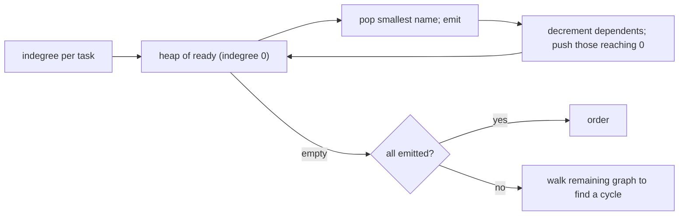

# Dependency order with cycle rejection

[Curriculum](../../../../README.md) · [Coding problems](../../README.md) · [All coding problems](../../../../../indexes/coding.md)

`[Generated]` The shape behind pipeline ordering, rollout ordering across rings, and "run tasks after all prerequisites" follow-ups. Prerequisites: [graphs](../../../../01-code/02-data-structures-algorithms/README.md).

## Candidate brief

> Tasks have prerequisites. Return an order in which every task runs after all of its prerequisites, or report that no such order exists and show one cycle. Then run ready tasks in parallel. Then a task fails.

| Contract | Decision |
|---|---|
| Input | `order(tasks, edges) -> list` where `edges` are `(prerequisite, dependent)` pairs; `tasks` lists every task, including ones with no edges |
| Output | A list containing each task once, prerequisites before dependents; among tasks that are ready at the same time, the one whose name sorts first comes first (deterministic) |
| Cycle | Raise `CycleError` whose `.cycle` is a list of tasks forming one cycle, first task repeated at the end |
| Unknown task in an edge | `ValueError` |
| Duplicate edges | Allowed; counted once |
| Complexity | O(T + E) time and space |

## The tool before the challenge

Kahn's algorithm: count incoming edges per task; repeatedly take a task with zero remaining, emit it, and decrement its dependents. If tasks remain with nonzero counts, they are in or behind a cycle. A min-heap of ready tasks gives the deterministic tie rule.

```python
import heapq
ready = [t for t in tasks if indegree[t] == 0]; heapq.heapify(ready)
```

<!-- interview-rehearsal:start -->

## What the interviewer expects

Say what "ready" means, how you detect a cycle without recursion, and what you return when there is one.

**Done means:** a valid topological order with a stated tie rule, `CycleError` carrying an actual cycle, and linear time.

### Test-case scenarios to settle before coding

| Case | Exact input or state | Expected result | What it is testing |
|---|---|---|---|
| Representative | tasks `a,b,c`; edges `a→c, b→c` | `[a, b, c]` | Both prerequisites before `c`; tie by name |
| Independent | tasks `b,a`; no edges | `[a, b]` | Tie rule on isolated tasks |
| Chain | `a→b, b→c` | `[a, b, c]` | Order propagates |
| Cycle | `a→b, b→a`, plus `c` | `CycleError` with cycle `[a, b, a]` or `[b, a, b]` | A witness, not only a boolean |
| Cycle behind a chain | `a→b, b→c, c→b` | `CycleError` with `[b, c, b]` | `a` is not part of the cycle |
| Duplicate edge | `a→b, a→b` | `[a, b]` | Counted once |
| Invalid | edge names an unknown task | `ValueError` | Validate |

For each case, show the indegree table that produces the result.

<!-- interview-rehearsal:end -->

`order(["a","b","c"], [("a","c"),("b","c")]) == ["a","b","c"]`; `order(["a","b"], [("a","b"),("b","a")])` raises `CycleError`.

Before opening the explanation, write the indegree table for the representative case and pop from it by hand.

<details>
<summary>Worked lesson, changed requirements, and reference</summary>

### Kahn with a heap, and a cycle witness from what is left



| step | ready heap | emitted | indegree |
|---|---|---|---|
| start | a, b | | c:2 |
| pop a | b | a | c:1 |
| pop b | | a b | c:0 → push c |
| pop c | | a b c | |

To produce a witness, take any remaining task and follow prerequisite edges among the remaining tasks (each remaining task has at least one remaining prerequisite, by construction); the walk must revisit a task within T steps, and the segment from that task back to itself is a cycle. O(T + E) overall.

### Follow-up 1 (senior): run ready tasks in parallel

Ready tasks are independent by definition. Replace "emit" with "submit to a worker pool"; when a task completes, decrement its dependents and submit any that become ready. Minimum finish time is the longest path in the DAG (critical path), not the number of tasks over the number of workers. This is [bundle 56](../56-worker-pool/README.md) driving this bundle.

### Follow-up 2 (staff): a task fails

Every descendant of the failed task is blocked, not failed: mark them `blocked` with the root cause, keep running everything else, and report both sets. Retry policy belongs to the task, not the scheduler; a retried task that has side effects must be idempotent, which is the same requirement as the consumer designs in CH 21.

### Run and check

```bash
cd curriculum/05-crowdstrike/02-coding-problems/problems/53-dependency-order
python -m unittest -v test_solution.py
```

[Reference implementation](solution.py) · [Contract and oracle tests](test_solution.py).

</details>

Next: [Network delay: shortest time to reach every node](../54-network-delay/README.md).
