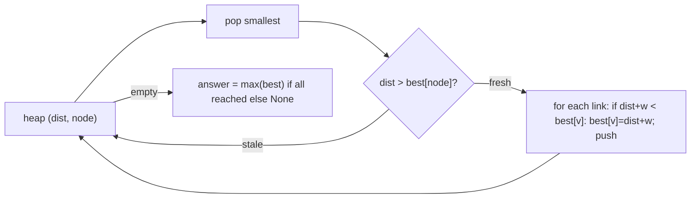

# Network delay: shortest time to reach every node

[Curriculum](../../../../README.md) · [Coding problems](../../README.md) · [All coding problems](../../../../../indexes/coding.md)

`[Aggregator]` ×2: "given a graph representing network nodes, find the shortest path from a starting node to all others" and "Network Delay Time" both appear on CrowdStrike lists. Prerequisites: [weighted paths](../../../../01-code/02-data-structures-algorithms/README.md).

## Candidate brief

> A signal is sent from one node over directed links with positive travel times. Return the time at which the last node receives it, or report that some node never does. Then the graph has a million links. Then link times change while the signal travels.

| Contract | Decision |
|---|---|
| Input | `network_delay(n, links, source) -> int or None`; nodes are `1..n`; links are `(u, v, w)` with `w >= 0` |
| Output | The maximum over nodes of the shortest arrival time; `None` if any node is unreachable |
| Single node | `n == 1` returns `0` |
| Negative weight | `ValueError` |
| Invalid node | A link or source outside `1..n` raises `ValueError` |
| Complexity | O((n + E) log n) with a binary heap; O(n + E) space |

## The tool before the challenge

Dijkstra with a lazy heap: push `(distance, node)` on every improvement; on pop, skip entries whose distance is stale. No decrease-key needed.

```python
import heapq
heap = [(0, source)]; dist = {source: 0}
```

<!-- interview-rehearsal:start -->

## What the interviewer expects

Name the algorithm and why it applies (non-negative weights), say what the heap holds, and give the complexity with the reason for the log factor.

**Done means:** correct shortest times from the source, `None` on unreachable nodes, and stale heap entries skipped rather than removed.

### Test-case scenarios to settle before coding

| Case | Exact input or state | Expected result | What it is testing |
|---|---|---|---|
| Representative | n=4, links `2→1:1, 2→3:1, 3→4:1`, source 2 | `2` | Longest of the shortest times |
| Unreachable | n=2, no links, source 1 | `None` | Absence is part of the contract |
| Single node | n=1, source 1 | `0` | Boundary |
| Better path found later | n=3, `1→3:5, 1→2:1, 2→3:1`, source 1 | `2` | Lazy heap skips the stale 5 |
| Zero weight | `1→2:0` | `0` | Non-negative includes zero |
| Parallel links | `1→2:5` and `1→2:2` | `2` | Take the cheaper |
| Invalid | a link with weight -1; source 0 | `ValueError` | Validate |

For each case, show the heap pops in order.

<!-- interview-rehearsal:end -->

`network_delay(4, [(2,1,1),(2,3,1),(3,4,1)], 2) == 2`; `network_delay(2, [], 1) is None`.

Before opening the explanation, trace the heap for the "better path found later" case.

<details>
<summary>Worked lesson, changed requirements, and reference</summary>

### Pop the nearest, relax its links, skip stale entries



| pop | best | pushes |
|---|---|---|
| (0,1) | 1:0 | (5,3), (1,2) |
| (1,2) | 2:1 | (2,3) |
| (2,3) | 3:2 | — |
| (5,3) | stale, skipped | — |

Each link pushes at most once per improvement, so the heap holds O(E) entries and each pop costs O(log E) = O(log n) for simple graphs. Non-negative weights are the precondition: a popped node's distance is final only because no later path can be shorter.

### Follow-up 1 (senior): a million links

Time is fine (a few seconds in Python, milliseconds in Go). Memory: adjacency lists of tuples cost ~100 bytes each; use arrays (`array` module or NumPy) for a compact CSR layout if it matters. If the graph does not fit on one machine, say the honest thing: shortest paths do not partition cleanly; precompute per region and stitch at boundary nodes, or accept an approximation.

### Follow-up 2 (staff): link times change while the signal travels

Static Dijkstra assumes the graph is fixed. With time-dependent weights, the arrival time at a node determines the outgoing weights, and Dijkstra still works if waiting never helps (FIFO property): relax with `w(u, arrival_at_u)`. If links can get faster later, waiting can help and the problem needs a time-expanded graph. Say which assumption you make.

### Run and check

```bash
cd curriculum/05-crowdstrike/02-coding-problems/problems/54-network-delay
python -m unittest -v test_solution.py
```

[Reference implementation](solution.py) · [Contract and oracle tests](test_solution.py).

</details>

Next: [Merge outage intervals](../55-interval-merge/README.md).
