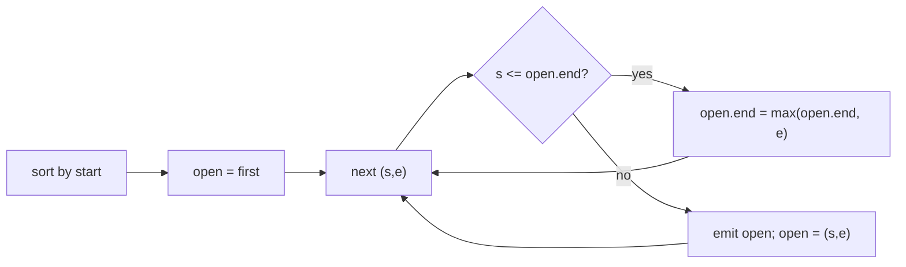

# Merge outage intervals

[Curriculum](../../../../README.md) · [Coding problems](../../README.md) · [All coding problems](../../../../../indexes/coding.md)

`[Generated]` The interval pattern behind maintenance windows, host-group update schedules, and "how long was the tenant degraded" questions. Prerequisites: [sorting and sweep](../../../../01-code/02-data-structures-algorithms/README.md).

## Candidate brief

> Alerts report outage windows as half-open `[start, end)` seconds, possibly overlapping and in any order. Return the merged windows, sorted, and the total downtime. Then windows arrive as a stream and must be reported as soon as they can no longer grow. Then each window belongs to a tenant.

| Contract | Decision |
|---|---|
| Input | `merge_windows(windows) -> (merged, total)`; each window is `(start, end)` with `start < end` |
| Merge rule | Overlapping or touching windows merge: `[0,5)` and `[5,8)` become `[0,8)` |
| Output | `merged` sorted by start, non-overlapping, non-touching; `total` is the sum of merged lengths |
| Empty | `([], 0)` |
| Invalid input | `start >= end`, or a non-numeric bound, raises `ValueError` |
| Complexity | O(n log n) time for the sort; O(n) space |

## The tool before the challenge

Sort by start, then sweep with one open window: if the next start is within the open window's end (touching counts), extend the end; otherwise close it and open the next.

```python
windows.sort()
for start, end in windows:
    if merged and start <= merged[-1][1]:
        merged[-1][1] = max(merged[-1][1], end)
```

The `max` matters: a later window can end earlier than the open one.

<!-- interview-rehearsal:start -->

## What the interviewer expects

State the touching rule for half-open intervals, say why sorting first makes one pass enough, and show the case where `max` is needed.

**Done means:** sorted, disjoint output; touching windows merged; total downtime computed from the merged list; validation before sorting.

### Test-case scenarios to settle before coding

| Case | Exact input or state | Expected result | What it is testing |
|---|---|---|---|
| Representative | `[(0,5),(3,8),(10,12)]` | `[(0,8),(10,12)]`, total `10` | Overlap merges; gap stays |
| Touching | `[(0,5),(5,8)]` | `[(0,8)]`, `8` | Half-open touching merges |
| Contained | `[(0,10),(2,3)]` | `[(0,10)]`, `10` | `max` keeps the larger end |
| Unsorted input | `[(10,12),(0,5)]` | `[(0,5),(10,12)]`, `7` | Sort first |
| Empty | `[]` | `([], 0)` | Boundary |
| Duplicates | `[(1,2),(1,2)]` | `[(1,2)]`, `1` | Same window twice |
| Invalid | `[(5,5)]`; `[("a",1)]` | `ValueError` | Validate |

For each case, show the open window after each step.

<!-- interview-rehearsal:end -->

`merge_windows([(0,5),(3,8),(10,12)]) == ([(0,8),(10,12)], 10)`.

Before opening the explanation, trace the contained case and say what goes wrong without `max`.

<details>
<summary>Worked lesson, changed requirements, and reference</summary>

### Sort, then one open window



| next | open before | open after | emitted |
|---|---|---|---|
| (0,5) | — | (0,5) | |
| (3,8) | (0,5) | (0,8) | |
| (10,12) | (0,8) | (10,12) | (0,8) |
| end | (10,12) | | (10,12) |

O(n log n) for the sort, O(n) for the sweep. Total downtime is the sum over merged windows, which double-counts nothing because the merged list is disjoint.

### Follow-up 1 (senior): windows arrive as a stream

Without sorting, a window that arrives late can extend one you already emitted. Keep a small ordered buffer (a heap by start) and a watermark: emit a merged window only once its end is below the watermark minus the maximum allowed lateness. Memory is O(windows inside the lateness horizon). If lateness is unbounded, say so: exact streaming merge is impossible, and you either re-emit corrections or bound lateness by policy.

### Follow-up 2 (staff): per-tenant windows and a fleet-wide question

Group by tenant and merge each group: O(n log n) total. For "how many tenants were down at time t," build the merged lists per tenant, then sweep all endpoints with a counter (+1 at start, −1 at end), which answers every t in one pass. This is the same sweep as "minimum concurrent workers" and it scales to millions of windows because it never materializes the timeline.

### Run and check

```bash
cd curriculum/05-crowdstrike/02-coding-problems/problems/55-interval-merge
python -m unittest -v test_solution.py
```

[Reference implementation](solution.py) · [Contract and oracle tests](test_solution.py).

</details>

Next: [Bounded worker pool with clean shutdown](../56-worker-pool/README.md).
