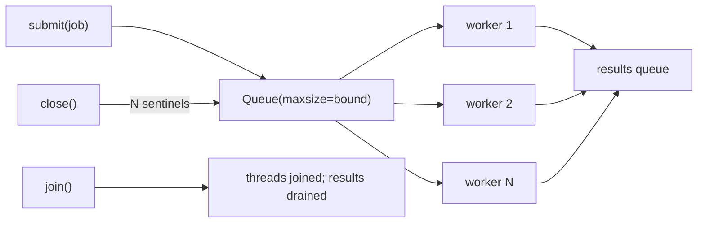

# Bounded worker pool with clean shutdown

[Curriculum](../../../../README.md) · [Coding problems](../../README.md) · [All coding problems](../../../../../indexes/coding.md)

`[Reported]` October 2025, Software Engineer – Cloud, senior: the follow-up that decided the loop was "what mechanism for a worker pool, how would you assign work to workers." `[Aggregator]` 2026: "a custom queue with thread-safe operations to prevent race conditions." This is that answer, in Python, with the Go version in the [Go lesson](../../../01-preparation/lessons/05-go-for-a-python-interviewer.md). Prerequisites: [bounded blocking queue](../../../../02-applications/01-backend/problems/42-bounded-blocking-queue/README.md).

## Candidate brief

> Process a stream of jobs with N workers. The producer must not run ahead of the workers by more than a bound. A job that raises must not kill a worker or lose other jobs. Shutdown must finish every accepted job and then stop every worker. Then: assign jobs so that jobs with the same key never run concurrently.

| Contract | Decision |
|---|---|
| Input | `WorkerPool(workers, bound, handler)`; `submit(job)` blocks while `bound` jobs are queued; `close()` stops accepting; `join()` waits for all workers; `results()` returns `(job, outcome)` pairs in completion order |
| Outcome | `("ok", value)` or `("error", exception)`; a raising handler never stops a worker |
| Backpressure | `submit` blocks, it does not drop and does not grow memory beyond `bound` |
| Shutdown | After `close()`, every job already submitted is processed; `submit` after `close` raises `RuntimeError` |
| Keyed mode | `KeyedWorkerPool` routes `job` to worker `hash(key(job)) % workers`, so equal keys are serialized; other keys still run in parallel |
| Invalid input | workers < 1 or bound < 1 raises `ValueError` |

## The tool before the challenge

`queue.Queue(maxsize=bound)` is the bounded, thread-safe queue: `put` blocks when full, `get` blocks when empty. A sentinel per worker ends the loop cleanly. `threading.Thread` for workers; `queue.Queue()` for results.

```python
q = queue.Queue(maxsize=bound)
q.put(job)          # blocks when full: this is the backpressure
q.put(SENTINEL)     # one per worker at close()
```

<!-- interview-rehearsal:start -->

## What the interviewer expects

Say how the producer is slowed, how a worker survives a bad job, how shutdown reaches every worker, and, for the keyed version, why per-key order needs per-worker queues.

**Done means:** N workers, bounded queue, error isolation, complete drain on close, and a keyed variant that serializes equal keys.

### Test-case scenarios to settle before coding

| Case | Exact input or state | Expected result | What it is testing |
|---|---|---|---|
| Representative | 3 workers, 10 jobs that return their square | 10 `ok` results, any order, set of values `{0,1,...,81}` | Parallel processing |
| Backpressure | bound 2, a handler that waits on an event, submit 3 jobs from a thread | the third `submit` is still blocked until a job is released | Producer is slowed, memory bounded |
| Error isolation | one job raises `ValueError` | that job's outcome is `("error", ValueError)`; the other jobs complete | A worker survives |
| Drain on close | submit 5, `close()`, `join()` | 5 results | Nothing accepted is lost |
| Submit after close | `close()` then `submit(1)` | `RuntimeError` | Contract boundary |
| Keyed serialization | 4 workers, 20 jobs with 2 keys, handler records concurrent count per key | max concurrency per key is 1 | Equal keys never overlap |
| Invalid | `WorkerPool(0, 1, f)` | `ValueError` | Validate |

For each case, show which queue operation produces the result.

<!-- interview-rehearsal:end -->

`p = WorkerPool(3, 4, lambda x: x*x); [p.submit(i) for i in range(10)]; p.close(); p.join(); {v for _, ("ok", v) in p.results()} == {i*i for i in range(10)}` in spirit; see the tests for the exact assertions.

Before opening the explanation, draw the queue, the workers, and the sentinel path.

<details>
<summary>Worked lesson, changed requirements, and reference</summary>

### One bounded queue, N workers, one sentinel each



| event | jobs queue | note |
|---|---|---|
| submit ×bound | full | next `submit` blocks |
| worker takes one | one slot free | blocked `submit` proceeds |
| handler raises | — | caught; `("error", e)` recorded; worker continues |
| close() | N sentinels appended after the last job | every worker sees one sentinel after the real jobs |
| join() | empty | threads exit; results complete |

Sentinels go in after all submitted jobs because the queue is FIFO, so "drain everything accepted" is free. Time is the handler's; the pool adds O(1) per job. Memory is O(bound + workers) beyond results.

### Assigning work: the reported follow-up, answered

| Strategy | Order guarantee | Throughput | Risk |
|---|---|---|---|
| One shared queue (this bundle) | none across jobs | best | none for stateless work |
| Hash by key to a per-worker queue (`KeyedWorkerPool`) | per key | good unless keys are skewed | a hot key pins one worker |
| Work stealing | none | best under uneven job cost | complexity |

CrowdStrike's published Kafka consumers use the shared-queue shape with round-robin assignment, and they commit offsets only after a batch completes `[Official]`. Volunteer that too: commit progress after the batch, and make the handler idempotent so a replayed job is waste, not corruption.

### Follow-up 1 (senior): the keyed pool and a hot key

Equal keys must be serialized, so each worker owns a bounded queue and `submit` routes by hash. A hot key fills one queue while others idle. Detect it (queue depth per worker), then either shard the hot key further if its jobs are independent, or accept the serialization and alert. Say which.

### Follow-up 2 (staff): cancellation and partial results

Add an `Event` the workers check between jobs and a `cancel()` that sets it and drains the queue without processing; report which jobs were accepted but not run so the caller can resubmit. In Go this is `context` cancellation reaching every `select`; the shape is identical.

### Run and check

```bash
cd curriculum/05-crowdstrike/02-coding-problems/problems/56-worker-pool
python -m unittest -v test_solution.py
```

[Reference implementation](solution.py) · [Contract and oracle tests](test_solution.py).

</details>

Next chapter: [Architecture: their systems and their design cases](../../../03-architecture/README.md).
