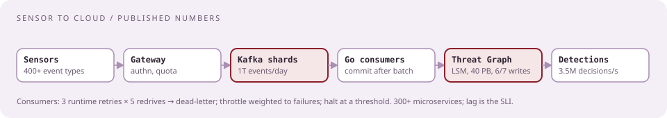
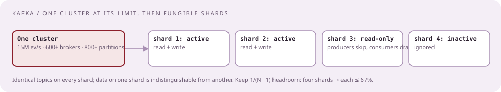
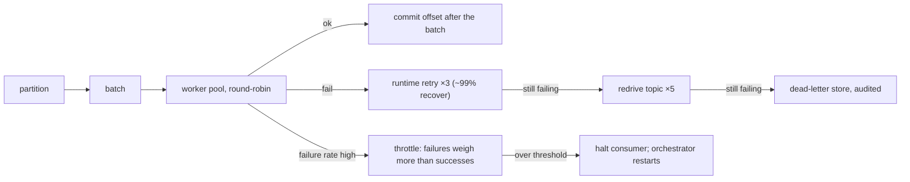
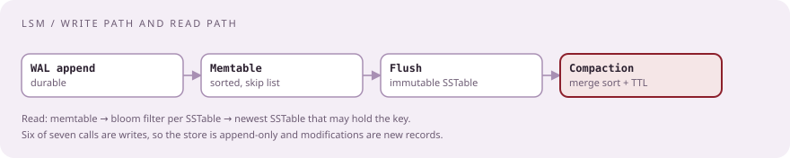
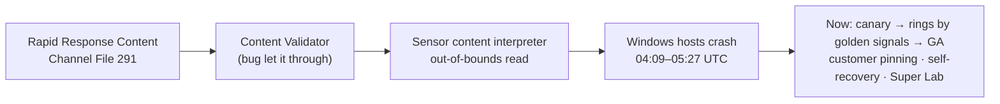

# How CrowdStrike builds it

[Curriculum](../../../README.md) · [Architecture](../README.md)

> "Size your design with their numbers, and use their words for it."

Everything here is `[Official]`: the engineering blog, the platform pages, and the incident reports. Interviewers there wrote or read these posts; the vocabulary and the scale are what they assume.

## Sensor to cloud, in one picture

| Stage | What they publish |
|---|---|
| Sensor | One lightweight agent per host, "more than 400 types of endpoint behavior," streams to the cloud, does fast local prevention |
| Scale | "Trillions of events per day"; "3.5 million blocking decisions every second"; Threat Graph over 40 PB, "upward of 70 million requests per second" |
| Transport | Kafka, "over 1 trillion events per day," 300+ microservices |
| Processing | Go microservices with worker pools; DSL-generated handlers per event type |
| Store | Threat Graph on LSM stores (Cassandra, RocksDB); append-only; ~6 of 7 calls are writes |
| Output | Detections and preventions to the customer; Enterprise Graph and Charlotte AI on top |

## Kafka at a trillion events a day

| Fact | Number or rule |
|---|---|
| Largest single cluster before sharding | 15 million events/s, 600+ brokers, 800+ partitions at 500 GB each |
| Why it stopped scaling | Topic-level limits and broker-connection overhead |
| The fix | Multiple independent clusters with identical topics; "data on one shard should be indistinguishable from the data on any other shard" |
| Shard states | active (read/write) · read-only (producers skip, consumers drain) · inactive |
| Headroom rule | keep 1/(N−1) free so one shard's traffic fits in the rest: four shards → each ≤ 67% |
| What they avoided | Per-customer or per-source topics, to keep data fungible |
| Clients | Shard-aware producer and consumer libraries |

## The consumer, and its three retry tiers

| Design point | Their statement |
|---|---|
| Offsets | Advance only after the batch completes; individual failures handled separately |
| Retries | 3 runtime × 5 redrive = 15 attempts, then cold storage / dead letter |
| Throttling | Exponential back-off pressure; failures weighted above successes |
| Shutdown | A failure-rate threshold halts the consumer entirely; the orchestrator restarts it |
| Lesson | Never classify malformed events as failures, or throttling and shutdown cascade |
| Stack | Go, confluent-kafka-go over librdkafka, wrapped internally |

## Monitoring the pipeline

| Tool | Role |
|---|---|
| Burrow | Consumer lag per partition |
| Kafka Monitor → Prometheus | Lag trends, mean recovery time, hotspots across partitions |
| Grafana | Alerting |
| KEDA | Autoscale consumers on lag during peaks; scheduled scaling for predictable traffic |
| AlertResponder | Restarts stuck stateless jobs before paging |
| Black-box monitors | Inject sample events to measure true end-to-end latency |
| SLIs | Data-loss rate and latency |

## Threat Graph on LSM stores

| Fact | Their statement |
|---|---|
| Write ratio | About six of every seven API calls are writes |
| Append-only | Records are never updated; a modification is a new record; a delete is a delete marker |
| Why LSM | Write throughput, append semantics, background compaction, data locality by key |
| Stores | Apache Cassandra (they contributed TimeWindowCompactionStrategy in 2016), RocksDB |
| Schema | One table holds vertices and edges as an adjacency list with a type column; one sequential read returns a vertex and its relationships |
| Principle | "Complexity is the enemy of scale" |
| Ingestion | New telemetry types are defined in a DSL (HCL/HIL) that generates Go handlers registered on the Kafka bus |

## Services, protocols, logging

| Topic | Their statement |
|---|---|
| gRPC | HTTP/2 multiplexing and streaming; Protocol Buffers as contract; `protoc-gen-validate` rules in the proto; up to 4× faster and 3× less resource use than REST for structured data |
| Logging | Moved from a Logrus singleton to zerolog behind a small interface; structured JSON; performance at trillions of weekly events |
| Data replicator | Raw events to customer S3 as semi-structured JSON with a common `event_simpleName`; hundreds of event types; schemas evolve |

## July 19, 2024, and what changed

| Before | After (`[Official]` Resilient by Design) |
|---|---|
| Content updates pushed broadly | Ring-based, automated Content Distribution System gated by golden signals; canary first |
| Validator trusted | Local developer testing, stress, fuzzing, fault injection; Falcon Super Lab across thousands of OS/kernel/hardware combinations |
| No customer control of content timing | Content pinning; per-host-group schedules; a content quality dashboard |
| Crash-loop hosts needed manual recovery | Sensor self-recovery into safe mode; a remediation toolkit |
| Internal review | External code reviews; a Chief Resilience Officer; ISO 22301 |

In a behavioral round this is the "risky change and blast radius" question; in a design round it is the rollout case. Know both.

## Vocabulary to use without hesitation

at-least-once · idempotent consumer · consumer group · partition key · commit after batch · redrive · dead-letter · backpressure · throttling · consumer lag · hot and cold tiers · TTL compaction · append-only · LSM, SSTable, memtable · bloom filter · content-addressed storage · consistent hashing · shard headroom · canary · ring deployment · golden signals · blast radius · content pinning · tenant isolation · noisy neighbor · black-box monitor · SLI/SLO · distributed trace · service mesh · IaC

## Sources

[Sharding Kafka](https://www.crowdstrike.com/en-us/blog/how-we-improved-scale-and-reliability-by-sharding-kafka/) · [Fault-tolerant Kafka consumers in Go](https://www.crowdstrike.com/en-us/blog/improving-fault-tolerance-in-apache-kafka-best-practices/) · [Monitoring streaming infrastructure](https://www.crowdstrike.com/en-us/blog/how-to-monitor-streaming-data-infrastructure-at-scale/) · [LSM trees and Threat Graph](https://www.crowdstrike.com/en-us/blog/how-log-structured-merge-trees-enable-crowdstrike-to-process-trillions-of-events-per-day/) · [Building a high-performance graph database](https://www.crowdstrike.com/en-us/blog/3-best-practices-for-building-high-performance-graph-database/) · [Threat Graph DSL ingestion](https://www.crowdstrike.com/en-us/blog/how-crowdstrike-threat-graph-leverages-dsl-to-improve-data-ingestion-part-1/) · [Big data, graph, and the cloud](https://www.crowdstrike.com/en-us/blog/big-data-graph-and-the-cloud-three-keys-to-stopping-todays-threats/) · [gRPC between microservices](https://www.crowdstrike.com/en-us/blog/improving-performance-and-reliability-of-microservices-communication-with-grpc/) · [Logging with Go](https://www.crowdstrike.com/en-us/blog/logging-with-go/) · [Architecture of agentic defense](https://www.crowdstrike.com/en-us/blog/architecture-of-agentic-defense-inside-the-falcon-platform/) · [Preliminary post-incident report, July 2024](https://www.crowdstrike.com/en-us/blog/falcon-content-update-preliminary-post-incident-report/) · [Resilient by design](https://www.crowdstrike.com/en-us/blog/reflecting-on-building-resilience-by-design/) · [Falcon Data Replicator via Databricks](https://www.databricks.com/blog/2021/05/20/building-a-cybersecurity-lakehouse-for-crowdstrike-falcon-events.html)

Next: [Building blocks, and the sentence for each](02-building-blocks.md).
