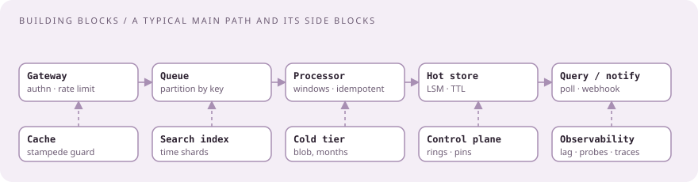

# Building blocks, and the sentence for each

[Curriculum](../../../README.md) · [Architecture](../README.md)

> "Say OLTP, queue, API and blob storage. Don't get tied to product names." — a CrowdStrike engineer's advice to a candidate `[Reported]`

Each block below has the one sentence to say when you draw it, the CrowdStrike context that makes it land, and the follow-up the sentence invites.

| Block | The sentence | Their context | The follow-up it invites |
|---|---|---|---|
| API gateway + rate limiting | "Authenticate, rate-limit per tenant, route; stateless so it scales flat." | Posting: JWT/OAuth, versioning, rate limiting, OpenAPI | Where the limiter's state lives ([case](../problems/rate-limiter-and-queue.md)) |
| Queue (Kafka) | "Partition by key for order, consumer groups for parallelism, offsets committed after the batch, at-least-once with idempotent consumers." | 1T events/day; sharded clusters `[Official]` | Hot partition; rebalance; poison message |
| Stream processor | "Windows over event time, a watermark for lateness, idempotent sinks; exactly-once is a property of the sink." | DSL-generated Go handlers `[Official]` | Late data; state size |
| Cache (Redis) | "Cache-aside with TTL; per-key locks or request coalescing against stampedes; know what is stale-tolerant." | Posting: Redis for caching and sessions | Cache down: fall through and rate-limit misses |
| OLTP store (Postgres) | "Transactions, indexes chosen from the query, isolation named on purpose, pooled connections." | Posting: Postgres with query optimization | Write scaling: shard or move writes to the log |
| Wide-column / LSM (Cassandra) | "Write-optimized, partition key chosen for the read path, tombstones and compaction as a cost, TTL by time-window compaction." | Threat Graph; TWCS contributed `[Official]` | Read amplification; wide partitions |
| Blob storage | "Content-addressed keys collapse duplicates; pre-signed URLs keep bytes off the API tier; multipart for large files." | The file-scanning case `[Reported]` | Lost completion events; egress cost |
| Search index (ES/OpenSearch) | "Inverted index for full-text and log search; shards and retention tuned; not the source of truth." | Posting; LogScale/NG-SIEM | Index size; reindex |
| Sharding + consistent hashing | "Uniform key, virtual nodes, only 1/N moves on resize; never shard by tenant alone." | Reported design question; Kafka and Cassandra rings | Hot key; resharding live |
| Replication + consistency | "Quorum where it matters; eventual where a stale read is cheap; say which is which." | Posting: multi-region | Split brain; failover |
| Idempotency + dedupe | "Idempotency key per request; dedupe window by (source, sequence); replay is safe by construction." | Reported idempotent-endpoint and consumer questions | Window size versus memory |
| Backpressure, shedding, breakers | "Bounded queues, lag-based autoscaling, throttle on dependency failure, circuit-break, retry with jitter." | KEDA on lag; failure-weighted throttling `[Official]` | What is shed first |
| Multi-tenant isolation | "Tenant in every key and query, per-tenant quotas and lanes, per-tenant encryption keys." | Security-flavored rounds | Noisy neighbor |
| Observability | "Golden signals per service, consumer lag as the SLI, black-box probes end to end, traces for cross-service root cause." | Burrow, Prometheus, Grafana `[Official]`; posting: Jaeger/Zipkin, ELK | Alert fatigue; cardinality |
| Deployment safety | "Canary, then rings gated by golden signals, automatic halt, customer pinning, rollback in minutes." | Post-2024 CDS `[Official]` | What signal halts the ring |
| Security basics | "Short-lived identities, mTLS between services, KMS-managed keys with envelope encryption, least privilege, immutable audit log." | Cloud-architecture round | Key rotation; audit retention |
| Infra | "Containers on Kubernetes with HPA/KEDA, Terraform for everything, staged CI/CD, multi-region active/active or warm standby." | Posting | Cost of active/active |
| Cost | "Name the expensive line: engine minutes, egress, hot storage, over-provisioned consumers; right-size to real traffic." | Reported interviewer advice on cost | What you would cut first |

## Numbers to carry into every case

| Quantity | Value to assume unless told |
|---|---|
| Endpoints | tens of millions |
| Events | 1 trillion/day ≈ 11.6 million/s average; plan 3× for peaks |
| Event size | ~1 KB → ~12 GB/s average ingress |
| Kafka shard | ≤ 67% utilization with four shards |
| Decision latency | seconds from event to detection |
| Threat Graph | 40 PB; 70 million requests/s; 6/7 writes |
| Retention | hot days, cold months; TTL by compaction |

## Check the mechanism

| Interviewer says | You say |
|---|---|
| "Why Kafka and not a database table as a queue?" | Sequential append, consumer groups, replay from an offset, partition-level parallelism; a table becomes a hot row |
| "Why not exactly-once?" | The transport is at-least-once; exactly-once visible effect comes from an idempotent sink keyed by (source, sequence) |
| "Why Cassandra and not Postgres here?" | Six of seven calls are writes; append-only; partition key matches the read; TTL by compaction is free |
| "What if Redis is down?" | Fall through to the store, coalesce misses, rate-limit, alert; the cache is an optimization, never the truth |

Next: [The ninety-minute review](03-the-ninety-minute-review.md).
