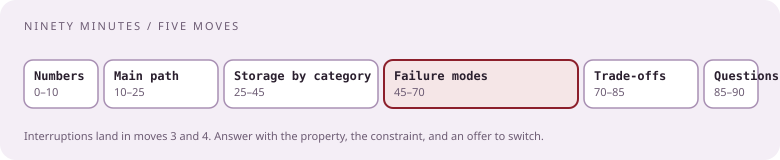
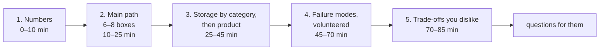

# The ninety-minute review

[Curriculum](../../../README.md) · [Architecture](../README.md)

> "They gave me a take-home system design problem." "Whiteboarding of VirusTotal with requirements provided days in advance." "A two-hour meeting with two other engineers to discuss the entire design." `[Reported]` 2022, 2023, 2026

The take-home is the easy half. The review is where candidates report being failed or down-leveled. This lesson is the method for the ninety minutes.

## What the review is, from reports

| Reported feature | Source |
|---|---|
| Prompt sent one or two days ahead; you bring a design | 2019, 2022, 2023, 2025, 2026 |
| 90 minutes, sometimes two hours; two or three engineers | 2020, 2025, 2026 |
| "Scale to billions of requests and big files" | 2020 |
| "Explain why you pick a particular system and the pros and cons" | 2020 |
| "Failure modes, concurrent uploads, users competing for the same resource" | 2025 |
| "Cassandra and consistent hashing came up" | 2023 |
| "Don't use technology names; say OLTP, queue, API, blob storage" | CrowdStrike engineer, 2024 |
| "Be ready to explain how those AWS technologies work; don't rely on infinite scalability; explain cost" | CrowdStrike engineer, 2024 |
| "Amazon people often fail because they rely on pre-built solutions like DynamoDB and SNS" | a hiring manager, relayed 2024 |
| "Learn to concede on better options or changed requirements you didn't anticipate" | Jan 2026 offer |
| "Security and availability are the two priorities" | Jan 2026 offer |

## The five moves

| Move | What you put on the screen | What you say |
|---|---|---|
| 1. Numbers | Peak and average rates, sizes, retention, tenants, latency budget | "These are the three numbers that change a decision" |
| 2. Main path | Six to eight boxes; one request walked through | "One event, end to end, then we go deep" |
| 3. Storage | For each store: write/read shape → category → product | "Write-heavy and append-only, so an LSM store; Cassandra fits because…" |
| 4. Failure modes | A table: failure, detection, containment, recovery | Say each before they ask |
| 5. Trade-offs | Two you dislike, with the alternative and why you still chose it | "The thing I'd change with one more week is…" |

## How to take an interruption

| They say | Wrong response | Right response |
|---|---|---|
| "Why not X?" | Defend Y harder | State X's property, say where it wins, say the constraint that made you choose Y, offer to switch if the constraint is wrong |
| "What if the queue backs up?" | "It scales" | Lag as the signal, autoscale on lag, bounded producers, shed by tenant priority, what is lost and for how long |
| "That won't work at our scale" | Argue | "Which number? Let me redo the arithmetic with yours" |
| "We do it differently" | Cave | Ask how, find the property their way protects, say what yours trades for it |

The January 2026 offer report's own words: "you need to be able to explain your proposals and honestly collaborate… learn to concede on possibly better options or changing requirements you didn't anticipate."

## The take-home document itself

| Section | Length | Content |
|---|---|---|
| Requirements and numbers | half a page | Functional, non-functional, the assumed rates, what is out of scope |
| Main path diagram | one figure | Six to eight boxes, one request drawn through |
| Data model | half a page | Each store, its key, its write/read shape, retention |
| Deep dives | one page | The two hardest parts (usually dedupe/concurrency and the queue) |
| Failure modes | one table | Failure, detection, containment, recovery |
| Trade-offs and next steps | half a page | Two you dislike; what you would measure first |

Bring it as a PDF and as slides; keep the diagram exportable as an image in case screen-sharing fails.

## Check the mechanism

| Prompt | A strong answer contains |
|---|---|
| "Walk us through your design" | Numbers first, then one request through the boxes, in under ten minutes |
| "Why this store?" | Its write/read shape, the category, then the product |
| "What breaks first?" | A named bottleneck with a number and the signal that shows it |
| "What would you change?" | A real trade-off, not "add more caching" |

Next: [File-scanning platform](../problems/file-scanning-platform.md).
