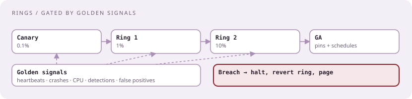
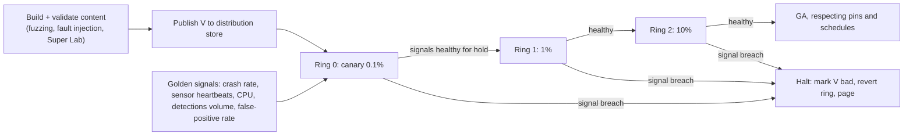

# Content rollout with rings, golden signals, and rollback in minutes

[Curriculum](../../../README.md) · [Architecture](../README.md) · [All system designs](../../../../indexes/system-designs.md)

`[Official]` After July 19, 2024, CrowdStrike published its new model: a ring-based Content Distribution System gated by golden signals, canary first, customer content pinning, host-group schedules, sensor self-recovery. `[Aggregator]` "Canary versus blue-green with automated rollback" is on the 2026 question list, and guides report at least one behavioral question on a risky change. This case is that design.

## Application background

Detection content (rules, templates, configs) must reach tens of millions of endpoints quickly, because attacks are live. In 2024 one bad content file reached hosts within minutes and crashed them. The system must now deliver fast *and* stop itself before a bad update spreads.

## Your assignment

**Deliver:** a design for publishing a content version to 20 million hosts through rings with automatic halt and rollback, customer controls, and auditability.

**Required behavior:** a new version reaches a canary set first; each ring advances only when golden signals are healthy for a hold time; a signal breach halts the rollout and reverts the affected ring within minutes; a customer can pin a version or delay by host group; every decision is recorded; a crash-looping host recovers without human help.

## Numbers first

| Quantity | Value | Consequence |
|---|---|---|
| Hosts | 20M | Fan-out through a CDN or tiered fetch, not push |
| Rings | canary 0.1%, ring 1 1%, ring 2 10%, GA | Blast radius bounded at each gate |
| Hold time | minutes per ring for urgent content, hours for routine | Speed versus safety is a per-content policy |
| Rollback target | under 5 minutes for a ring | Hosts must be able to fetch the previous version, and the sensor must survive a bad one |

## Expected behavior

| Action | Expected | Why |
|---|---|---|
| Publish version V | Canary hosts fetch V; others stay on V−1 | Ring 0 |
| Canary healthy for hold time | Ring 1 receives V | Gate on signals |
| Crash rate rises in ring 1 | Rollout halts; ring 1 reverts to V−1; alert | Automatic halt |
| Customer pinned V−3 | Never receives V until unpinned | Customer control |
| Host group "servers" scheduled for Sunday | Receives V on Sunday | Scheduling |
| Host crash-loops after V | Sensor self-recovery boots to safe mode, reverts content | Last line of defense |

## Main path

## Components

| Component | Responsibility | Store |
|---|---|---|
| Content registry | Versions, validation results, rollout state, who approved | OLTP, audited |
| Ring controller | Advances rings on gates; halts on breach; idempotent state machine | OLTP for state; queue for commands |
| Distribution | Hosts fetch by version through a CDN; signed content; delta updates | Blob + CDN |
| Policy service | Pins, host-group schedules, per-tenant overrides | OLTP + cache |
| Signal aggregator | Per-ring golden signals in near real time | Stream processor over telemetry |
| Sensor | Verifies signature, applies content, reports health, self-recovers | Local |

## The gate, precisely

| Signal | Healthy means | Breach means |
|---|---|---|
| Sensor heartbeat rate in ring | ≥ 99.9% of ring hosts reporting within 5 min | Halt |
| Crash or safe-mode entries | ≤ baseline + small margin | Halt |
| CPU/memory on ring hosts | Within baseline band | Halt |
| Detection volume | Within expected band for the content | Investigate; halt if extreme |
| False-positive rate | Not rising | Halt |

A hold time with a minimum ring population avoids advancing on too little data; an urgent-content policy shortens holds but never skips the canary.

## Failure modes, volunteered

| Failure | Detection | Containment | Recovery |
|---|---|---|---|
| Bad content passes validation | Ring 0 signals | Halt at 0.1% | Revert ring 0; mark V bad |
| Signal pipeline itself is down | Missing signals | Do not advance on no data | Wait or manual override with audit |
| Ring controller crashes mid-advance | State machine idempotent | Resume from persisted state | — |
| Host cannot fetch V−1 for rollback | Fetch errors | Sensor self-recovery to safe mode | Remediation toolkit |
| Customer pinned to a version with a known bug | Registry flags | Notify; never override silently | Customer unpins |

## Canary versus blue-green, the reported question

| | Canary / rings | Blue-green |
|---|---|---|
| What changes | A growing subset of the fleet | The whole fleet at once, from an idle copy |
| Rollback | Revert the ring | Switch back to the other color |
| Fits | Fleets of customer devices you cannot duplicate | Services you run yourself with spare capacity |
| CrowdStrike's choice for content | Rings gated by signals `[Official]` | Not applicable to endpoints |

## Follow-ups

**Senior:** "A signal breach in ring 2 affects 2 million hosts." Reverting means 2 million fetches of V−1; the CDN takes it, and the sensor applies the last-known-good content from local storage without a fetch. Say which hosts can self-heal and which need the fetch. **Staff:** "Design the audit and the human override." Every advance, halt, pin, and override is an append-only record with actor and reason; overrides require two people for GA; the record is what the post-incident review reads.

Next: [Endpoint management control plane](endpoint-control-plane.md).
