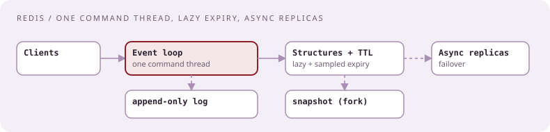
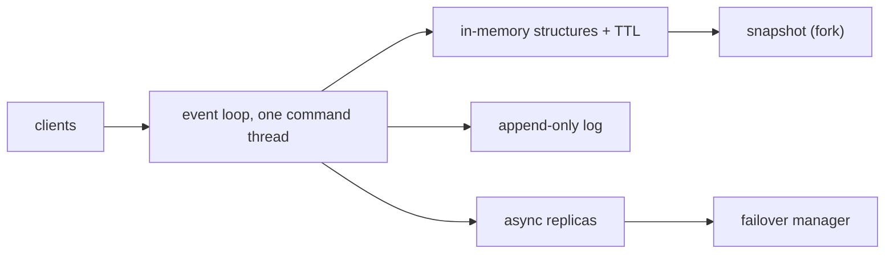

# Design Redis, briefly

[Curriculum](../../../README.md) · [Architecture](../README.md) · [All system designs](../../../../indexes/system-designs.md)

`[Reported]` January 2026, senior offer: after the code review round, "implement an in memory cache like Redis as well as some small level of design for a system like Redis. The design portion was brief in this loop and was more to address the knowledge of cache uses." The coding half is [bundle 47](../../02-coding-problems/problems/47-lru-cache-ttl/README.md); this page is the brief design.

## Application background

A service needs a fast shared store for sessions, hash lookups, counters, and short-lived state, in front of slower databases. It must answer in under a millisecond, expire keys, survive a process restart without losing everything, and stay available when one node dies.

## Your assignment

**Deliver:** a ten-minute design covering data structures, the execution model, expiry, eviction, persistence, replication, and what the caller must do when the cache is unavailable.

## The ten-minute answer

| Aspect | Design | The sentence |
|---|---|---|
| Execution | One thread runs the command loop; I/O handled with an event loop; no locks on data | "Single-threaded on purpose: commands are serialized, so there is no lock contention and every command is atomic" |
| Data types | strings, hashes, lists, sets, sorted sets, streams; each a specialized in-memory structure | "The value type picks the structure: a sorted set is a skip list plus a hash" |
| Expiry | TTL per key; lazy check on access plus periodic sampling of a few keys | "Lazy plus sampled, so expiry never blocks the loop" |
| Eviction | When memory is full: LRU or LFU *approximated by sampling* a handful of keys | "Approximate LRU by sampling, trading precision for memory and speed" |
| Persistence | Snapshot (fork and write) and an append-only command log with periodic rewrite | "Snapshots for fast restart, the log for the last seconds" |
| Replication | Async replicas; a sentinel or cluster manager promotes a replica on failure | "Async, so a failover can lose the last writes; say so" |
| Clustering | Key space split into slots; slots assigned to nodes; clients redirected | "Hash slots, not consistent hashing, with explicit moves" |
| Cache pattern | Cache-aside with TTL; write-through when staleness is unacceptable | "The cache is never the source of truth" |

## Cache uses, the part they wanted

| Use | Pattern | Failure to name |
|---|---|---|
| Hash → scan result lookup (file-scanning case) | cache-aside, TTL by result freshness | Stampede on a viral hash: per-key lock or coalescing |
| Sessions | write-through, TTL = session life | Replica lag after failover logs a user out; acceptable |
| Rate-limit counters | atomic script per call | Store down: fail open or closed, decided in advance |
| Leaderboards / top-k | sorted set | Memory per set; trim |
| Distributed lock | `SET NX` with expiry and a fencing token | A lock without a fencing token is unsafe under pauses |

## Failure modes, volunteered

| Failure | Effect | Design response |
|---|---|---|
| Node dies | Async replica promoted; last writes lost | Callers tolerate a stale read; critical writes go to the database |
| Memory full | Eviction | Choose the policy per workload; monitor evictions |
| Big key (1 GB list) | Blocks the loop on delete | Avoid; delete lazily in chunks |
| Cache unavailable | Every read misses | Fall through with request coalescing and a miss rate limit; alert |
| Snapshot fork on a large dataset | Latency spike | Schedule; replicas take snapshots |

## Follow-ups

**Senior:** "Why not multi-threaded?" Because serialized commands give atomicity for free and most workloads are memory-bound, not CPU-bound; scale by sharding across processes, not by threads. **Staff:** "When would you not use it?" When the data must not be lost (it is a cache), when values are large blobs (use blob storage), or when cross-key transactions are needed (use the database).

Next: [Worker pool for template jobs](worker-pool-template-jobs.md).
