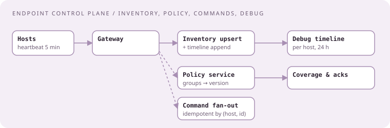
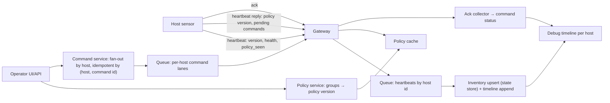

# Endpoint management control plane: inventory, policy, and commands for millions of hosts

[Curriculum](../../../README.md) · [Architecture](../README.md) · [All system designs](../../../../indexes/system-designs.md)

`[Official]` The R30109 posting's own words: "distributed systems architecture for endpoint management platforms," "sensor telemetry and system debuggability," "event driven systems using modern messaging patterns." `[Generated]` as a design case in that shape; no candidate report names this exact prompt, so treat it as practice for the team's domain rather than a reported question.

## Application background

Every host runs a sensor. The control plane must know each host's identity, sensor version, health, and policy; let an operator change policy for a group; run a command on a host or on a million hosts and know which ones acknowledged; and answer "why did this host not get the update" from telemetry.

## Your assignment

**Deliver:** a design for host inventory, policy assignment, command fan-out with acknowledgement, and per-host debuggability, sized for 20 million hosts, a heartbeat every 5 minutes (≈67k/s), 10,000 operators, policy changes affecting up to 5 million hosts at once, and commands to up to 1 million hosts with results within 15 minutes.

**Required behavior:** a host's current state is queryable in under 100 ms; a policy change reaches all targeted hosts and reports coverage; a command is delivered at most once per host per command id; a host offline for a month is marked stale, not deleted; every operator action is audited; a support engineer can reconstruct a host's last 24 hours.

## Numbers first

| Quantity | Value | Consequence |
|---|---|---|
| Heartbeats | 67k/s, ~500 B | Ingest through the same event path as telemetry; state is upserted, not appended |
| Host state | 20M rows, hot reads | OLTP partitioned by tenant, or a wide-column store keyed by host id, plus cache |
| Policy fan-out | 5M hosts | Never push 5M messages synchronously; hosts pull on heartbeat with a version check |
| Commands | 1M hosts, 15 min | Fan-out via queue; per-host idempotency by command id |

## Expected behavior

| Action | Expected | Why |
|---|---|---|
| Host heartbeats | Inventory row updated; last-seen advanced | Upsert path |
| Operator sets policy P on group G | Policy version bumps; hosts in G see P on next heartbeat; coverage % rises | Pull with version |
| Command C to 1M hosts | Each host runs C once; acknowledgements tallied; stragglers listed | At-most-once per host |
| Host offline 30 days | Marked stale; excluded from coverage denominators | Staleness |
| Support asks "why no update on host H" | Timeline: heartbeats, policy version seen, command deliveries, sensor errors | Debuggability |
| Two operators change G's policy concurrently | Last write with version check; conflict surfaced | Optimistic concurrency |

## Main path

## Stores, by category

| Data | Shape | Category | Why |
|---|---|---|---|
| Host current state | 67k upserts/s, point reads | wide-column or OLTP keyed by host id, cache in front | Latest state, not history |
| Host timeline | appends per event, reads by host and time | LSM store with TTL | Debuggability; 24 h to 30 d |
| Groups and policies | small, read-heavy, versioned | OLTP, cached | Operators write rarely, hosts read constantly |
| Commands and acks | 1M rows per command, tallies | OLTP partitioned by command id, counters in cache | Status pages |
| Audit | append-only | append-only store | Who did what |

## Fan-out without a thundering herd

| Mechanism | Design |
|---|---|
| Policy delivery | Hosts pull on heartbeat; reply carries the current policy version; host fetches the policy body from a CDN only when the version changed |
| Command delivery | Command service writes one row per target host; the heartbeat reply includes pending command ids; host fetches, runs, acks; ack is idempotent by (host, command id) |
| Coverage | Coverage = hosts reporting `policy_seen == current` ÷ live hosts in group; stale hosts excluded |
| Urgent commands | Optional long-poll or push channel for the small set that cannot wait one heartbeat interval |

## Failure modes, volunteered

| Failure | Detection | Containment | Recovery |
|---|---|---|---|
| Heartbeat burst after a network outage | Queue lag | Bounded consumers; upsert is idempotent | Drain |
| Policy cache stale | Version mismatch rate | Short TTL; version in reply, not the body | — |
| Command sent twice to a host | Duplicate command id | Host-side idempotency by command id | — |
| 200k hosts never ack | Straggler list after 15 min | Report, do not block | Retry lane with backoff |
| Inventory store partition hot (one big tenant) | Partition metrics | Partition by host id, not tenant | — |
| Operator race | Version check fails | 409 with both versions | Operator retries |

## Debuggability, the posting's word

| Question | Answer from |
|---|---|
| "Did host H see policy version 42?" | Timeline: heartbeat with `policy_seen` |
| "Why is H's sensor on an old version?" | Timeline: update attempts, errors, pin status |
| "Which hosts never got command C?" | Command rows without acks, joined with last-seen |
| "What changed for H at 03:12?" | Timeline events around that time, with trace ids |

## Follow-ups

**Senior:** "Root-cause a fleet-wide dip in heartbeats." Walk from the black-box probe (synthetic heartbeats) to gateway error rates to queue lag to consumer health; say which signal you look at first and why. **Staff:** "Add a second region." Hosts pin to a home region; inventory replicates asynchronously; commands are region-scoped with a global status view; state the consistency you give up (a host's state may be seconds stale in the other region) and who is allowed to write where.

Next: [Searchable event store with hot and cold tiers](searchable-event-store.md).
