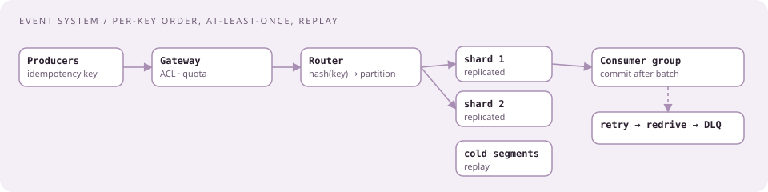
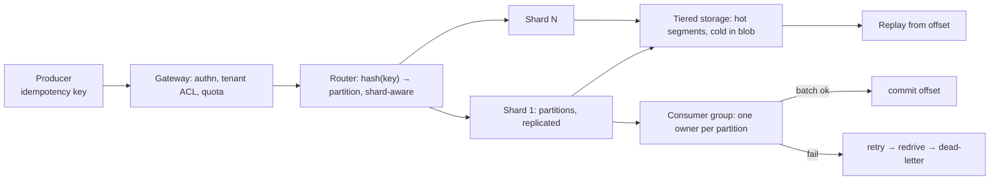

# Real-time event message system with per-key order and safe replay

[Curriculum](../../../README.md) · [Architecture](../README.md) · [All system designs](../../../../indexes/system-designs.md)

`[Reported]` January 2026, senior offer: "I was asked to design an event system as a take home assignment with various requirements provided," then a two-hour review with two engineers. "CrowdStrike is a security company so systems have two high priorities: security and availability." `[Aggregator]` ×3 list "threat detection pipeline handling backpressure without data loss" and "message broker consumer ensuring idempotency under at-least-once delivery."

## Application background

Producers publish events to named topics. Consumers subscribe and must see each event at least once, in order per key, and be able to replay from a point in the past. Consumers crash, producers retry, tenants share the system, and an event may contain sensitive data.

## Your assignment

**Deliver:** a design for publish, store, subscribe, replay, and dead-lettering, sized for 5 million events per second, 1 KB each, 10,000 topics, 50,000 consumer instances, 7 days of replay.

**Required behavior:** per-key order preserved; at-least-once delivery with a way for consumers to be idempotent; replay from any offset within retention; a consumer that keeps failing on one event does not stall its partition forever; tenants cannot read each other's topics; the system stays available when one node, one zone, or one shard is down.

## Numbers first

| Quantity | Value | Consequence |
|---|---|---|
| Events | 5M/s ≈ 5 GB/s | One cluster is at CrowdStrike's published limit (15M/s); plan shards |
| Retention | 7 days × 5 GB/s ≈ 3 PB | Tiered storage: hot on brokers, cold in blob |
| Consumers | 50k instances | Group coordination and rebalancing are a real cost |
| Keys | per-key order | Partition by key; ordering only within a partition |

## Expected behavior

| Action | Expected | Why |
|---|---|---|
| Publish two events with key K | Consumers see them in publish order | Per-key order |
| Producer retries a publish | One event, or two with the same idempotency key that consumers collapse | At-least-once made safe |
| Consumer crashes mid-batch | Redelivery of the uncommitted batch | Commit after the batch `[Official]` |
| One event fails 15 times | Moved to a dead-letter store; partition continues | Redrive tiers `[Official]` |
| Consumer asks for offset from 3 days ago | Served from cold tier | Replay |
| Tenant B subscribes to A's topic | Rejected | Isolation |
| A shard is lost | Producers route to other shards; consumers drain read-only | Shard states `[Official]` |

## Main path

## Stores, by category

| Data | Shape | Category | Why |
|---|---|---|---|
| Event log | append, sequential read by offset | replicated commit log | Kafka-class; partitions give order and parallelism |
| Cold segments | write once, rare reads | blob store | 3 PB is not broker disk |
| Offsets | small, frequent writes | compacted log or OLTP | Committed after batch |
| Topic and ACL metadata | small, read-heavy | OLTP + cache | Tenant isolation lives here |
| Dead letters | rare appends, audited | append-only store | Investigation and replay |

## Delivery semantics, said precisely

| Guarantee | How | What it costs |
|---|---|---|
| At-least-once | Consumer commits after processing | Duplicates on crash |
| Per-key order | One partition per key, one consumer per partition | Hot keys limit parallelism |
| Idempotent effect | Sink keyed by (producer id, sequence) or event id; dedupe window ([bundle 45](../../02-coding-problems/problems/45-telemetry-dedupe/README.md)) | Window memory |
| Exactly-once, if asked | Transactional produce-and-commit across the log and the offset store | Throughput; only within the log's own transactions |

## Failure modes, volunteered

| Failure | Detection | Containment | Recovery |
|---|---|---|---|
| Consumer lag grows | Lag per partition (Burrow-style) | Autoscale consumers on lag; bounded in-flight | Drain |
| Poison event | Retry count per event | 3 runtime retries, 5 redrives, then dead-letter `[Official]` | Manual or fixed-code replay |
| Malformed events counted as failures | Failure-rate spike with no dependency outage | Classify malformed separately or throttling cascades `[Official]` | — |
| Dependency outage | Failure-weighted throttle | Back off; halt at threshold; orchestrator restarts | Resume from committed offset |
| Broker or zone loss | Replica lag, ISR shrink | Replication factor 3, min in-sync 2 | Leader election |
| Shard loss | Health | Route producers away; consumers drain read-only; 1/(N−1) headroom `[Official]` | Rebuild |
| Rebalance storm | Group churn | Static membership, cooperative rebalancing | — |

## Security and availability, the two priorities

| Concern | Design |
|---|---|
| Who may publish and subscribe | Per-topic ACLs keyed by tenant, enforced at the gateway and the broker |
| Data at rest | Encrypted segments; per-tenant keys if topics are tenant-owned |
| In transit | mTLS producer→gateway→broker |
| Audit | Append-only log of subscriptions and replays |
| Availability | Replication, shards with headroom, consumers that fail open on non-critical dependencies |

## Follow-ups

**Senior:** "A hot key carries 30% of events." Per-key order forces one partition; split the key by a secondary attribute only if the consumer can tolerate partial order, otherwise scale that consumer vertically and alert. **Staff:** "Consumers need exactly-once effects into an external database." Make the sink idempotent with the event id as a unique constraint and commit the offset in the same transaction as the write; explain why this is exactly-once *effect*, not exactly-once *delivery*.

What a strong review contains

Partitioning explained by key, not by topic; the commit-after-batch rule and what it implies on crash; the retry tiers with numbers; tiered storage sized; ACLs at two layers; one honest trade-off (hot keys against order). If the interviewer says "we do it differently," ask how and find the property their way protects.

Next: [Telemetry ingestion from millions of endpoints](telemetry-ingestion.md).
