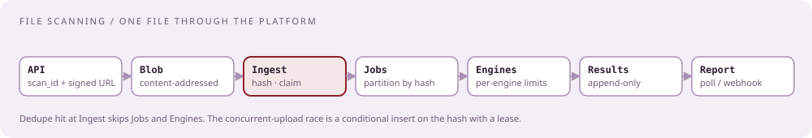
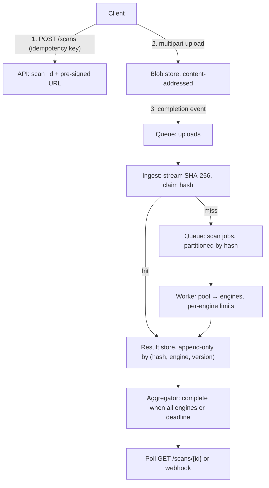

# File-scanning platform: upload once, scan with many engines, one report

[Curriculum](../../../README.md) · [Architecture](../README.md) · [All system designs](../../../../indexes/system-designs.md)

`[Reported]` seven independent times, 2019 to 2026, London, Dublin, and the US: "design a VirusTotal-like system," handed out one or two days ahead and defended for ninety minutes; "file uploads, hashing, blob storage, database sharding, scaling, async flow in event-driven architecture"; "Cassandra and consistent hashing came up"; "concurrent uploads, users competing for the same resource." This is the one CrowdStrike design prompt that is genuinely repeated.

## Application background

A customer uploads a file. The platform hashes it, stores the bytes once, sends the file to many scanning engines, and produces one report the customer can poll or be notified about. Uploads arrive in bursts, files can be gigabytes, the same file is uploaded by thousands of tenants, and engines fail or run slow.



## Your assignment

**Deliver:** a design for the upload, dedupe, fan-out, aggregation, and report path, sized for 10,000 uploads per second at peak, median 200 KB, p99 50 MB, max 2 GB, twenty engines per file at 100 ms to 30 s each, and a report within 60 s for 95% of files.

**Required behavior:** a repeated file is never rescanned for the same engine version; two tenants uploading the same file at the same second produce one scan and two reports; an engine outage never blocks a report; a client retry never creates a second scan; one tenant's flood never starves another.

## Numbers first

| Quantity | Value | Consequence |
|---|---|---|
| Uploads | 10k/s peak | Ingest and metadata writes are the hot path |
| Bytes | ~2 GB/s median, bursts far higher | Bytes go straight to blob storage, never through the API tier |
| Engines | 20 × 10k/s = 200k engine calls/s | Fan-out is the biggest compute cost; dedupe is the biggest lever |
| Report deadline | 60 s p95 | Async by default; polling or webhook |
| Duplicate rate | assume 40–80% by content hash | Every duplicate avoided saves 20 engine calls |

## Expected behavior

| User action | Expected behavior | Why it matters |
|---|---|---|
| Upload 200 KB | `202 Accepted` with `scan_id`; report within seconds | Never block on twenty engines |
| Upload a file scanned yesterday | Report served from the hash result; no new scans | Dedupe by content hash |
| Two tenants, same file, same second | One scan, two `scan_id`s pointing at one result | The concurrent-upload race |
| 2 GB file | Multipart, pre-signed URL, direct to blob | Big-file question |
| Engine X down | Report shows 19/20 with X pending; retried with backoff | Partial failure never blocks |
| Client retries the request | Same `scan_id` via idempotency key | Idempotency |
| Tenant floods 1M uploads | Per-tenant quota and queue lane; others unaffected | Isolation |

## Main path



## Stores, by category first

| Data | Write/read shape | Category | Product, and why | Key |
|---|---|---|---|---|
| File bytes | write once, read by engines | blob store | S3-class; content-addressed so duplicates collapse; pre-signed URLs keep bytes off the API | `sha256` |
| Engine results | 200k appends/s, read per hash | append-only wide-column | Cassandra-class: write-optimized, partition per hash, TTL by compaction `[Official]` | `(hash) → (engine, version, verdict, ts)` |
| Scan metadata | 10k writes/s, point reads | OLTP | Postgres-class, small rows, pointers only | `scan_id → tenant, hash, status` |
| Hash → status | hot lookup on every upload | cache in front of results | Redis-class; miss falls through | `hash → complete / scanning / absent` |
| Scan jobs | fan-out, replay | queue | Kafka-class, partition by hash | `hash` |

## The concurrent-upload race, answered

```mermaid
sequenceDiagram
 participant A as Ingest A
 participant B as Ingest B
 participant S as Result store
 A->>S: claim(hash) conditional insert "scanning", lease 5 min
 B->>S: claim(hash)
 S-->>A: won
 S-->>B: lost: attach scan_id B to hash
 A->>A: enqueue scan job
 Note over A,S: if A dies, the lease expires and the next claimant re-runs; results are idempotent by (hash, engine, version)
```

A conditional insert (compare-and-set) on the hash row is the whole mechanism. No fleet-wide lock. A double run after a lease expiry is waste, not corruption.

## Sharding and consistent hashing, answered

Partition the results store and the job queue by content hash: the key is uniform by construction, so a viral file creates a hot *cache* entry (fine) rather than a hot *partition*. Add nodes with consistent hashing so only 1/N of keys move. Never partition by tenant: one tenant can be 40% of traffic.

## Failure modes, volunteered

| Failure | Detection | Containment | Recovery |
|---|---|---|---|
| Completion event lost | Reconciler lists new blobs hourly and compares | None needed | Enqueue missing scans |
| Job queue backlog | Consumer lag | Autoscale workers on lag; shed by tenant priority | Drain |
| Engine rate-limited or down | Per-engine error rate | Token bucket per engine; deferred lane; report marks pending | Retry with backoff; backfill |
| Poison file crashes an engine | Crash count per hash | Sandbox engines; quarantine after N crashes | Report notes the engine's failure |
| Engine version update | Manual | Low-priority backfill lane walking the hash index | Rescan over days |
| Hot hash (40% of uploads) | Cache hit rate | Cache absorbs it; batch `scan_id` writes | None |

## Follow-ups

**Senior:** "Now the same file is 40% of all uploads." The hash cache absorbs the lookups; the remaining cost moves to the metadata store's `scan_id` write rate, so batch those writes and keep reports pointer-only. **Staff:** "Make it multi-region with a regional outage." Region-local blob and queue; results replicated asynchronously by hash; a global read path that tolerates a stale miss, because a rescan is safe; an explicit statement of what is lost for how long.

## Trade-offs to name

| Choice | What it costs | Why anyway |
|---|---|---|
| Async by default | Clients must poll or receive webhooks | Twenty engines at up to 30 s cannot be synchronous |
| Content-addressed dedupe across tenants | A tenant learns nothing about others, but a shared result exists | Cuts engine cost by the duplicate rate; results carry no tenant data |
| Lease-based claim, not a lock | Rare double scans after a lease expiry | No coordinator on the hot path |

<details><summary>What a strong ninety minutes contains</summary>

Numbers before boxes; six to eight boxes; one file walked end to end; every store justified by its write/read shape; the race handled with a conditional insert, not a distributed lock; costs named (engine minutes, blob egress, cache memory); one trade-off you dislike stated plainly. Reviewers report caring more about "why" than about diagram polish.

</details>

Next: [Real-time event message system](event-message-system.md).
